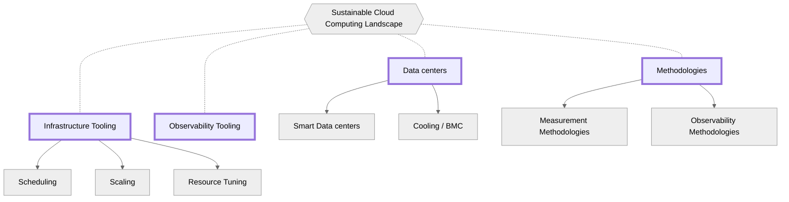
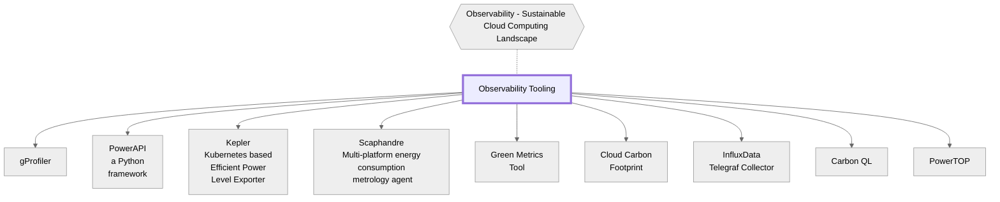
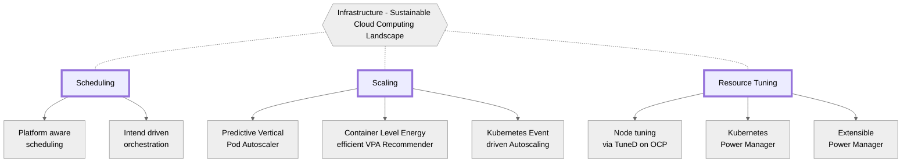

*This document was published on 23.06. We are aware that this document contains gaps that will be addressed in future releases. Contributions are very welcome!*

<i class="fas fa-globe-asia mb-3"></i>[Read the Korean translation of this document here](/about/landscape-ko/).

Cloud computing has revolutionized the way we store and process data, enabling organizations to be more agile, efficient, and scalable.
However, as companies transform their business models to meet sustainability requirements, concerns about environmental sustainability in cloud computing have also emerged.
The carbon footprint of cloud computing has become a topic of discussion, as it indirectly causes enormous amounts of emissions due to its energy consumption.
As a result, it has become imperative to quantify and reduce carbon emissions associated with cloud computing to mitigate the impact on the environment.

Quantifying operational carbon emissions is not as simple as deploying tooling for visibility and accountability.
This is particularly true for cloud computing, as there are multiple hardware components enclosed in a server, different generations/architecture/vendors of hardware in cloud Infrastructure, dependencies of the services, services running in virtualized/containerized environments, separate fan/cooling controller in the server, missing data, telemetry & observability, AI/ML workloads, and confidential workloads.
These challenges make it difficult to accurately measure carbon emissions associated with cloud computing.

In this white paper, we explore the challenges associated with carbon and energy accounting in cloud computing and provide insights into the complexities of quantifying carbon emissions in public and private clouds.
Furthermore, the paper explores sector-specific challenges, such as the telecommunications industry.

## Table of Contents

- [Table of Contents](#table-of-contents)
- [Contributors](#contributors)
- [Foundations of Sustainable Cloud Systems](#foundations-of-sustainable-cloud-systems)
  - [Carbon Emissions of the Cloud](#carbon-emissions-of-the-cloud)
  - [Green Computing](#green-computing)
  - [Carbon/Energy Accounting](#carbonenergy-accounting)
- [Challenges of Sustainable Cloud Systems](#challenges-of-sustainable-cloud-systems)
- [Challenges of Carbon/Energy Accounting](#challenges-of-carbonenergy-accounting)
  - [Quantifying Operational Carbon Emission](#quantifying-operational-carbon-emission)
  - [Clouds](#clouds)
    - [Challenges in the Public Cloud](#challenges-in-the-public-cloud)
      - [Users of Cloud Service Providers](#users-of-cloud-service-providers)
    - [Challenges in the Private Clouds](#challenges-in-the-private-clouds)
  - [Sector Specific Challenges](#sector-specific-challenges)
    - [Telco](#telco)
    - [Finance](#finance)
  - [Workload Specific Challenges](#workload-specific-challenges)
    - [AI/ML](#aiml)
- [Layers of the solutions](#layers-of-the-solutions)
- [Current Industry Research and Development](#current-industry-research-and-development)
  - [Runtime System Power Measurement](#runtime-system-power-measurement)
  - [Energy Conservation and Carbon Reduction](#energy-conservation-and-carbon-reduction)
    - [Tuning, Scaling, and Configuration](#tuning-scaling-and-configuration)
  - [Green System Architecture](#green-system-architecture)
- [Current Sustainable Cloud Computing Landscape](#current-sustainable-cloud-computing-landscape)
  - [Data centers](#data-centers)
    - [Smart Data Centers](#smart-data-centers)
    - [Cooling / BMC](#cooling--bmc)
  - [Methodologies](#methodologies)
    - [Measurement Methodologies](#measurement-methodologies)
    - [Observability Methodologies](#observability-methodologies)
  - [Observability Tooling](#observability-tooling)
  - [Infrastructure Tooling](#infrastructure-tooling)
    - [Scheduling At The Cluster Level](#scheduling-at-the-cluster-level)
    - [Scaling](#scaling)
    - [On-Node Power Management Tuning](#on-node-power-management-tuning)
- [Sustainability Initiatives](#sustainability-initiatives)
  - [Organizations](#organizations)
  - [Conferences](#conferences)
  - [Carbon Emissions Reports](#carbon-emissions-reports)
  - [Net Zero / Carbon Neutrality](#net-zero--carbon-neutrality)
  - [Programming Language Efficiency Analysis](#programming-language-efficiency-analysis)

## Contributors
A special thank you to our contributors of this document. If you are interested in improving and enhancing the content, please file a PR on the repo and ensure you add yourself as a contributor below!

Huamin Chen, [Marlow Weston](https://github.com/catblade), [Niki Manoledaki](https://github.com/nikimanoledaki), Eun Kyung Lee, [Chen Wang](https://github.com/wangchen615), [Chris Lloyd-Jones](https://github.com/Sealjay), 
[Parul Singh](https://github.com/husky-parul), [Przemysław Perycz](https://github.com/pperycz), [Christopher Cantalupo](https://github.com/cmcantalupo), [Patricia Cahill](https://github.com/patricia-cahill), [Jochen Joswig](https://github.com/by-d-sign), [Emily Fox](https://github.com/thefoxatwork), [Leonard Pahlke](https://github.com/leonardpahlke)

## Foundations of Sustainable Cloud Systems
Sustainable cloud and cloud native systems may only be constructed when three foundations exist.
These foundations form the basis of informed design, decision-making, and accountability in cloud and cloud native architectures.

### Carbon Emissions of the Cloud
The carbon emissions of Information and Communication Technology (short: ICT) systems are categorized as and composed of:
- **operational emissions**: the amount of carbon emitted during the operational or in-use phase of an ICT system.
These emissions are mostly due to burning of fossil fuels to generate the electricity required by these systems.
- **embodied emissions**: the amount of carbon emitted during the creation and disposal the hardware (short: HW) and physical components of an ICT system (e.g.: devices, servers, cables, buildings, etc.).
Embodied emissions are also referred to as embedded emissions.

Cloud and cloud native systems are no exception to the foundation of carbon emissions to ensure environmentally sustainable computing as they are firmly under the umbrella of ICT systems.

### Green Computing
Green computing refers to the architecture and design of software and systems that monitor and optimize resource consumption, reduce environmental impact, and improve sustainability, while providing useful services to its users and stakeholders.

### Carbon/Energy Accounting
Carbon and energy accounting refers to systems, services, and methodologies to track and account for carbon and energy consumption.

## Challenges of Sustainable Cloud Systems
The challenges associated with building and maintaining sustainable cloud systems are still being uncovered with green computing and carbon and energy accounting as two rapidly developing fields with interest from a variety of industry sectors.
We anticipate more challenges _and_ solutions to be uncovered as more adoption and maturity of these technologies increases. However, the below section attempts to capture current challenges across the foundations.
A popular standard for Carbon Accounting is the [Greenhouse Gas Protocol](https://ghgprotocol.org/) (short: GHG protocol, GHGP).

## Challenges of Carbon/Energy Accounting
### Quantifying Operational Carbon Emission
Observability in the performance of cloud native workloads has grown in popularity as organizations learn the value in various telemetry data points for increased visibility and understanding of how their architectures are operating.
As more organizations begin to consider how to reach similar value in the resource utilization and energy consumption, they're learning that quantifying the operational carbon emission is not as simple as deploying tooling for visibility and accountability.
Quantifying the operational carbon emission is not trivial for a number of reasons, not limited to the following:

* Multiple Hardware (HW) components enclosed in a server - power modeling is required for various HW components (e.g., CPU, Memory, GPU, Storage, I/O) for accurate quantification/estimation.
* HW is used by multiple users/accounts simultaneously – power modeling per different user (e.g., multiple software thread(s)) is a totally different problem for modeling.
A important issue to understand here is [Energy Proportionality](https://learn.greensoftware.foundation/energy-efficiency#energy-proportionality).
The SW/HW interaction should be well-understood for power modeling.
* Different generations/architecture/vendors of HW in cloud Infrastructure - power modeling is required for different generations/architecture/vendors for example, Intel vs. AMD vs. ARM, Skylake vs. Sapphire Rapids, and ConnectX-5 vs. ConnectX-6.
* Dependencies of the services - a service may use different services. (e.g., Kubernetes uses COS service), applications may be distributed across data centers and clouds.
* Services running in virtualized/containerized environments - power modeling is required for virtualized/containerized environments, which increases the complexity of modeling
* Separate fan/cooling controller in the server – The fan and other cooling components are often controlled by a separate controller, which requires additional modeling.
* Missing data – due to the limitation of exposing internal data in the cloud, accessing the key data to calculate the operation emission is prohibited. On-premise (On-prem) data centers are sometimes lacking power measurement technology.
* Telemetry & observability – a user often uses multiple HW at the same time, reliable and high-granularity telemetry becomes more important. However, telemetry/observability overhead should be low relative to the services being executed on the server/cloud.
* AI/ML workloads – dramatic increase in using Artificial Intelligence (AI)/ Machine Learning (ML) workload leads to the strong need of dedicated GPU-based clusters. The characteristics of such workloads are different than traditional workloads and their power consumptions are significantly higher.
* Confidential workloads - evolve from VM use case to confidential container (SGX/SEV/TDX), the TEE (Trusted Execution Environment)
and the usage of bounce buffer/SWIOTLB might cost more energy. However, the confidential workload is hard to be observed due to
security concerns.

Quantifying embedded carbon emissions is also very challenging as manufactural details (embodied emissions) are not being incorporated into information for holistic quantification by consumers of manufactured technology.
This is out of the scope of this white paper, however this TAG encourages interested readers to suggest guidance, best practices, methods, and mechanisms to quantify these emissions by filing an issue or pull request on our [repository](https://github.com/cncf/tag-env-sustainability).
<!-- We may want to put some directions though // +1, would this be guidance/best practice on methods to quantify these emissions or guidance on methods to mitigate these emissions? --> 

### Clouds

#### Challenges in the Public Cloud
Public cloud providers, such as AWS, Azure, and GCP are often quite restrictive with consumption and emission data, as the providers limit decisions users can make with regard to accessing sustainability-related metrics. 
Sustainability-related metrics include data points such as the energy consumption, hardware, electricity source, data center PUE, etc.

Providers do try to keep their day-to-day costs, energy usage, and emissions down, but the functionality exposed to users to can be quite limited.
This is likely due in part to the shared responsibility model upon which cloud computing is designed - abstracting the operational complexity organizations would otherwise be responsible for in running their own data centers.
<!--- this statement needs reference: They do not trust their users, as users vary from amateur to experienced. --->  
Additionally, the quantification challenges previously identified also contribute heavily to further difficulties in accounting for carbon costs by specific users, as the carbon accounting can take much longer than users have to connect to individual types of jobs.
The hyperscalers mentioned above offer insight into the carbon emissions of cloud resources through carbon dashboards or APIs.
Yet, these can be quite limited and/or have a considerable time lag for the carbon emission data to become available within an acceptable timewindow for users to take action on.
In addition, the methodologies used to calculate carbon emissions can vary between cloud providers, reducing a user's ability to compare between providers.
How this information is measured or estimated is often obtuse, inconsistent, and without industry consensus.
As with most emerging technology areas, the variance in underlying implementations will continue until industry centers around a collective schema or framework for both measuring and expressing those measurements.

#####  Users of Cloud Service Providers
Users are often unaware and inexperienced in how their workloads effect their organization's carbon footprint.
Those that do care about their environmental impact have a hard time connecting their individual workloads to their carbon costs.

#### Challenges in the Private Clouds
These are clouds run by particular companies or universities for use of the members of those companies or universities.
These clouds are often more trusting environments, as the users are accountable to the administrators or management of the cloud they are running their workloads on. 
Due to the special-purposes of private clouds, environmental sustainability, green computing, and accountability of emissions are not in the forefront of design, operation, or even expense, thus contributing to further challenges unique to private cloud.
These are still yet unknown.

### Sector Specific Challenges
#### Telco
Telecommunications (Telco) customers are often demanding due to their unique needs in providing high reliability and high velocity service to their customers.
Telco needs their systems to be extremely stable, and the traffic to be fast and reliable.
Some systems are left entirely at full-power because power modulation can affect traffic and the tolerance for this is low.
Building systems that reduce power that Telco is confident will not affect their traffic is challenging.

#### Finance
Finance may have simulations being run, in the off-hours, and those will look like an AI/ML workload.
However, for transactions and fast-traffic, finance has predictable times of day of use-when the markets are up.
For this reason, time-of-day adjustments on the majority of the clusters run by finance can be limited.
However, transaction times do affect real dollars, so being fast will be prioritized in these environments over power use.
In order to get this set of customers to use sustainable options, care must be taken to limit the impact to their bottom line.
Additional, high-security and regulatory requirements can increase the utilization and emissions from finance workloads as a result of increased logging, monitoring, and other factors.

### Workload Specific Challenges

#### AI/ML
In addition to the challenges identified above, Artificial Intelligence (AI) and Machine Learning (ML) workloads exist either as schedulable compute at a cloud service provider or within a bare metal environment.
In either case, AI/Ml clusters often  have the added complexity of XPUs, or accelerators.
These accelerators take significant amounts of power to run, more by an order of magnitude required from regular computer chips.
Additionally, some of the workloads on these clusters are not time-sensitive, for instance training sets of information, and some are time-sensitive, for instance inference jobs for recognition systems.

#### Software Development and Testing
While a concentration is made on the sustainability of active services used by consumers a major factor in the overall footprint of cloud
sustainability is in the development and testing of the software that these services use. 
The environmental footprint of the development of software has the same factors that effect it as actual services running but they may be weighted differently. 
Examples of the types of loads during software development are the individual hardware costs of the developers, the build servers for the software and the various testing stages in the creation of services. 
Each of these stages are necessary for the development of software but incur an environmental cost. The different loads can be addressed in different ways with flexibility that are different from the sector specific challenges that the software is being produced for. 
Examples of this is that the testing of Telecoms software might not be as time critical as the production deployments and this gives different flexibility. While there can be some greater flexibility with the location of build servers there will still be speed constraints and developer efficiency is important. 
The location and utilization of test systems which can be long running and large would seem to be an area of a lot of concern as they can sometimes be of the same order of magnitude as the active deployed systems.

## Layers of the solutions
When considering solutions complimentary to the three foundations of sustainable cloud systems, we can divide solution considerations into three general areas:

1. Which data center to use, if there are multiple options available.
2. Where to place the workload once a data center is chosen.
3. How to manage the resources on the node allocated for a workload to run on.

All of these elements can be investigated further individually.

| Area               | Goal                                                                                                                                                                                                                                     | Efforts                                |
| ------------------ | ---------------------------------------------------------------------------------------------------------------------------------------------------------------------------------------------------------------------------------------- | -------------------------------------- |
| Multi Data Centers | Intelligently choosing which data center to schedule on according to environmental factors such as whether the region is powered by renewables, the region's Marginal Emissions Rate, Power Usage Effectiveness (PUE), time of day, etc. | Cluster Management                     |
| Within Data Center | Scheduling effectively according to workload, availability, and urgency of workload                                                                                                                                                      | Power Management, K8S Scheduler Plugin |
| Within a node      | Optimizing resources to handle workload specifications (which may include performance parameters) while minimizing resource consumption                                                                                                  | Node Tuning, Pod Scaling               |

## Current Industry Research and Development
There are a number of developments and ongoing research in the field of sustainable computing.
If you know of some that aren't captured here, we would love for you to contribute them!

### Runtime System Power Measurement
:green_book: [A summarization of topics and research up to 2016](https://en.wikipedia.org/wiki/Run-time_estimation_of_system_and_sub-system_level_power_consumption)

### Energy Conservation and Carbon Reduction

#### Tuning, Scaling, and Configuration
At runtime, energy consumed by workloads can be reduced at HW level through DVFS-based scaling, at SW level through runtime parameter tuning and re-configuration, or at the orchestration level through scale-to-zero automation. 

### Green System Architecture
Green HW/SW systems either improve sub-system efficiency or change the way that computation is conducted.

For instance, programs written in [energy efficient langugages](https://haslab.github.io/SAFER/scp21.pdf) or running on more [optimized runtimes](https://hal.inria.fr/hal-03275286/document) are generally "greener".

On the other hand, architectures that address the root cause of energy waste, including idle power and data center cooling, are evaluated to be more environmentally friendly.
For instance, Federated Learning spreads model training to devices that do not require expensive cooling is [evaluated](https://www.cam.ac.uk/research/news/can-federated-learning-save-the-world) to reduce carbon footprint in aggregate.

## Current Sustainable Cloud Computing Landscape

The diagram below illustrates the dimensions of the sustainable cloud computing landscape, which are described in detail in the following sections.



### Data centers

#### Smart Data Centers
* ECO-Qube is a holistic management system that aims to enhance energy efficiency and cooling performance by orchestrating both hardware and software components in edge computing applications [ECO-Qube](https://eco-qube.eu/)
* [Patchwork Kilt](https://openuk.uk/patchworkkilt/) - A blueprint for sustainable data centers.
* [Open Compute Sustainability Project](https://www.opencompute.org/projects/sustainability) - Leveraging the expertise of the OCP community, we offer an open framework and resources for OCP members and data center industry – vendors, suppliers, and end users - to deploy industry best practices that promotes reusability and circularity.  

#### Cooling / BMC
* :newspaper: :ice_cube: OCP Cooling Telemetry [Improve data center cooling facility efficiency through platform power telemetry](https://www.opencompute.org/documents/ocp-wp-dcf-improve-data-center-cooling-facility-efficiency-through-platform-power-telemetryr1-0-final-update-pdf) <br> 
Data center operators usually over provision facility capacity to ensure enough buffer to fulfill peak demand.
Over provisioning brings great pressure to data centers' total cost of ownership (TCO).
Today, the data center management stack has been widely deployed to monitor data center runtime health status and it gathered tons of data across power, temperature, and resource utilization.
These data create opportunities to optimize data center efficiency through data intelligences.
In this paper, we introduced our practices in cloud environments for using power trend prediction to improve cooling efficiency. 
Meanwhile, this paper discussed some key challenges and design considerations while enabling IT platform data-driven facility control at hyperscale data center, e.g. telemetry collection, messaging mechanism, and management API.
Effective interoperability among IT devices, facility and management systems is very critical for solution deployment, and the adoption of Open Compute Project design and Redfish API easier system-level integration and reduce deployment costs over different systems and different manufacturers. 
* :ice_cube: BMC Telemetry [Exposes Baseboard Management Controller data in Prometheus format.](https://github.com/gebn/bmc_exporter)

### Methodologies
#### Measurement Methodologies
* [Software Carbon Intensity (SCI) Standard](https://github.com/Green-Software-Foundation/sci) - A specification that describes how to calculate the carbon intensity of software applications.
* [Green Software Patterns](https://patterns.greensoftware.foundation/) - An online open-source database of software patterns reviewed and curated by the Green Software Foundation across a wide range of categories.
* [SCI Guidance](https://sci-data.greensoftware.foundation/) - The SCI Guidance project details various approaches on how to understand the different methodologies that are available for calculating energy, carbon intensity, embodied emissions, and functional unit values which are the core components of the SCI calculation.
* Runtime system power consumption estimate [Run-time estimation of system and sub-system level power consumption](https://en.wikipedia.org/wiki/Run-time_estimation_of_system_and_sub-system_level_power_consumption)

#### Observability Methodologies

* :eyes: Open Telemetry [High-quality, ubiquitous, and portable telemetry to enable effective observability](https://opentelemetry.io/)<br>
A CNCF incubating project designed to create and collect telemetry data from services and software and then forward these to a variety of analysis tools.
OpenTelemetry integrates with popular libraries and frameworks such as Spring, ASP.NET Core, Express, Quarkus, and others.  

### Observability Tooling

The diagram below illustrates the infrastructure dimension of the sustainable cloud computing landscape.



* :eyes: gProfiler [OS code profiling tool to visualize applications' execution sequences and resource usage down to the line of code level](https://docs.gprofiler.io/)<br>
gProfiler, is a free, self-service, and open source, enabling businesses to improve application performance through continuous profiling, thereby reducing costs and minimizing carbon footprint.
Granulate users can monitor their carbon emission reduction on the gCenter dashboard, alongside cost and resource reductions, with the CO2 Savings Meter.
* :eyes: PowerAPI [Python framework for building software-defined power meters](https://github.com/powerapi-ng/)<br> 
PowerAPI is a middleware toolkit for building software-defined power meters.
Software-defined power meters are configurable software libraries that can estimate the power consumption of software in real time.
PowerAPI supports the acquisition of raw metrics from a wide diversity of sensors (eg., physical meters, processor interfaces, hardware counters, OS counters) and the delivery of power consumptions via different channels (including file system, network, web, graphical).
As a middleware toolkit, PowerAPI offers the capability of assembling power meters «à la carte» to accommodate user requirements.
* :eyes: [Kubernetes-based Efficient Power Level Exporter: ](https://github.com/sustainable-computing-io/kepler)<br>
Kepler leverages eBPF programs to probe per-container energy consumption related to system counters and exports them as Prometheus metrics.
These metrics help end users monitor their containers’ energy consumption and help cluster administrators make intelligent decisions toward achieving their energy conservation goals.
The [Kepler Model Server](https://github.com/sustainable-computing-io/kepler-model-server) is an internal program that provides Kepler with ML models for estimating power consumption on Kubernetes workloads.
The Kepler Model Server pre-trains its models with node energy statistics (labels) and node performance counters (features) as Prometheus metrics on a variety of different Kubernetes clusters and workloads.
Once the models achieve an acceptable performance level, Kepler Model Server exports them via flask routes and Kepler can then access them to calculate per-pod energy consumption metrics given per-pod performance counters.
Unlike other similar projects, the Kepler Model Server also continuously trains and tunes its pre-trained models using node data scraped by Kepler’s Power Estimate Agents from client clusters.
This gives Kepler the ability to further adapt its pod energy consumption calculation capabilities to serve clients’ unique systems.
* :eyes: Scaphandre [Scaphandre](https://github.com/hubblo-org/scaphandre)<br>
Scaphandre is a multi-platform monitoring agent, dedicated to power usage / energy consumption metrics and other useful data for reducing ICT software impacts.
* :eyes: Green Metrics Tool [A holistic framework to measure the energy / co2 of your application.](https://docs.green-coding.berlin/)
* :eyes: [InfluxData Telegraf Collector](https://github.com/influxdata/telegraf) - an open source, plugin-based agent for collecting, processing, aggregating, and writing metrics.
Includes multiple input plugins that help determine energy consumption, e.g. [intel_powerstat](https://github.com/influxdata/telegraf/tree/master/plugins/inputs/intel_powerstat) (exposes CPU & DRAM power consumption, CPU temperature, TDP, CPU and uncore frequencies, C-State residencies), [ipmi_sensor](https://github.com/influxdata/telegraf/tree/master/plugins/inputs/ipmi_sensor) (exposes IPMI sensor data), [redfish](https://github.com/influxdata/telegraf/tree/master/plugins/inputs/redfish) (exposes CPU temperature, fan speed, power supply and voltage data as exposed by [DMTF's Redfish](https://redfish.dmtf.org/) interfaces), and a high number of plugins that help determine the utilization of individual resources that in turn help identifying where the power is consumed.
A rich set of available output plugins makes it easy to integrate with various metrics destinations.
* :eyes: [Carbon QL](https://github.com/Green-Software-Foundation/carbon-ql) - The intent of this project is to build a single API codenamed carbonQL that you can use to measure your software emissions for every runtime environment.
* :eyes: [Cloud Carbon Footprint](https://www.cloudcarbonfootprint.org/docs/) <br>
This application pulls usage data (compute, storage, networking, etc.) from major cloud providers and calculates estimated energy (Watt-Hours) and greenhouse gas emissions expressed as carbon dioxide equivalents (metric tons CO2e). 
We display these visualizations in a dashboard for developers, sustainability leaders and other stakeholders in an organization to view and take action. It currently supports AWS, Google Cloud and Microsoft Azure.
* :eyes: [PowerTOP](https://github.com/fenrus75/powertop) - a Linux tool, which among other things allows you to monitor the power consumption per process running on the Linux machine.
* :green_book: OSTI [Paper] [Metrics for Evaluating Energy Saving Techniques for Resilient HPC Systems](https://www.osti.gov/servlets/purl/1140455)
* :green_book: [Carbon Aware SDK](https://github.com/Green-Software-Foundation/carbon-aware-sdk): The Carbon Aware SDK is a WebApi and Command Line Interface (CLI) to assist in building carbon aware software.

### Infrastructure Tooling

The diagram below illustrates the infrastructure dimension of the sustainable cloud computing landscape.



#### Scheduling At The Cluster Level
At the cluster-level scheduling phase, energy to be consumed by the workload can be reduced by intelligent schedulers that are aware of carbon footprint in a data center, thermal temperature and cooling, caching aware, or server power efficiency.
Batch scheduling according to power costs (carbon, money, et cetera).

* :train: Power Driven Scheduling and Scaling with CPU telemetry in K8s [Power Driven Scheduling and Scaling with CPU telemetry in Kubernetes](https://github.com/intel/platform-aware-scheduling/tree/master/telemetry-aware-scheduling/docs/power) <br>
Telemetry Aware Scheduling, a scheduling extension, and the Kubernetes native Horizontal Pod Autoscaler (HPA) are used to enable cluster automation based on real-time information about the current state of power usage on the node.
The power metrics used to drive placement and scaling decisions derive from Intel's Running Average Power Limit (RAPL). [collectd](https://collectd.org/) is used to gather the metrics and expose them to Prometheus which makes them available inside the cluster using the Prometheus Adapter.
* :train: [Intent Driven Orchestration](https://github.com/intel/intent-driven-orchestration) <br>
This grants a new way to do orchestration by moving from an imperative model to an intent driven model for choosing workload placement.
In this model, the user expresses their intents in the form of objectives (e.g. as required latency, throughput, or reliability targets) and the orchestration stack itself determines what resources in the infrastructure are required to fulfill the objectives. 
This new approach will continue to benefit from community investments in scheduling (determining when & where to place workloads) and be augmented with a continuous running planning loop determining what/how to configure in the system.
There is already preliminary work being done to leverage this in a power-optimal usage environment.
* :green_book: Carbon-aware Kubernetes scheduler [A Low Carbon Kubernetes Scheduler](http://ceur-ws.org/Vol-2382/ICT4S2019_paper_28.pdf)
* :green_book: Energy aware scheduling [Paper] [Improving Data Center Efficiency Through Holistic Scheduling In Kubernetes](https://www.researchgate.net/publication/333062266_Improving_Data_Center_Efficiency_Through_Holistic_Scheduling_In_Kubernetes)

#### Scaling

* :speedboat: Predictive VPA [Predictive Vertical Pod Autoscaler (VPA) recommenders pluggable with the default VPA on OpenShift](https://github.com/openshift/predictive-vpa-recommenders)
* :speedboat: CLEVER [Container Level Energy-efficient VPA Recommender for Kubernetes](https://github.com/sustainable-computing-io/clever):<br>
Vertical Pod Autoscalers in Kubernetes allow for automatic CPU and memory request and limit adjustment based on historical resource usage measurements.
A VPA deployment has three main components: VPA Recommender, VPA Updater, and VPA Admission Controller.
It is possible to replace the default VPA Recommender with a custom Recommender.
CLEVER, an intelligent recommender, uses this feature to ensure the QoS or performance of the workloads are not compromised when you try to adjust the CPU frequencies of your cluster.
Here’s how it works: assume you have a frequency tuner deployed in your cluster to update the frequency of the CPUs frequencies as per a target metrics or energy consumption budget.
Intuitively, when you lower down the frequencies, you do save energy but the performance of workloads also decreases.
To counter this you can obtain information like ClusterState and CPU frequencies for the nodes after the frequencies were changed.
CLEVER recomputes the new recommendation for CPU requests for pods managed by the VPA based on the updated CPU frequencies.
That’s how CLEVER guarantees a similar QoS for a workload by lowering the frequencies to reduce energy but at the same time increasing CPU allocation.
* :speedboat: [Keda](https://keda.sh/): Kubernetes Event-driven Autoscaling enables scale-to-zero platforms.

#### On-Node Power Management Tuning
Once the region and node are chosen, administrators and users can further tune the node to minimize the amount of power necessary to run workloads.
This can reduce power 30% or more per node.

* :musical_note: Node tuning via TuneD on OCP [Manage node-level tuning by orchestrating the tuned daemon](https://docs.openshift.com/container-platform/4.10/scalability_and_performance/using-node-tuning-operator.html) <br> 
The Node Tuning Operator helps you manage node-level tuning by orchestrating the TuneD daemon.
The majority of high-performance applications require some level of kernel tuning. The Node Tuning Operator provides a unified management interface to users of node-level sysctl's and more flexibility to add custom tuning specified by user needs.
* :musical_note: Kubernetes Power Manager [Kubernetes Operator designed to expose and utilize Intel specific power management technologies in a Kubernetes Environment](https://github.com/intel/kubernetes-power-manager) <br>
The allocation of CPU resources from a pool of platforms in a container orchestration engine like Kubernetes (K8s) is exclusively based on availability.
In order to expose and use power management technologies in a Kubernetes context, the Kubernetes Power Manager is a Kubernetes operator created using the Operator SDK.
The Kubernetes Power Manager makes use of a powerful set of power management technologies that give users more precise control over CPU performance and power usage on a per-core basis.
Yet, Kubernetes is purposefully built to operate as an abstraction layer between the workload and such hardware capabilities as a workload orchestrator.
Users of Kubernetes who are running performance-critical applications with particular requirements that depend on hardware capabilities have a hurdle as a result of this.
By enabling the user to adjust the frequencies and determine the priority level of the cores selected by the Kubernetes Native CPU Manager, the Kubernetes Power Manager fills the gap between the hardware feature enablement and the container orchestration layer.
It has been proven to work with TuneD as well to allow TuneD profiles to bem used to control the power on the nodes according to various frequency tunings.
* :musical_note: GEOPM [Extensible Power Manager](https://geopm.github.io):<br>
Initially specific to HPC environments, but now more generalized, the Global Extensible Open Power Manager (GEOPM) is a framework for exploring power and energy optimizations on heterogeneous platforms. <br>
The GEOPM software is split into two packages: The GEOPM Service and the GEOPM Runtime. The GEOPM Service provides user-space access to low-level hardware metrics and configuration knobs. The GEOPM Runtime leverages the GEOPM Service to tune hardware settings in reaction to hardware metrics and application feedback. The application feedback is collected through lightweight asynchronous profiling hooks injected with callbacks into middle-ware packages. <br>
The GEOPM Runtime has a plugin architecture for selecting between optimization algorithms. Some of the built-in algorithms target energy efficiency, and others optimize performance within a power bound.
The port of GEOPM to Kubernetes is ongoing. There is an [experimental branch](https://github.com/geopm/geopm/tree/cloud#experimental-branch) called ``cloud`` with implementations of new features that support Kubernetes. These features will be migrated into the main ``dev`` branch as they each become production ready.<br>
Additional documentation may be found in the [service readme file](https://github.com/geopm/geopm/tree/cloud/service#kubernetes-support) and in the [runtime k8 directory](https://github.com/geopm/geopm/tree/cloud/k8).

<!--- ### HPC Specific Models --->

## Sustainability Initiatives
There are a number of sustainability initiatives ongoing, if we've missed one please contribute to this list by filing a pull request!

### Organizations
* :honeybee: Green Software Foundation [Building a trusted ecosystem of people, standards, tooling and best practices for green software](https://greensoftware.foundation/) <br>
  The Green Software Foundation (GSF) exists to change how we build software, [so there are zero harmful environmental effects](https://greensoftware.foundation/articles/theory-of-change-defining-strategy-gsf), a foundation with over 42 member organizations.
  Key pillars are Knowledge, Tech Culture, and Tooling; which are delivered through a [standards working group](https://standards.greensoftware.foundation/), an [open source working group](https://opensource.greensoftware.foundation/), a [community working group](https://community.greensoftware.foundation/), and a [policy working group](https://policy.greensoftware.foundation/). <br>
  The GSF has created a [software carbon intensity (SCI)](https://github.com/Green-Software-Foundation/software_carbon_intensity) standard, which has been submitted to ISO (International Standards Organisation) for ratification, to ensure we measure carbon consistently. This standard is being implemented in code through the [Carbon Aware SDK](https://github.com/Green-Software-Foundation/carbon-aware-sdk) (a tool to do more when the energy grid is green, and less when it is dirty), the [Carbon Pipeline](https://github.com/Green-Software-Foundation/Carbon_CI_Pipeline_Tooling) (measuring carbon in the CICD process, and [CarbonQL](https://github.com/Green-Software-Foundation/carbon-ql) - a standardized API for measuring carbon according to the SCI standard.
* :honeybee: [LF Energy](https://www.lfenergy.org/)<br>
  LF Energy is an open source foundation focused on the power systems sector, hosted within The Linux Foundation. LF Energy provides a neutral, collaborative community to build the shared digital investments that will transform the world’s relationship to energy.  This organization contains the repositories for the core LF Energy Foundation and many of the hosted projects and working groups. Their landscape can be found [here](https://landscape.lfenergy.org/).  
* :honeybee: Energy Efficient High Performance Computing Working Group [Encourages implementation of energy conservation measures, energy efficient design in high performance computing (HPC)](https://eehpcwg.llnl.gov/)<br>
  Mission is to encourage the implementation of energy conservation measures, energy efficient design in high performance computing (HPC), and 
  share ideas.  Can find an extensive collection of papers [here](https://datacenters.lbl.gov/resources?field_focus_areas_tid) that can be
  extrapolated from in terms of patterns to be lifted into the cloud native landscape.
* :honeybee: [Green Software Training](https://learn.greensoftware.foundation/) <br>
  This initiative will teach you how to build, maintain and run greener applications irrespective of the application domain, industry, organization size or type, programming language, or framework; leading to a [Green Software Certification](https://training.linuxfoundation.org/training/green-software-for-practitioners-lfc131/) backed by the Linux Foundation.
* :honeybee: [Cloud Carbon Footprint](https://www.cloudcarbonfootprint.org/)<br> 
  Get to know the carbon footprint of your cloud usage - and reduce it.<br>
Cloud Carbon Footprint is an open source tool that provides visibility and tooling to measure, monitor and reduce your cloud carbon emissions. We use best practice methodologies to convert cloud utilization into estimated energy usage and carbon emissions, producing metrics and carbon savings estimates that can be shared with employees, investors, and other stakeholders.
* 🐝 [Open Compute Project](https://www.opencompute.org/projects/heat-reuse)<br>
  Almost 100% of the energy used in a processor turns into heat. Up until very recently this has been a liability and a challenge: an immense quantity of heat to be removed which requires a significant additional energy expenditure. With the proper design, data center cooling systems can be converted into a heat source and a heat management opportunity that in turn converts the heat from a liability to an asset. The OCP Heat Reuse subgroup explores these challenges and opportunities. Its goal is to suggest solutions to enable implementations of technologies designed to harness the heat to turn cost into profit.```

### Conferences
* :honeybee: Linux Foundation's SustainabilityCon [The first sustainability-focused track by the Linux Foundation](https://events.linuxfoundation.org/open-source-summit-north-america/about/sustainabilitycon/)
* :honeybee: [EnviroInfo](https://www.enviroinfo2023.eu/): EnviroInfo 2023 is the 37th edition of the long-standing and well-established international and interdisciplinary conference series on leading environmental information and communication technologies.

### Carbon Emissions Reports

* :page_facing_up: IEA [Emissions - Global Energy and CO2 Status Report 2019](https://www.iea.org/reports/global-energy-co2-status-report-2019/emissions)
* :page_facing_up: European Environment Agency [EU Greenhouse Emission Intensity](https://www.eea.europa.eu/ims/greenhouse-gas-emission-intensity-of-1)
* :page_facing_up: electricityMap's [real-time CO2 emission data](https://app.electricitymap.org)
* [SCI Reporting](https://github.com/Green-Software-Foundation/sci-reporting) - Creating the infrastructure, and processes to store, host, and publicly report SCI scores, and other related reporting requirements within the SCI specification. 
* :page_facing_up: WattTime API [Provides insight into a electricity grid’s marginal emissions rate](https://www.watttime.org/api-documentation/#introduction)

### Net Zero / Carbon Neutrality
* :leafy_green: The Climate Pledge [Net-Zero Carbon by 2040](https://www.theclimatepledge.com/)
* :leafy_green: WeTransfer [WeTransfer becomes Climate Neutral](https://wetransfer.com/blog/story/breaking-the-climate-neutral-barrier/)
* :leafy_green: Adrian Cockroft, ex-Amazon VP of Sustainability Architecture ["Cloud computing pioneer's new focus is on sustainability transformation"](https://www.aboutamazon.com/news/sustainability/cloud-computing-pioneers-new-focus-is-on-sustainability-transformation)
* :leafy_green: Supercritical [Helping businesses achieve net zero](https://gosupercritical.com/)

### Programming Language Efficiency Analysis
* :electric_plug: Energy Efficiency of Languages [The complete set of tools for energy consumption analysis of programming languages, using Computer Language Benchmark Game](https://github.com/greensoftwarelab/Energy-Languages)
