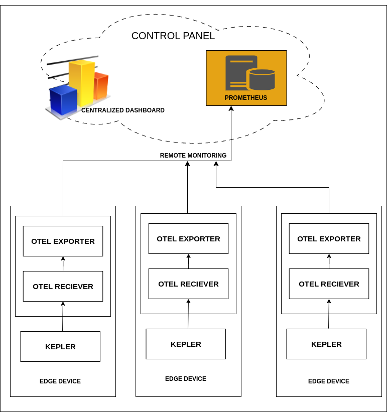

# Embracing Edge Computing with Kepler: A Dive into Remote Monitoring, Centralized Dashboarding, and Visualization

In the ever-evolving landscape of technology, edge computing has emerged as a game-changer, enabling real-time data processing closer to the data source. Kepler, with its integration with OpenTelemetry (OTEL), has paved the way for exploring remote monitoring and centralized dashboarding options at the edge. This revolutionary approach offers invaluable insights into equipment and workload power consumption, making it a pivotal shift in the realm of energy observability.

## Remote Monitoring Revolutionized

Kepler metrics provide comprehensive insights into power consumption, empowering users with detailed analytics. The migration from Prometheus to OTLP exporter streamlines the process, eliminating the heavy Prometheus-based monitoring stack. Kepler’s OTLP exporters, operational on edge devices, facilitate centralized metric collection, ushering in a new era of efficient power and energy monitoring.

## The Power of Centralized Dashboarding

Centralized dashboarding emerges as a cornerstone of this paradigm shift. With edge devices operational in various locations, having a centralized dashboard becomes indispensable. It offers a unified view of all the monitored parameters, ensuring seamless monitoring and identifying major power consuming workloads and/or devices. Centralized dashboarding ensures that insights into equipment and workload power consumption are readily accessible, enabling timely decision-making and proactive issue resolution.

## The Power of OpenTelemetry

Embracing OpenTelemetry isn't just a trend; it's a necessity. This open standard for observability ensures vendor-neutral instrumentation, collection, and export of telemetry data. OpenTelemetry's flexibility, consistency, and growing ecosystem, coupled with support from major observability vendors, position it as the go-to choice for modern applications.

## Kepler’s Architectural Brilliance

Kepler’s architecture captures pod/container/processes level metrics efficiently. The OTEL collector acts as the intermediary, processing and routing data to destinations. Leveraging Prometheus as a backend, coupled with Grafana's prowess, transforms raw data into meaningful visualizations. This synergy offers a seamless experience, enabling users to comprehend complex data effortlessly.

In conclusion, Kepler together with OpenTelemetry and its focus on edge computing mark a significant leap in the power monitoring landscape.

Reference: Hybrid Cloud Patterns

*Note: Follow [link](https://github.com/husky-parul/otel-observability) for the deployment steps. Stay tuned for more updates on [Kepler OTEL SDK instrumentation](https://github.com/sustainable-computing-io/kepler/issues/659).*
