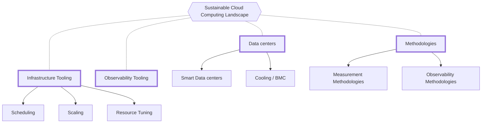
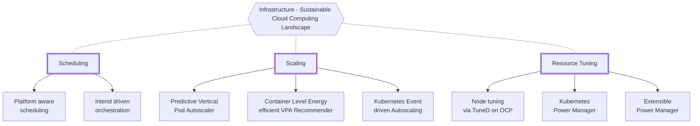

<i class="fas fa-globe-americas mb-3"></i>[Lea la traducción en ingles de este documento aqui](/landscape/).

Este documento identifica los esfuerzos de sostenibilidad conocidos, en curso y describe los desafíos dentro de los entornos nativos de la nube. Este documento es la versión 0.1 y contiene problemas pendientes que se resolverán en versiones futuras. ¡Agradecemos sus comentarios!
La computación en la nube ha revolucionado la forma en que se almacenan y procesan los datos, haciendo que las organizaciones sean más ágiles, eficientes y escalables. Sin embargo, aumentan las preocupaciones sobre la sostenibilidad ambiental de la computación en la nube a medida que las empresas transforman sus modelos de negocio para cumplir con los requisitos de sostenibilidad. La huella de carbono de la computación en la nube se ha convertido en un tema de discusión porque la computación en la nube causa indirectamente enormes cantidades de emisiones de carbono debido al consumo de energía. Por lo tanto, se ha vuelto esencial cuantificar y reducir las emisiones de carbono asociadas a la computación en la nube para mitigar su impacto ambiental.
Cuantificar las emisiones operativas de carbono no es tan simple como implementar herramientas para la visibilidad y la rendición de cuentas. Especialmente en el caso de la computación en la nube, hay múltiples componentes de hardware incluidos en el servidor, diferentes generaciones/arquitecturas/proveedores de hardware en la infraestructura de la nube, dependencias de servicios, servicios que se ejecutan en un entorno virtualizado/en contenedores, ventiladores/controladores de refrigeración separados en el servidor. servidor, falta Esto es especialmente cierto con datos, telemetría y visibilidad, cargas de trabajo de IA/ML, cargas de trabajo confidenciales y más. Estos problemas dificultan medir con precisión las emisiones de carbono asociadas con la computación en la nube.
Este documento técnico explora los desafíos asociados con la contabilidad del carbono y la energía en la computación en la nube y proporciona información sobre las complejidades de cuantificar las emisiones de carbono en las nubes públicas y privadas. El documento también analiza los desafíos específicos del sector, como la industria de las telecomunicaciones.

<!-- markdown-link-check-disable -->
## Índice

- [Colaboradores](#contributors)
- [Fundamentos de los sistemas de nube sostenibles](#foundations-of-sustainable-cloud-systems)
- [Desafíos de la construcción de sistemas sostenibles en la nube](#challenges-of-sustainable-cloud-systems)
- [Desafíos de la contabilidad del carbono/energía](#challenges-of-carbonenergy-accounting)
- [capas de solución](#layers-of-the-solutions)
- [Investigación y desarrollo de la industria actual](#current-industry-research-and-development)
- [Panorama actual de la computación sostenible en la nube](#current-sustainable-cloud-computing-landscape)
- [Iniciativas relacionadas con la sosteniblidad](#sustainability-initiatives)

## Colaboradores   <a href="#contributors" id="contributors"></a>

<!-- markdown-link-check-enable -->

Un agradecimiento especial a quienes contribuyeron a este documento. Si está interesado en mejorar nuestro contenido, envíe un PR al repositorio y agréguese como colaborador a continuación.

<!-- cspell:disable-next-line -->
Huamin Chen, [Marlow Weston](https://github.com/catblade), [Niki Manoledaki](https://github.com/nikimanoledaki), Eun Kyung Lee, [Chen Wang](https://github.com/wangchen615), [Chris Lloyd-Jones](https://github.com/Sealjay), [Parul Singh](https://github.com/husky-parul), [Przemysław Perycz](https://github.com/pperycz), [Christopher Cantalupo](https://github.com/cmcantalupo), [Patricia Cahill](https://github.com/patricia-cahill), [Jochen Joswig](https://github.com/by-d-sign), [Emily Fox](https://github.com/thefoxatwork), [Leonard Pahlke](https://github.com/leonardpahlke)

<!-- markdown-link-check-disable-next-line -->
## Fundamentos de un sistema sostenible en la nube  <a href="#foundations-of-sustainable-cloud-systems" id="foundations-of-sustainable-cloud-systems"></a>

La nube sostenible y los sistemas nativos de la nube solo se pueden construir cuando existen tres bases: Estos cimientos forman la base para el diseño, la toma de decisiones y la responsabilidad informados en arquitecturas de nube y nativas de la nube.

### Huella de carbono de la nube&#x20;

Las emisiones de carbono de los sistemas de tecnologías de la información y las comunicaciones (abreviadas TIC) se clasifican y organizan de la siguiente manera:

* **Emisiones Operativas:** Emisiones de carbono emitidas durante la fase de operación o uso de un sistema TIC. Estas emisiones son causadas principalmente por la combustión de combustibles fósiles para producir la electricidad necesaria para estos sistemas.
* **Emisiones incorporadas:** La cantidad de carbono emitida durante la creación y eliminación de hardware (abreviado como HW) y componentes físicos (por ejemplo, dispositivos, servidores, cables, edificios, etc.) de los sistemas de TIC. Las emisiones internalizadas también se denominan emisiones integradas.

Dado que los sistemas en la nube y nativos de la nube también entran en la categoría de sistemas TIC, no pueden estar exentos de los cálculos de emisiones de carbono para garantizar una informática ambientalmente sostenible.

### Computación ecológica&#x20;

La computación verde se refiere a la arquitectura y el diseño de software y sistemas que monitorean y optimizan el consumo de recursos, reducen el impacto ambiental y mejoran la sostenibilidad al tiempo que brindan servicios útiles a los usuarios y partes interesadas.

### Contabilidad de carbono/energía&#x20;

La contabilidad de carbono y energía se refiere a sistemas, servicios y metodologías para rastrear y contabilizar el consumo de carbono y energía.

<!-- markdown-link-check-disable-next-line -->
## Desafíos de construir un sistema sostenible en la nube <a href="#challenges-of-sustainable-cloud-systems" id="challenges-of-sustainable-cloud-systems"></a>

La informática ecológica y la contabilidad del carbono y la energía son campos de interés que evolucionan rápidamente en una variedad de industrias, y los desafíos asociados con la construcción y el mantenimiento de sistemas de nube sostenibles aún se están descubriendo. A medida que estas tecnologías aumentan en adopción y madurez, esperamos ver más desafíos y soluciones. Sin embargo, las secciones siguientes buscan identificar los desafíos que enfrentan actualmente ambas fundaciones. Los estándares ampliamente utilizados para la contabilidad del carbono son: [Protocolo de gases de efecto invernadero(](https://ghgprotocol.org/)Nombre abreviado: Protocolo de Gases de Efecto Invernadero (GHGP).

<!-- markdown-link-check-disable-next-line -->
## Dificultades en la contabilidad del carbono y la energía <a href="#challenges-of-carbonenergy-accounting" id="challenges-of-carbonenergy-accounting"></a>

### Cuantificación de las emisiones de carbono operativas

La observabilidad del rendimiento de las cargas de trabajo nativas de la nube ha ganado popularidad a medida que las organizaciones ven el valor de una variedad de elementos de datos de telemetría para aumentar la visibilidad y la comprensión de cómo se está desempeñando su arquitectura. A medida que más organizaciones comienzan a considerar cómo lograr valor real a partir de la utilización de recursos y el consumo de energía, se dan cuenta de que cuantificar su huella de carbono operativa no es tan simple como implementar herramientas para la visibilidad y la rendición de cuentas. Cuantificar las emisiones operativas de carbono es un desafío por varias razones:

* Dado que el HW es utilizado por múltiples usuarios/cuentas simultáneamente, el modelado de energía por usuario (por ejemplo, subprocesos de software múltiple) es un tema completamente diferente. El tema importante a entender aquí es [Proporcionalidad energética)](https://learn.greensoftware.foundation/energy-efficiency/#energy-proportionality). El modelado de energía requiere una buena comprensión de las interacciones SW/HW.
* Diferentes generaciones/arquitecturas/proveedores de infraestructura en la nube: Intel vs. AMD vs. ARM, Skylake vs. Sapphire Rapids y ConnectX-5 vs. Se requiere modelado de energía para varias generaciones/arquitecturas/proveedores, incluido ConnectX-6.
* Dependencia del servicio: cada servicio puede utilizar otros servicios. (por ejemplo, Kubernetes utiliza servicios COS) Las aplicaciones pueden distribuirse entre centros de datos y nubes.
* Servicios que se ejecutan en entornos virtualizados/en contenedores: los entornos virtualizados/en contenedores requieren un modelado energético, lo que aumenta la complejidad del modelado.
* Si su servidor tiene ventiladores/controladores de refrigeración independientes: los ventiladores y otros componentes de refrigeración suelen estar controlados por controladores independientes, por lo que se requiere un modelado adicional.
* Datos faltantes: los límites de exposición de datos internos en la nube impiden el acceso a datos clave para los cálculos de emisiones operativas. Los centros de datos locales a veces carecen de tecnología de medición de energía.
* Telemetría y observabilidad: dado que los usuarios suelen utilizar varios HW simultáneamente, la telemetría granular y confiable se vuelve más importante. Sin embargo, la sobrecarga de telemetría/observabilidad debería ser baja en comparación con los servicios que se ejecutan en servidores/nube.
* Cargas de trabajo de IA/ML: a medida que el uso de cargas de trabajo de inteligencia artificial (IA)/aprendizaje automático (ML) crece rápidamente, también crece la necesidad de clústeres dedicados basados ​​en GPU. Las características de estas cargas de trabajo son diferentes a las tradicionales y su consumo de energía es mucho mayor.
* Carga de trabajo confidencial: como se confirmó a través de casos de uso de VM, la evolución a contenedores confidenciales (SGX/SEV/TDX), el uso de TEE (Trusted Execution Environment) y el uso del buffer de rebote/SWIOTLB resultarán en mayores costos de energía. Sin embargo, las cargas de trabajo confidenciales son difíciles de observar debido a preocupaciones de seguridad.

También es muy difícil cuantificar las emisiones de carbono incorporadas porque los detalles de fabricación (“emisiones incorporadas”) no se incorporan a la información para una cuantificación holística de los consumidores de tecnología de fabricación. Aunque esto está más allá del alcance de este documento, los lectores interesados ​​pueden enviar un número o PR a este [TAG Almacenamiento](https://github.com/cncf/tag-env-sustainability) para obtener orientación sobre cómo cuantificar estas emisiones; por favor sugiera mejores prácticas, métodos y mecanismos.

<figure><figcaption><p><a href="https://learn.greensoftware.foundation/energy-efficiency/#energy-proportionality">Proporcionalidad Energética(Energy Proportionality)</a></p></figcaption></figure>

### Nube&#x20;

#### Desafíos de la nube pública

Los proveedores de nube pública como AWS, Azure y GCP a menudo proporcionan datos de consumo y emisiones bastante limitados, lo que limita las decisiones que los usuarios pueden tomar con respecto al acceso a métricas relacionadas con la sostenibilidad. Las métricas relacionadas con la sostenibilidad incluyen puntos de datos como el consumo de energía, hardware, energía, PUE del centro de datos y más.

Aunque los proveedores se esfuerzan por reducir los costos diarios, el uso de energía y las emisiones, la funcionalidad expuesta a los usuarios puede ser bastante limitada. Esto se debe en parte al modelo de responsabilidad compartida mediante el cual se diseña la computación en la nube, lo que reduce la complejidad operativa de la que son responsables las organizaciones cuando operan sus propios centros de datos.

Además, los problemas de cuantificación antes mencionados crean mayores dificultades a la hora de calcular los costos del carbono para usuarios específicos, ya que los cálculos de carbono pueden tardar mucho más de lo que esos usuarios tendrían que vincular a tipos de tareas individuales. Los hiperescaladores mencionados anteriormente brindan información sobre la huella de carbono de los recursos de la nube a través de paneles de control de carbono o API. Sin embargo, estos métodos pueden ser muy limitados o tener retrasos importantes antes de que los datos sobre emisiones de carbono estén disponibles a tiempo para que los usuarios tomen medidas. Además, la metodología utilizada para calcular las emisiones de carbono puede variar entre los proveedores de la nube, lo que reduce la capacidad de los usuarios para comparar proveedores. La forma de medir o estimar esta información suele ser vaga, inconsistente y sin consenso de la industria. Como ocurre con la mayoría de los sectores tecnológicos emergentes, la diversidad de implementación fundamental continuará hasta que la industria adopte un esquema o marco común para medir y representar estas emisiones.

#### Usuarios de proveedores de servicios en la nube

Los usuarios a menudo no tienen experiencia y no son conscientes de cómo sus cargas de trabajo impactan la huella de carbono de su organización. Incluso aquellos que están preocupados por su impacto ambiental tienen dificultades para vincular las cargas de trabajo individuales con los costos del carbono.

#### Desafíos de la nube privada

Una nube privada es una nube operada por una empresa o universidad específica que solo puede ser utilizada por miembros de esa empresa o universidad. Estas nubes suelen ser entornos más confiables porque responsabilizan a los usuarios ante el administrador o administrador de la nube que ejecuta sus cargas de trabajo. Debido al propósito especial de las nubes privadas, la sostenibilidad ambiental, la informática ecológica y la responsabilidad de las emisiones no son prioridades principales para el diseño, la operación o incluso el costo, lo que crea desafíos adicionales exclusivos de las nubes privadas. Estos problemas aún no se han resuelto.

### Desafíos por industria&#x20;

#### Comunicacion(Telco)

Los clientes de telecomunicaciones suelen ser exigentes debido a sus requisitos únicos de proporcionar servicios altamente confiables y de alta velocidad a sus clientes. Las empresas de telecomunicaciones requieren que sus sistemas sean muy confiables y que el tráfico sea rápido y estable. Algunos sistemas se mantienen completamente a máxima potencia porque la modulación de potencia puede afectar el tráfico y tener una baja tolerancia al mismo. Es difícil para los operadores construir sistemas que reduzcan la energía y que estén seguros de que no afectarán el tráfico.

#### Finanzas(Finance)

En finanzas, las simulaciones se pueden ejecutar fuera del horario laboral y estas simulaciones pueden parecerse a cargas de trabajo de IA/ML. Sin embargo, para transacciones y tráfico rápido, el sector financiero tiene tiempos de uso predecibles (horarios de apertura del mercado). Por lo tanto, los ajustes de zona horaria pueden ser limitados para la mayoría de los grupos operados por Finanzas. Sin embargo, los tiempos de las transacciones afectan los montos reales, por lo que la velocidad es una prioridad sobre el uso de energía en estos entornos. Garantizar que estos clientes utilicen opciones sostenibles requiere atención para limitar el impacto en el resultado final. Los requisitos regulatorios y de seguridad adicionales pueden aumentar la utilización y la huella de carbono de las cargas de trabajo financieras debido al mayor registro, monitoreo y otros factores.

### Desafíos específicos de la carga de trabajo&#x20;

#### IA/ML&#x20;

Además de los desafíos identificados anteriormente, las cargas de trabajo de inteligencia artificial (IA) y aprendizaje automático (ML) existen como computación programable en proveedores de servicios en la nube o dentro de entornos bare metal. En ambos casos, los clústeres de IA/ML suelen tener la complejidad adicional de las XPU o aceleradores. Estos aceleradores requieren cantidades significativas de energía para funcionar, mucho más que un chip de computadora típico. Además, algunas cargas de trabajo en estos grupos no son urgentes (como los conjuntos de información de entrenamiento), mientras que otras sí lo son, como los trabajos de inferencia para sistemas de reconocimiento.

<!-- markdown-link-check-disable-next-line -->
## Capas de la solución <a href="#layers-of-the-solutions" id="layers-of-the-solutions"></a>

Al considerar soluciones que complementen los tres fundamentos de un sistema de nube sostenible, las consideraciones se pueden dividir en tres áreas generales:

1. ¿Qué centro de datos utilizar cuando hay múltiples opciones disponibles?
2. Después de elegir un centro de datos, decida dónde colocar sus cargas de trabajo.
3. Cómo gestionar recursos en nodos asignados para ejecutar cargas de trabajo

Cuando todos estos factores se examinan individualmente con más detalle, son los siguientes:&#x20;


<table><thead><tr><th width="166">Rango</th><th width="417.3333333333333">Objetivo</th><th>Requisitos</th></tr></thead ><tbody><tr><td>Multi Data Center</td><td>Factores ambientales como disponibilidad de energía renovable en el área, emisiones marginales en el área, efectividad del uso de energía (PUE), zona horaria, etc. Seleccione inteligentemente los centros de datos para reservar en función de factores</td><td>Gestión de clústeres</td></tr><tr><td>Centros de datos</td><td>Disponibilidad y urgencia de las cargas de trabajo Programación eficiente según </td><td>administración de energía, complemento del programador K8S</td></tr><tr><td>Nodo</td><td>minimiza el consumo de recursos y al mismo tiempo cumple con las especificaciones de la carga de trabajo (parámetros de rendimiento) Optimización de recursos para manejar variables (incluidas las variables)</td><td>Ajuste de nodo, escalado de pod</td></tr></tbody></table>

<!-- markdown-link-check-disable-next-line -->
## Investigación y desarrollo actuales de la industria.<a href="#current-industry-research-and-development" id="current-industry-research-and-development"></a>

Se están realizando muchos desarrollos e investigaciones en el campo de la informática sostenible. Si conoce algo que no aparece aquí, ¡le agradeceríamos que pudiera contribuir!

### Mediciones de potencia del sistema en tiempo de ejecución&#x20;

:green_book: [Resumen de temas e investigaciones hasta 2016](https://en.wikipedia.org/wiki/Run-time_estimation_of_system_and_sub-system_level_power_consumption)

### Ahorro de energía y reducción de carbono&#x20;

#### Tuning, Extensiones y Configuración&#x20;

La energía consumida por las cargas de trabajo en tiempo de ejecución se puede reducir mediante el escalado basado en DVFS a nivel de HW, mediante el ajuste y la reconfiguración de parámetros de tiempo de ejecución a nivel de SW o mediante la automatización de escala a cero en el nivel de orquestación.

### Arquitectura del sistema ecológico&#x20;

Los sistemas ecológicos HW/SW mejoran la eficiencia del subsistema o cambian la forma en que se realizan los cálculos.
Por ejemplo, [lenguaje energéticamente eficiente](https://haslab.github.io/SAFER/scp21.pdf) escrito o visto como [Tiempo de ejecución optimizado](https://inria.hal.science/hal-03275286/document)Los programas que se ejecutan son generalmente "verdes".

Por otro lado, se evalúa que la energía inactiva y la refrigeración del centro de datos resuelven la causa fundamental del desperdicio de energía con una arquitectura respetuosa con el medio ambiente. Por ejemplo, el aprendizaje federado extiende la formación de modelos a dispositivos que no requieren refrigeración costosa, reduciendo así la huella de carbono general. [La evaluación](https://www.cam.ac.uk/research/news/can-federated-learning-save-the-world) es posible.

<!-- markdown-link-check-disable-next-line -->
## Entorno actual de computación sostenible en la nube  <a href="#current-sustainable-cloud-computing-landscape" id="current-sustainable-cloud-computing-landscape"></a>

El siguiente diagrama muestra las dimensiones de un entorno de computación en la nube sostenible, que se explican en detalle en las siguientes secciones.



### Centro de datos

#### Centro de datos inteligente

[ECO-Qube](https://www.ecoqube.org)- Un sistema de gestión integral que tiene como objetivo mejorar la eficiencia energética y el rendimiento de refrigeración mediante la orquestación de componentes de hardware y software de aplicaciones informáticas de vanguardia.

[Patchwork Kilt](https://openuk.uk/patchworkkilt/) - Plan para un centro de datos sostenible

[Open Compute Sustainability Project](https://www.opencompute.org/projects/sustainability)- Proporciona un marco abierto y recursos para que los miembros de OCP y la industria de centros de datos (vendedores, proveedores y usuarios finales) aprovechen la experiencia de la comunidad de OCP para implementar las mejores prácticas de la industria que promuevan la reutilización y la circularidad.

#### Enfriamiento / BMC

:newspaper: :ice_cube: Telemetría de enfriamiento OCP [Mejora de la eficiencia de las instalaciones de enfriamiento del centro de datos a través de la telemetría de energía de la plataforma](https://www.opencompute.org/documents/ocp-wp-dcf-improve-data-center-cooling-facility-efficiency-through-platform-power-telemetryr1-0-final-update-pdf)

Los operadores de centros de datos generalmente sobreaprovisionan la capacidad de las instalaciones para garantizar suficiente reserva para satisfacer la demanda máxima. El sobreaprovisionamiento supone una carga significativa para el coste total de propiedad (TCO) de su centro de datos. Hoy en día, las pilas de administración de centros de datos se implementan ampliamente para monitorear el estado del tiempo de ejecución del centro de datos, recopilando toneladas de datos sobre energía, temperatura y utilización de recursos. Estos datos crean oportunidades para optimizar la eficiencia del centro de datos a través de la inteligencia de datos. Este documento técnico presentó un ejemplo de cómo mejorar la eficiencia de la refrigeración mediante la predicción de tendencias de energía en un entorno de nube. Mientras tanto, este documento técnico analiza algunos desafíos clave y consideraciones de diseño al implementar el control de la infraestructura de datos de la plataforma de TI en centros de datos de hiperescala, incluida la recopilación de telemetría, los mecanismos de mensajería y las API de administración. La interoperabilidad efectiva entre dispositivos de TI, instalaciones y sistemas de gestión es fundamental para implementar soluciones, y la adopción del diseño de Open Compute Project y la API de Redfish facilitará la integración a nivel de sistema y reducirá los costos de implementación en múltiples sistemas y múltiples fabricantes.

:ice_cube: Telemetría BMC [expone datos del controlador de administración de placa base (BMC) en formato Prometheus](https://github.com/gebn/bmc_exporter)

### Metodología

#### Metodología de medición

[Estándar de intensidad de carbono del software (SCI)](https://github.com/Green-Software-Foundation/sci): una especificación que describe cómo calcular la intensidad de carbono de las aplicaciones de software.

[Patrones de software ecológico](https://patterns.greensoftware.foundation/): una base de datos en línea de código abierto de patrones de software revisados ​​y seleccionados en una variedad de categorías por la Green Software Foundation.

[Guía SCI](https://sci-guide.greensoftware.foundation): el proyecto Guía SCI proporciona una variedad de herramientas que se pueden utilizar para calcular la energía, la intensidad de carbono, las emisiones incorporadas y los valores unitarios funcionales, que son los principales. componentes de los cálculos del SCI y detalla diferentes enfoques para comprender la metodología.

Tiempo de ejecución: estimación del consumo de energía del sistema Tiempo de ejecución [Predicción en tiempo de ejecución del consumo de energía a nivel del sistema y subsistema](https://en.wikipedia.org/wiki/Run-time_estimation_of_system_and_sub-system_level_power_consumption)

#### Metodología de observabilidad &#x20;

:eyes: OpenTelemetry es [telemetría portátil, ubicua y de alta calidad con visibilidad integrada efectiva](https://opentelemetry.io/).

El proyecto de incubación OpenTelemetry CNCF está diseñado para generar y recopilar datos de telemetría de servicios y software y luego transmitirlos a una variedad de herramientas de análisis. OpenTelemetry se integra con bibliotecas y marcos populares como Spring, ASP.NET Core, Express, Quarkus y más.

### Herramienta de observabilidad&#x20;

El siguiente diagrama muestra los segmentos de infraestructura de un entorno de computación en la nube sostenible.

```sirena
diagrama de flujo de tuberculosis
     root{{Observabilidad: panorama sostenible de la computación en la nube}} -.- obs[Herramientas de observabilidad]

     %% OBSERVABILIDAD
     obs --> g_profiler[gProfiler]
     obs --> power_api[PowerAPI\n un marco Python\n]
     obs --> kepler[Kepler\n basado en Kubernetes\n Efficient Power\n Exportador de niveles]
     obs --> scaphandre[Scaphandre\n Consumo de energía\n agente de metrología]
     obs --> green_metrics_tool[Herramienta\n Métricas Verdes]
     obs --> cloud_carbon_footprint[Huella de Cloud Carbon\n]
     obs --> influx_telegraf[InfluxData\n Telegraf Collector]
     obs --> carbon_ql[Carbono QL]
     obs --> potencia superior[PowerTOP]

    click g_profiler "https//docs.gprofiler.io/" "Source"
    click power_api "https://github.com/powerapi-ng/" "Source"
    click kepler "https://github.com/sustainable-computing-io/kepler" "Source"
    click scaphandre "https://github.com/hubblo-org/scaphandre" "Source"
    click green_metrics_tool "https://docs.green-coding.berlin/" "Source"
    click cloud_carbon_footprint "https://www.cloudcarbonfootprint.org/docs/" "Source"
    click influx_telegraf "https://github.com/influxdata/telegraf" "Source"
    click carbon_ql "https://github.com/Green-Software-Foundation/carbon-ql" "Source"
    click powertop "https://github.com/fenrus75/powertop" "Source"

    classDef sections fill:#ececff,stroke:#9572db,stroke-width:4px
    class obs sections;
```

:eyes: [gProfiler](https://docs.gprofiler.io/): herramienta de creación de perfiles de código del sistema operativo que visualiza el orden de ejecución de una aplicación y el uso de recursos hasta el nivel de código.

Gratuito, de autoservicio y de código abierto, gProfiler ayuda a las empresas a mejorar el rendimiento de las aplicaciones mediante la creación de perfiles continuos para reducir costos y minimizar su huella de carbono. Los usuarios granulares pueden monitorear la reducción de su huella de carbono en el panel de gCenter, junto con el ahorro de costos y recursos a través del medidor de ahorro de CO2.

:eyes: [Marco PowerAPI Python](https://github.com/powerapi-ng/) - Medidor de potencia definido por software PowerAPI es un conjunto de herramientas de middleware para crear medidores de potencia definidos por software. Los medidores de energía definidos por software son bibliotecas de software configurables que pueden estimar el consumo de energía del software en tiempo real. PowerAPI admite la recopilación de métricas sin procesar de una variedad de sensores (por ejemplo, medidores físicos, interfaces de procesador, contadores de hardware, contadores de sistema operativo) y la comunicación del consumo de energía a través de una variedad de canales (incluidos sistemas de archivos, redes, web y gráficos). PowerAPI, un conjunto de herramientas de middleware, brinda la capacidad de ensamblar medidores de energía "a la carta" para adaptarse a los requisitos del usuario.

:eyes: [Kepler](https://github.com/sustainable-computing-io/kepler) - Exportador de niveles de energía eficiente basado en Kubernetes: Kepler aprovecha el programa eBPF para investigar el consumo de energía por contenedor en relación con los contadores del sistema. esto como métricas de Prometheus. Estas métricas ayudan a los usuarios finales a monitorear el consumo de energía de sus contenedores y ayudan a los administradores de clústeres a tomar decisiones informadas para lograr objetivos de ahorro de energía. [Kepler Model Server](https://github.com/sustainable-computing-io/kepler-model-server) es un programa interno que proporciona a Kepler modelos ML para estimar el consumo de energía de las cargas de trabajo de Kubernetes. El servidor de modelos Kepler entrena previamente modelos utilizando estadísticas de energía de nodos (etiquetas) y contadores de rendimiento de nodos (características) como métricas de Prometheus para diferentes cargas de trabajo y clústeres de Kubernetes. Una vez que un modelo alcanza un nivel de rendimiento aceptable, el servidor de modelos de Kepler exporta el modelo a través de la ruta Flask, y Kepler puede acceder a este modelo para calcular las métricas de consumo de energía por módulo dados los contadores de rendimiento por módulo. A diferencia de otros proyectos similares, Kepler Model Server entrena y ajusta continuamente modelos previamente entrenados utilizando datos de nodos extraídos de grupos de clientes por el agente de estimación de energía de Kepler. Esto permite a Kepler adaptar aún más la función de cálculo del consumo de energía de la cápsula para adaptarla al sistema exclusivo del cliente.

:eyes: [Scaphandre](https://github.com/hubblo-org/scaphandre) - Agente de medición del consumo de energía Agente de medición del consumo de energía Scaphandre es un agente de monitoreo dedicado a las métricas del consumo de energía. El objetivo de este agente es ayudar a medir y comprender los patrones de consumo de energía de los servicios técnicos. Creemos que este es un elemento clave para permitir que la industria tecnológica haga la transición hacia una mayor sustentabilidad.

:eyes: [Herramienta de métricas ecológicas](https://docs.green-coding.berlin/): un marco integral para medir la huella de energía/carbono de sus aplicaciones.

:eyes: [InfluxData Telegraph Collector](https://github.com/influxdata/telegraf): un agente basado en complementos de código abierto para la recopilación, el procesamiento, la agregación y la escritura de métricas. Varios complementos de entrada, como [intel_powerstat](https://github.com/influxdata/telegraf/tree/master/plugins/inputs/intel_powerstat), para ayudar a determinar el consumo de energía (consumo de energía de CPU y DRAM, temperatura de la CPU), TDP , frecuencias de CPU y Uncore, exposición de residencia de C-State), [ipmi_sensor](https://github.com/influxdata/telegraf/tree/master/plugins/inputs/ipmi_sensor)(exposición de datos del sensor IPMI), [gallineta nórdica]( https://redfish.dmtf.org/) (que expone la temperatura de la CPU, la velocidad del ventilador, la fuente de alimentación y los datos de voltaje de la interfaz Redfish de DMTF), ayuda a determinar dónde se consume energía al determinar la utilización de recursos individuales. Se incluyen muchos complementos para permitir una fácil integración con una variedad de objetivos métricos a través del amplio conjunto de complementos de salida disponibles.

:eyes: [Carbon QL](https://github.com/Green-Software-Foundation/carbon-ql) - El objetivo de este proyecto es crear un único nombre en código carbonQL que pueda usarse para medir las emisiones de software en cualquier tiempo de ejecución. entorno Se trata de construir una API.

:ojos: [Huella de carbono en la nube](https://www.cloudcarbonfootprint.org/docs/) &#x20;

La aplicación toma datos de uso (cómputo, almacenamiento, redes, etc.) de los principales proveedores de nube y calcula la energía estimada (vatios-hora) y las emisiones de gases de efecto invernadero expresadas en dióxido de carbono equivalente (toneladas métricas de CO2e). Muestre estas visualizaciones en un panel para que los desarrolladores, los líderes de sostenibilidad y otras partes interesadas de su organización puedan verlas y tomar medidas. Actualmente es compatible con AWS, Google Cloud y Microsoft Azure.

:eyes: [PowerTOP](https://github.com/fenrus75/powertop) - Una herramienta de Linux que permite, entre otras cosas, monitorear el consumo de energía por proceso que se ejecuta en un sistema Linux.

:green_book: OSTI \[Paper] [Métricas para evaluar técnicas de ahorro de energía para sistemas HPC resilientes](https://www.osti.gov/biblio/1140455)

:green_book: [Carbon Aware SDK](https://github.com/Green-Software-Foundation/carbon-aware-sdk): API web e interfaz de línea de comandos (CLI) que admite la creación de software de concientización sobre el carbono.

### Herramientas de infraestructura&#x20;

El siguiente diagrama muestra los segmentos de infraestructura de un entorno de computación en la nube sostenible.



### Programación a nivel de clúster

La fase de programación a nivel de clúster ayuda a reducir la energía consumida por las cargas de trabajo a través de un programador inteligente que reconoce la huella de carbono, la temperatura térmica y la refrigeración, la detección de almacenamiento en caché y la eficiencia energética del servidor del centro de datos. Programación de lotes basada en costos de energía (carbono, costo, etc.).

* :train: [Platform Aware Scheduling](https://github.com/intel/platform-aware-scheduling/tree/master/telemetry-aware-scheduling/docs/power) - Alimentación mediante telemetría de CPU en K8s Central Scheduling y Escalado \
   Las extensiones de programación Telemetry Aware Scheduling y el Horizontal Pod Autoscaler (HPA) nativo de Kubernetes se utilizan para habilitar la automatización del clúster basada en información en tiempo real sobre el uso actual de energía de los nodos. Las métricas de potencia utilizadas para tomar decisiones de ubicación y escala se derivan del límite de potencia promedio en ejecución (RAPL) de Intel, que [recopila las métricas](https://collectd.org/) y las expone a Prometheus. Se utiliza para que sea utilizable en el interior. un clúster mediante un adaptador.
* :entrenar: [Orquestación impulsada por intención](https://github.com/intel/intent-driven-orchestration) \
   Esto proporciona una nueva forma de realizar la orquestación al pasar de un modelo imperativo a un modelo basado en la intención para seleccionar la ubicación de la carga de trabajo. En este modelo, los usuarios expresan su intención en forma de objetivos (como objetivos de latencia, rendimiento o confiabilidad requeridos) y la propia pila de orquestación determina los recursos en la infraestructura necesarios para lograr esos objetivos. Este nuevo enfoque continuará aprovechando las inversiones de la comunidad en programación (determinando cuándo y dónde colocar las cargas de trabajo), aumentadas por un ciclo de planificación de ejecución continua que determina qué y cómo configurar el sistema. Ya se están realizando trabajos preliminares para utilizar esto en entornos de energía óptima.

* :green_book: Programador de Kubernetes sensible al carbono - [Programador de Kubernetes con bajas emisiones de carbono](https://ceur-ws.org/Vol-2382/ICT4S2019_paper_28.pdf)
<!-- markdown-link-check-disable-next-line -->
* :green_book: Programación consciente de la energía [documento técnico] [Mejora de la eficiencia del centro de datos mediante la programación holística en Kubernetes](https://www.researchgate.net/publication/333062266_Improving_Data_Center_Efficiency_Through_Holistic_Scheduling_In_Kubernetes)

### Escalado

&#x20;:speedboat: [VPA predictivo](https://github.com/openshift/predictive-vpa-recommenders): función de recomendación de escalador automático de pod vertical (VPA) predictivo que se puede integrar con el VPA predeterminado de OpenShift.

:speedboat: [CLEVER](https://github.com/sustainable-computing-io/clever) - Una herramienta recomendada por VPA de eficiencia energética y nivel de contenedor para Kubernetes: el escalador automático de pod vertical de Kubernetes mide el uso histórico de recursos. Solicitudes de CPU y memoria y ajustes de límites basados ​​en mediciones. Hay tres componentes principales en una implementación de VPA: recomendador de VPA, actualizador de VPA y controlador de admisión de VPA. Puede reemplazar la función de recomendación VPA predeterminada con una función de recomendación personalizada. CLEVER, una función de recomendación inteligente, garantiza que la QoS o el rendimiento de sus cargas de trabajo no se degraden cuando intenta ajustar la frecuencia de la CPU de su clúster utilizando esta función. Así es como funciona: Supongamos que se implementa un sintonizador de frecuencia en el clúster para actualizar la frecuencia de la CPU en función de una métrica objetivo o un presupuesto de consumo de energía. Intuitivamente, bajar la frecuencia ahorra energía, pero también reduce el rendimiento de la carga de trabajo. Para contrarrestar esto, puede obtener información como el estado del clúster de un nodo y la frecuencia de la CPU después de cambiar la frecuencia. CLEVER recalcula nuevas recomendaciones para solicitudes de CPU para los pods administrados por el VPA en función de las frecuencias de CPU actualizadas. Así es como CLEVER garantiza una QoS similar para sus cargas de trabajo al reducir la frecuencia para ahorrar energía y al mismo tiempo aumentar la asignación de CPU.

:speedboat: [KEDA](https://keda.sh/): el escalado automático basado en eventos de Kubernetes permite una plataforma de escala a cero.

### Ajuste de la administración de energía en el nodo

Una vez seleccionados la región y los nodos, los administradores y usuarios pueden ajustar aún más los nodos para minimizar la cantidad de energía necesaria para ejecutar sus cargas de trabajo. Esto puede reducir la energía por nodo en más del 30%.

* :musical_note: [Sintonización de nodos con TuneD en OCP](https://docs.openshift.com/container-platform/4.10/scalability_and_performance/using-node-tuning-operator.html) - Orquesta un demonio sintonizado para configurar un nodo Administrar ajuste de nivel\
   El operador de ajuste de nodos ayuda a gestionar el ajuste a nivel de nodo orquestando el demonio TuneD. La mayoría de las aplicaciones de alto rendimiento requieren cierto nivel de ajuste del kernel. El operador de ajuste de nodo proporciona a los usuarios de sysctl a nivel de nodo una interfaz de administración unificada y la flexibilidad de agregar ajustes personalizados especificados según las necesidades del usuario.
* :musical_note: [Kubernetes Power Manager](https://github.com/intel/kubernetes-power-manager): el operador de Kubernetes expone y utiliza la tecnología de administración de energía específica de Intel en el entorno de Kubernetes. Diseñado\
   “La asignación de recursos de CPU de grupos de plataformas en motores de orquestación de contenedores como Kubernetes (K8) se basa completamente en la disponibilidad. Para exponer y utilizar tecnologías de administración de energía en el contexto de Kubernetes, Kubernetes Power Manager es un operador de Kubernetes creado utilizando el SDK del operador. Kubernetes Power Manager utiliza un potente conjunto de tecnologías de administración de energía para brindar a los usuarios un control más preciso sobre el rendimiento de la CPU y el uso de energía por núcleo. Sin embargo, Kubernetes está diseñado intencionalmente para actuar como una capa de abstracción entre las cargas de trabajo y las funciones de hardware, como los orquestadores de cargas de trabajo. Esto presenta un obstáculo para los usuarios de Kubernetes que ejecutan aplicaciones críticas para el rendimiento con requisitos específicos que dependen de las capacidades del hardware. Al permitir a los usuarios ajustar la frecuencia y determinar el nivel de prioridad de los núcleos seleccionados por el administrador de CPU nativo de Kubernetes, Kubernetes Power Manager cierra la brecha entre la activación de funciones de hardware y la capa de orquestación de contenedores. También se ha demostrado que funciona con TuneD, lo que permite utilizar perfiles TuneD para controlar la potencia de los nodos según diferentes sintonizaciones de frecuencia.
* :nota_musical: [GEOPM](https://github.com/geopm/geopm) - [Administrador de energía extensible](https://geopm.github.io/)\
   Inicialmente especializado para entornos HPC, pero ahora más general, Global Extensible Open Power Manager (GEOPM) es un marco para explorar la potencia y la optimización de la energía en plataformas heterogéneas. El software GEOPM se divide en dos paquetes: GEOPM Service y GEOPM Runtime. El servicio GEOPM proporciona acceso en el espacio del usuario a métricas de hardware y botones de configuración de bajo nivel. El tiempo de ejecución de GEOPM aprovecha el servicio GEOPM para ajustar la configuración del hardware en respuesta a las métricas del hardware y los comentarios de la aplicación. Los comentarios de la aplicación se recopilan a través de enlaces ligeros de creación de perfiles asincrónicos insertados como devoluciones de llamada en el paquete de middleware. El tiempo de ejecución de GEOPM tiene una arquitectura de complemento que permite la selección de algoritmos de optimización. Algunos de los algoritmos integrados apuntan a la eficiencia energética, mientras que otros optimizan el rendimiento dentro de las limitaciones de energía. Actualmente se está llevando a cabo la migración de GEOPM a Kubernetes. La [rama experimental](https://github.com/geopm/geopm/tree/cloud#experimental-branch) llamada nube implementa nuevas funciones para admitir Kubernetes. Cada una de estas funciones se migrará a la rama de desarrollo principal cuando estén listas para producción. Puede encontrar documentación adicional en el archivo del servicio [léame](https://github.com/geopm/geopm/tree/cloud/service#kubernetes-support) y en el [directorio runtime k8](https://github.com/geopm/geopm/tree/nube/k8).
<!-- markdown-link-check-disable-next-line -->
## Actividades relacionadas con la sostenibilidad <a href="#sustainability-initiatives" id="sustainability-initiatives"></a>

Tenemos una serie de actividades de sostenibilidad en marcha y, si ve que falta algo, ayúdenos a actualizar esta lista enviando un PR.

### grupo

* :bee: [Fundación de Software Verde](https://greensoftware.foundation/) \
   Construir un ecosistema confiable de personas, estándares, herramientas y mejores prácticas para software ecológico.
   La Green Software Foundation (GSF) es una fundación con más de 42 organizaciones miembros que existe para cambiar la forma en que creamos software para que tenga efectos menos dañinos para el medio ambiente. Los ejes principales son Conocimiento, Cultura Tecnológica y Herramientas, incluido el [Grupo de Trabajo de Estándares](https://standards.greensoftware.foundation/), el [Grupo de Trabajo de Código Abierto](https://opensource.greensoftware.foundation/), y [Grupo de trabajo comunitario](https://standards.greensoftware.foundation/), [grupo](https://community.greensoftware.foundation/) y [Grupo de trabajo de políticas](https://policy.greensoftware.foundation/) . Para garantizar una medición de carbono consistente, GSF creó el estándar [Software Carbon Intensity](https://github.com/Green-Software-Foundation/sci) (SCI) y estableció la Organización Internacional de Estándares (ISO) que solicitó su ratificación. Este estándar es el [Carbon Aware SDK](https://github.com/Green-Software-Foundation/carbon-aware-sdk), CI/, una herramienta para ayudar a las redes de energía a hacer más cuando son verdes y menos cuando son verdes. están sucios [Carbon Pipeline](https://github.com/Green-Software-Foundation/carbon-ci) para medir el carbono en procesos de CD, [CarbonQL](https://github.com/Green-Software-Foundation/carbon-ci), una API estandarizada para medir el carbono según los estándares SCI. Se está implementando en código a través de (https://github.com/Green-Software-Foundation/carbon-ql).
* :abeja: [LF Energía](https://lfenergy.org/) \
   LF Energy es una fundación de código abierto centrada en el sector de sistemas de energía alojada por la Fundación Linux. LF Energy proporciona una comunidad neutral y colaborativa para construir inversiones digitales compartidas que transformarán la relación del mundo con la energía. Esta organización incluye la Fundación LF Energy principal y un depósito de muchos proyectos y grupos de trabajo alojados. Puede encontrar más información [aquí](https://landscape.lfenergy.org/) (Landscape).
* :bee: [Grupo de trabajo sobre informática de alto rendimiento y eficiencia energética](https://eehpcwg.llnl.gov/) \
   Fomentar la implementación de medidas de ahorro energético y diseños energéticamente eficientes en informática de alto rendimiento (HPC). Su objetivo es compartir ideas y fomentar la implementación de medidas de ahorro energético y diseños energéticamente eficientes en informática de alto rendimiento (HPC). Aquí puede encontrar una extensa colección de artículos que pueden extrapolarse en términos de patrones que conducen a entornos nativos de la nube.
* :bee: [Educación sobre software ecológico](https://learn.greensoftware.foundation/) \
   Esta iniciativa le enseña cómo crear, mantener y ejecutar aplicaciones ecológicas independientemente del dominio de la aplicación, la industria, el tamaño o tipo de organización, el lenguaje de programación o el marco, y conduce a la certificación de software ecológico respaldada por la Fundación Linux.
* :bee: [Huella de carbono en la nube](https://www.cloudcarbonfootprint.org/)\
   Comprenda y reduzca la huella de carbono de su uso de la nube. Cloud Carbon Footprint es una herramienta de código abierto que proporciona visibilidad y herramientas para medir, monitorear y reducir su huella de carbono en la nube. Utilizamos metodologías de mejores prácticas para traducir su uso de la nube en uso de energía y emisiones de carbono proyectadas, creando métricas y estimaciones de ahorro de carbono que puede compartir con empleados, inversores y otras partes interesadas.

### conferencia

:bee: [SustainabilityCon](https://events.linuxfoundation.org/open-source-summit-north-america/about/sustainabilitycon/)  de la Fundación Linux - La primera pista centrada en la sostenibilidad de la Fundación Linux&#x20;

:bee:: [EnviroInfo](https://www.enviroinfo2023.eu/) - EnviroInfo 2023 es el evento número 37 de una larga tradición de conferencias internacionales e interdisciplinarias sobre las principales tecnologías de la información y la comunicación medioambientales.

### Informe de emisiones de carbono

:page_facing_up: Emisiones de la AIE - [Informe sobre el estado global de la energía y el CO2 de 2019](https://www.iea.org/reports/global-energy-co2-status-report-2019/emissions)

:page_facing_up: Agencia Europea de Medio Ambiente - [Intensidad de las emisiones de gases de efecto invernadero de la UE](https://www.eea.europa.eu/ims/greenhouse-gas-emission-intensity-of-1)&#x20;

:page_facing_up: [Mapa de electricidad](https://app.electricitymaps.com/map)- Datos de emisiones de CO2 en tiempo real&#x20;

[Informes SCI](https://github.com/Green-Software-Foundation/sci-reporting): crea la infraestructura y los procesos para almacenar, alojar e informar públicamente puntuaciones de SCI y otros informes relacionados dentro de la especificación SCI. Cumple los requisitos.&#x20;

:page_facing_up: [WattTime API](https://docs.watttime.org/#tag/Introduction): proporciona información sobre las tasas de emisión marginales de la red eléctrica.

### Cero neto / Carbono neutro

:leafy_green: Compromiso climático para lograr [la neutralidad de carbono para 2040](https://www.theclimatepledge.com/)

:leafy_green: WeTransfer - [WeTransfer logra la neutralidad climática](https://wetransfer.com/blog/story/breaking-the-climate-neutral-barrier/)&#x20;
<!-- cspell:deshabilitar-siguiente-línea -->
:leafy_green: Adrian Cockroft, ex vicepresidente de Arquitectura de Sostenibilidad de Amazon "[El nuevo enfoque de los pioneros de la computación en la nube es la innovación en sostenibilidad](https://www.aboutamazon.com/news/sustainability/cloud-computing-pioneers-new-focus-is-on-sustainability-transformation)"&#x20;

:leafy_green: Empresas Súper Críticas [Apoyo para lograr la neutralidad de carbono](https://gosupercritical.com/)

### Análisis de eficiencia del lenguaje de programación

:electric_plug:: Eficiencia energética de los lenguajes de programación - [Una herramienta para analizar el consumo de energía de los lenguajes de programación a través del juego de referencia de lenguajes informáticos](https://github.com/greensoftwarelab/Energy-Languages)