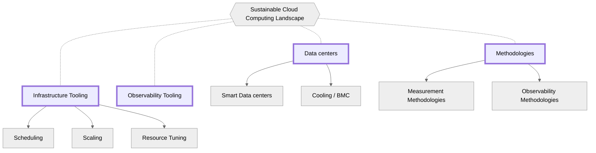
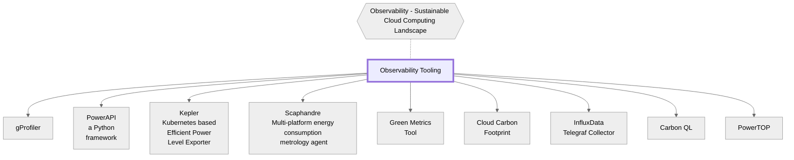
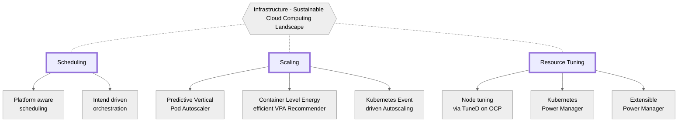

*Este documento fue publicado el 23.06. Somos conscientes de que este documento contiene vacios que se abordarán en futuras versiones. ¡Las contribuciones son muy bienvenidas!*

Todos los textos relevantes pueden encontrarse explicados aquí en el  [glossary](https://tag-env-sustainability.cncf.io/glossary/). Si falta algo, siéntase libre de enviar un PR para incluirlo.

## Resumen

<i class="fas fa-globe-asia mb-3"></i>[Lea la traducción Coreana de este documento aqui](/ko/landscape/).

La computación en la nube ha revolucionado la forma en que almacenamos y procesamos datos, permitiendo que las organizaciones sean más ágiles, eficientes y escalables. Sin embargo, a medida que las empresas transforman sus modelos de negocio para cumplir con los requisitos de sostenibilidad, también han surgido preocupaciones sobre la sostenibilidad ambiental en la computación en la nube. La huella de carbono de los servicios en la nube se han convertido en un tema de discusión, ya que indirectamente provoca enormes cantidades de emisiones debido a su consumo de energía. Como resultado, se ha vuelto imperativo cuantificar y reducir las emisiones de carbono asociadas con la computación en la nube para mitigar el impacto en el medio ambiente.

Cuantificar las emisiones de carbono operativas no es tan simple como implementar herramientas que otorguen visibilidad y rendición de cuentas.
Esto es especialmente cierto para la computación en la nube, ya que hay múltiples componentes de hardware encapsulados en un servidor, diferentes generaciones/arquitecturas/proveedores de hardware en la infraestructura de la nube, dependencias de los servicios, servicios que se ejecutan en entornos virtualizados/containerizados, controlador de ventilador/enfriamiento separado en el servidor, datos faltantes, telemetría y observabilidad, cargas de trabajo de IA/ML y cargas de trabajo confidenciales.
Estos desafíos hacen que sea difícil medir con precisión las emisiones de carbono asociadas con la computación en la nube.

En este documento técnico, exploramos los desafíos asociados con la cuenta de carbono y energía en la computación en la nube y brindamos información sobre las complejidades de cuantificar las emisiones de carbono en nubes públicas y privadas. Además, el documento explora los desafíos específicos del sector, como la industria de las telecomunicaciones.

## Tabla de Contenidos

- [Tabla de Contenidos](#tabla-de-contenidos)
- [Colaboradores](#colaboradores)
- [Fundamentos de Sistemas de la Nube Sostenible](#fundamentos-de-sistemas-de-la-nube-sostenible)
  - [Emisiones de Carbono de la Nube](#emisiones-de-carbono-de-la-nube)
  - [Computación Ecológica](#computación-ecológica)
  - [Cuantificación de Carbono/Energía](#cuantificación-de-carbonoenergía)
- [Desafíos de los Sistemas de Nube Sostenible](#desafíos-de-los-sistemas-de-nube-sostenible)
- [Desafíos de la Cuantificación de Carbono/Energía](#desafíos-de-la-cuantificación-de-carbonoenergía)
  - [Cuantificación de Emisiones de Carbono Operativas](#cuantificación-de-emisiones-de-carbono-operativas)
  - [Nubes](#nubes)
    - [Desafíos en las Nubes Públicas](#desafíos-en-las-nubes-públicas)
      - [Usuarios de Proveedores de Servicios en la Nube](#usuarios-de-proveedores-de-servicios-en-la-nube)
    - [Desafíos en las Nubes Privadas](#desafíos-en-las-nubes-privadas)
  - [Desafíos Específicos del Sector](#desafíos-específicos-del-sector)
    - [Telecomunicaciones](#telecomunicaciones)
    - [Finanzas](#finanzas)
  - [Desafíos Específicos de las Cargas de Trabajo](#desafíos-específicos-de-las-cargas-de-trabajo)
    - [AI/ML](#aiml)
- [Capas de las soluciones](#capas-de-las-soluciones)
- [Investigación y Desarrollo de la Industria Actual](#investigación-y-desarrollo-de-la-industria-actual)
  - [Medición del Consumo de Energía del Sistema en Tiempo de Ejecución](#medición-del-consumo-de-energía-del-sistema-en-tiempo-de-ejecución)
  - [Conservación de Energía y Reducción de Carbono](#conservación-de-energía-y-reducción-de-carbono)
    - [Ajuste, Escalado y Configuración](#ajuste-escalado-y-configuración)
  - [Arquitectura de Sistemas Verdes](#arquitectura-de-sistemas-verdes)
- [Panorama Actual de la Informática en la Nube Sostenible](#panorama-actual-de-la-informática-en-la-nube-sostenible)
  - [Centros de Datos](#centros-de-datos)
    - [Centros de Datos Inteligentes](#centros-de-datos-inteligentes)
    - [Refrigeración / BMC.](#refrigeración--bmc)
  - [Metodologías](#metodologías)
    - [Metodologías de Medición](#metodologías-de-medición)
    - [Metodologías de Observabilidad](#metodologías-de-observabilidad)
  - [Herramientas de Observabilidad](#herramientas-de-observabilidad)
  - [Herramientas de Infraestructura](#herramientas-de-infraestructura)
    - [Programación a Nivel de Clúster](#programación-a-nivel-de-clúster)
    - [Escalado](#escalado)
    - [Ajuste de la Gestión de Energía en el Nodo](#ajuste-de-la-gestión-de-energía-en-el-nodo)
- [Iniciativas de Sostenibilidad](#iniciativas-de-sostenibilidad)
  - [Organizaciones](#organizaciones)
  - [Conferencias](#conferencias)
  - [Informes de Emisiones de Carbono](#informes-de-emisiones-de-carbono)
  - [Neutralidad de Carbono / Cero Neto](#neutralidad-de-carbono--cero-neto)
  - [Análisis de Eficiencia de Lenguajes de Programación](#análisis-de-eficiencia-de-lenguajes-de-programación)

## Colaboradores

Un agradecimiento especial a nuestros colaboradores de este documento. Si estás interesado en mejorar y enriquecer el contenido, por favor presenta un PR en el repositorio y asegúrate de agregarte como colaborador a continuación.

<!-- cspell:disable-next-line -->
Huamin Chen, [Marlow Weston](https://github.com/catblade), [Niki Manoledaki](https://github.com/nikimanoledaki), Eun Kyung Lee, [Chen Wang](https://github.com/wangchen615), [Chris Lloyd-Jones](https://github.com/Sealjay),
[Parul Singh](https://github.com/husky-parul), [Przemysław Perycz](https://github.com/pperycz), [Christopher Cantalupo](https://github.com/cmcantalupo), [Patricia Cahill](https://github.com/patricia-cahill), [Jochen Joswig](https://github.com/by-d-sign), [Emily Fox](https://github.com/thefoxatwork), [Leonard Pahlke](https://github.com/leonardpahlke)

## Fundamentos de Sistemas de la Nube Sostenible

Los sistemas nativos de la nube sostenibles solo pueden construirse cuando existen tres fundamentos.
Estos fundamentos constituyen la base del diseño informado, la toma de decisiones y la rendición de cuentas en arquitecturas de nube y nativas en la nube.

### Emisiones de Carbono de la Nube

Las emisiones de carbono de los sistemas de Tecnología de la Información y Comunicación (abreviado: TIC) se categorizan y componen de la siguiente manera:

- **emisiones operativas**: la cantidad de carbono emitido durante la fase operativa o de uso de un sistema de TIC. Estas emisiones se deben principalmente a la quema de combustibles fósiles para generar la electricidad requerida por los mismos.
- **emisiones incorporadas**: la cantidad de carbono emitido durante la creación y disposición del hardware (abreviado: HW) y componentes físicos de un sistema de TIC (por ejemplo: dispositivos, servidores, cables, edificios, etc.). Las emisiones incorporadas también se conocen como emisiones integradas.

La nube y los sistemas nativos en la nube no son una excepción a las emisiones de carbono para garantizar una computación ambientalmente sostenible, ya que están firmemente bajo el paraguas de los sistemas de TIC.

### Computación Ecológica

La computación ecológica se refiere a la arquitectura y diseño de software y sistemas que supervisan y optimizan el consumo de recursos, reducen el impacto ambiental y mejoran la sostenibilidad, al tiempo que proporcionan servicios útiles a sus usuarios y partes interesadas.

### Cuantificación de Carbono/Energía

La cuantificación de carbono y energía se refiere a sistemas, servicios y metodologías para rastrear y contabilizar el consumo de carbono y energía.

## Desafíos de los Sistemas de Nube Sostenible

Los desafíos asociados con la construcción y mantenimiento de sistemas de nube sostenible aún se están descubriendo con la computación ecológica y la ccuantificación de carbono y energía como dos campos en desarrollo rápido con interés de una variedad de sectores industriales.
Anticipamos que se descubrirán más desafíos y soluciones a medida que aumente la adopción y madurez de estas tecnologías. Sin embargo, la siguiente sección intenta capturar los desafíos actuales en los fundamentos.
Un estándar popular para la Contabilidad de Carbono es el [Greenhouse Gas Protocol](https://ghgprotocol.org/) (abreviado: GHG protocol, GHGP).

## Desafíos de la cuantificación de Carbono/Energía

### Cuantificación de Emisiones de Carbono Operativas

La observabilidad en el rendimiento de las cargas de trabajo nativas en la nube ha ganado popularidad a medida que las organizaciones comprenden el valor de diversos puntos de datos de telemetría para aumentar la visibilidad y comprensión de cómo operan sus arquitecturas.
A medida que más organizaciones comienzan a considerar cómo alcanzar un valor similar en la utilización de recursos y el consumo de energía, están aprendiendo que cuantificar las emisiones de carbono operativas no es tan simple como implementar herramientas para visibilidad y rendición de cuentas.
Cuantificar las emisiones de carbono operativas no es trivial por varias razones, que no se limitan a las siguientes:

* Múltiples componentes de hardware (HW) encapsulados en un servidor : se requiere modelado de potencia para varios componentes de hardware (por ejemplo, CPU, memoria, GPU, almacenamiento, E/S) para una cuantificación/estimación precisa.
* El hardware (HW) es utilizado por múltiples usuarios/cuentas simultáneamente: el modelado de potencia por usuario diferente (por ejemplo, múltiples hilo(s) de software) es un problema totalmente diferente para el modelado. Un tema importante para entender aquí es [Proporcionalidad Energética](https://learn.greensoftware.foundation/energy-efficiency#energy-proportionality).
La interacción entre el software y el hardware debe entenderse bien para el un modelador poderoso.
* Diferentes generaciones/arquitecturas/proveedores de hardware en la infraestructura de la nube: se requiere modelado de potencia para diferentes generaciones/arquitecturas/proveedores, por ejemplo, Intel vs. AMD vs. ARM, Skylake vs. Sapphire Rapids, y ConnectX-5 vs. ConnectX-6.
* Dependencias de los servicios: un servicio puede utilizar diferentes servicios (por ejemplo, Kubernetes utiliza el servicio COS), las aplicaciones pueden estar distribuidas en varios centros de datos y nubes.
* Servicios que se ejecutan en entornos virtualizados/containerizados: se requiere modelado de potencia para entornos virtualizados/containerizados, lo que aumenta la complejidad del modelado.
* Controlador separado de ventiladores/refrigeración en el servidor: Los ventiladores y otros componentes de refrigeración suelen ser manejados por un controlador separado, lo que requiere modelado adicional.
* Datos faltantes: debido a la limitación de exponer datos internos en la nube, se prohíbe el acceso a los datos clave para calcular las emisiones operativas. A veces, los centros de datos locales (On-premise) carecen de tecnología de medición de energía.
* Telemetría y observabilidad: a menudo, un usuario utiliza múltiples componentes de hardware al mismo tiempo, por lo que la telemetría confiable y de alta granularidad se vuelve más importante. Sin embargo, el sobrecosto de la telemetría/observabilidad debe ser bajo en relación con los servicios que se ejecutan en el servidor/nube.
* Cargas de trabajo de IA/ML: el aumento dramático en el uso de cargas de trabajo de Inteligencia Artificial (IA)/Aprendizaje Automático (ML) conduce a una fuerte necesidad de clústeres dedicados basados en GPU. Las características de estas cargas de trabajo son diferentes a las de las cargas de trabajo tradicionales y su consumo de energía es significativamente más alto.
* Cargas de trabajo confidenciales: evolucionan desde casos de uso de máquinas virtuales a contenedores confidenciales (SGX/SEV/TDX), el TEE (Entorno de Ejecución Confiable).
También el uso de búferes de rebote/SWIOTLB podría costar más energía. Sin embargo, la carga de trabajo confidencial es difícil de observar debido a preocupaciones de seguridad.

Cuantificar las emisiones de carbono incorporadas también es muy desafiante ya que los detalles de fabricación (emisiones integradas) no se están incorporando en la información para una cuantificación holística por parte de los consumidores de tecnología fabricada.
Esto está fuera del alcance de este documento técnico, sin embargo, este Grupo de Trabajo alienta a los lectores interesados a sugerir orientaciones, mejores prácticas, métodos y mecanismos para cuantificar estas emisiones presentando un problema o solicitud de extracción en nuestro. [repositorio](https://github.com/cncf/tag-env-sustainability).
<!-- Quisieramos proporcionar algunas indicaciones sin embargo // +1, ¿se trata de orientación/mejores prácticas sobre métodos para cuantificar estas emisiones o guía sobre métodos para mitigar estas emisiones? -->

### Nubes

#### Desafíos en las Nubes Públicas

Los proveedores de nube pública, como AWS, Azure y GCP, a menudo son bastante restrictivos con los datos de consumo y emisión, ya que limitan las decisiones que los usuarios pueden tomar con respecto al acceso a métricas relacionadas con la sostenibilidad.
Las métricas relacionadas con la sostenibilidad incluyen puntos de datos como el consumo de energía, hardware, fuente de electricidad, PUE del centro de datos, etc.

Los proveedores intentan mantener sus costos, uso de energía y emisiones diarias bajos, pero la funcionalidad expuesta a los usuarios puede ser bastante limitada.
Esto probablemente se deba en parte al modelo de responsabilidad compartida en el que se basa la informática en la nube, que abstrae la complejidad operativa de las organizaciones que de otra manera serían responsables de ejecutar sus propios centros de datos.
<!--- Este enunciado necesita referencia: No confían en sus usuarios, ya que estos varían desde aficionados hasta experimentados. --->
Además, los desafíos de cuantificación previamente identificados también contribuyen en gran medida a dificultades adicionales para contabilizar los costos de carbono por parte de usuarios específicos, ya que la cuantificación de carbono puede llevar mucho más tiempo del que tienen los usuarios para conectar a tipos individuales de trabajos.
Los hiperescaladores mencionados anteriormente ofrecen información sobre las emisiones de carbono de los recursos en la nube a través de paneles de control de carbono o APIs.
Sin embargo, estos pueden ser bastante limitados y/o tener un considerable retraso temporal para que los datos de emisiones de carbono estén disponibles dentro de una ventana de tiempo aceptable para que los usuarios tomen medidas.
Además, las metodologías utilizadas para calcular las emisiones de carbono pueden variar entre proveedores de nube, lo que reduce la capacidad de un usuario para comparar entre proveedores.
Cómo se mide o estima esta información a menudo es opaco, inconsistente y sin consenso en la industria.
Como ocurre con la mayoría de las áreas de tecnología emergentes, la variación en las implementaciones subyacentes continuará hasta que la industria se centre en un esquema o marco colectivo tanto para medir como para expresar esas mediciones.

##### Usuarios de Proveedores de Servicios en la Nube

Los usuarios a menudo no son conscientes e inexpertos en cómo sus cargas de trabajo afectan la huella de carbono de su organización.
Aquellos que se preocupan por su impacto ambiental tienen dificultades para conectar sus cargas de trabajo individuales con sus costos de carbono.

#### Desafíos en las Nubes Privadas

Estas son nubes administradas por empresas o universidades para uso de los miembros de estos lugares.
Estas nubes suelen ser entornos más confiables, ya que los usuarios son responsables ante los administradores o la dirección de la nube en la que ejecutan sus cargas de trabajo.
Debido a los propósitos especiales de las nubes privadas, la sostenibilidad ambiental, la informática ecológica y la responsabilidad de las emisiones no están en primer plano en el diseño, operación o incluso en el gasto, lo que contribuye a desafíos adicionales únicos de las nubes privadas.
Estos todavía son desconocidos.

### Desafíos Específicos del Sector

#### Telecomunicaciones

Los clientes de las Telecomunicaciones (Telco) suelen ser exigentes debido a sus necesidades únicas para proporcionar servicios de alta confiabilidad y alta velocidad a sus clientes.
Las Telecomunicaciones necesitan que sus sistemas sean extremadamente estables y que el tráfico sea rápido y confiable.
Algunos sistemas se dejan completamente a plena potencia porque la modulación de energía puede afectar el tráfico y la tolerancia para esto es baja.
Construir sistemas que reduzcan la potencia sin que Telco tenga la seguridad de que no afectará su tráfico es un desafío.

#### Finanzas

Las finanzas pueden tener simulaciones en funcionamiento, fuera del horario laboral, y estas se parecerán a una carga de trabajo de IA/ML.
Sin embargo, para las transacciones y el tráfico rápido, las finanzas tienen momentos predecibles del día en los que se utilizan, cuando los mercados están activos.
Por esta razón, los ajustes de hora del día en la mayoría de los clústeres utilizados por las finanzas pueden ser limitados.
Sin embargo, los tiempos de transacción afectan dólares reales, por lo que la velocidad se priorizará en estos entornos sobre el uso de energía.
Para que este conjunto de clientes utilice opciones sostenibles, es necesario tener cuidado de limitar el impacto en su balance final.
Además, los requisitos de alta seguridad y regulación pueden aumentar la utilización y las emisiones de las cargas de trabajo financieras como resultado del aumento de registro, monitoreo y otros factores.

### Desafíos Específicos de las Cargas de Trabajo

#### AI/ML

Además de los desafíos identificados anteriormente, las cargas de trabajo de Inteligencia Artificial (IA) y Aprendizaje Automático (ML) existen ya sea como cómputo programable en un proveedor de servicios en la nube o dentro de un entorno de hardware dedicado.
En ambos casos, los clústeres de IA/ML a menudo tienen la complejidad adicional de las XPUs, o aceleradores.
Estos aceleradores requieren cantidades significativas de energía para funcionar, siendo requeridas por un orden de magnitud mayor que los chips de computadora regulares.
Además, algunas de las cargas de trabajo en estos clústeres no son sensibles al tiempo, por ejemplo, conjuntos de entrenamiento de información, y otras al tiempo, por ejemplo, trabajos de inferencia para sistemas de reconocimiento.

## Capas de las soluciones

Al considerar soluciones complementarias a los tres fundamentos de los sistemas de nube sostenible, podemos dividir las consideraciones de solución en tres áreas generales:

1. Qué centro de datos utilizar, si hay varias opciones disponibles.
2. Dónde colocar la carga de trabajo una vez que se elige un centro de datos.
3. Cómo gestionar los recursos en el nodo asignado para que una carga de trabajo se ejecute.

Todos estos elementos pueden ser investigados más a fondo de manera individual.

| Area               | Objetivo                                                                                                                                                                                                                                     | Esfuerzos                                |
| ------------------ | ---------------------------------------------------------------------------------------------------------------------------------------------------------------------------------------------------------------------------------------- | -------------------------------------- |
| Múltiples Centros de Datos | Elegir de manera inteligente en qué centro de datos programar según factores ambientales como si la región es alimentada por energías renovables, la Tasa de Emisiones Marginales de la región, la Eficiencia del Uso de Energía (PUE), la hora del día, etc. | Gestión de Clústeres                   |
| Dentro del Centro de Datos | Programación eficaz según la carga de trabajo, disponibilidad y urgencia de la carga de trabajo.                                                                                                                                                      | Gestión de energía, complemento del planificador de K8S |
| Dentro de un nodo      | Optimización de recursos para manejar las especificaciones de la carga de trabajo (que pueden incluir parámetros de rendimiento) al tiempo que se minimiza el consumo de recursos.                                                                                                  | Ajuste del nodo, Escalado de pods               |

## Investigación y Desarrollo de la Industria Actual

Hay varios desarrollos e investigación en curso en el campo de la informática sostenible.
Si conoces algunos que no están mencionados aquí, ¡nos encantaría que los contribuyeras!

### Medición del Consumo de Energía del Sistema en Tiempo de Ejecución

📗 [Una síntesis de temas e investigaciones hasta 2016](https://en.wikipedia.org/wiki/Run-time_estimation_of_system_and_sub-system_level_power_consumption)

### Conservación de Energía y Reducción de Carbono

#### Ajuste, Escalado y Configuración

En tiempo de ejecución, la energía consumida por las cargas de trabajo puede reducirse a nivel de hardware mediante el escalado basado en DVFS, a nivel de software mediante la sintonización de parámetros en tiempo de ejecución y reconfiguración, o a nivel de orquestación mediante la automatización de escalamiento a cero.

### Arquitectura de Sistemas Verdes

Los sistemas de hardware/software verdes mejoran la eficiencia de los subsistemas o cambian la forma en que se lleva a cabo la computación.

Por ejemplo, programas escritos en [lenguajes eficientes en energía.](https://haslab.github.io/SAFER/scp21.pdf) o que se ejecutan en [entornos de ejecución mas optimizados](https://hal.inria.fr/hal-03275286/document) are generally "greener".

Por otro lado, las arquitecturas que abordan la causa principal del desperdicio de energía, incluyendo el consumo en estado de reposo y la refrigeración de centros de datos, se consideran más amigables con el medio ambiente. Por ejemplo, el Aprendizaje Federado distribuye el entrenamiento de modelos a dispositivos que no requieren refrigeración costosa [evaluadas](https://www.cam.ac.uk/research/news/can-federated-learning-save-the-world) to reduce carbon footprint in aggregate.

## Panorama Actual de la Informática en la Nube Sostenible

El diagrama a continuación ilustra las dimensiones del panorama de la informática en la nube sostenible, que se describen en detalle en las secciones siguientes.



### Centros de Datos

#### Centros de Datos Inteligentes

* ECO-Qube es un sistema de gestión integral que tiene como objetivo mejorar la eficiencia energética y el rendimiento de enfriamiento al coordinar tanto los componentes de hardware como de software en aplicaciones de computación en el borde. [ECO-Qube](https://www.ecoqube.org)
* [Patchwork Kilt](https://openuk.uk/patchworkkilt/) - Un modelo para centros de datos sostenibles.
* [Open Compute Sustainability Project](https://www.opencompute.org/projects/sustainability) - Aprovechando la experiencia de la comunidad de OCP, ofrecemos un marco abierto y recursos para los miembros de OCP y la industria de centros de datos: proveedores, suministradores y usuarios finales, para implementar las mejores prácticas de la industria que promueven la reutilización y la circularidad.

#### Refrigeración / BMC

* 📰 🧊 Telemetría de refrigeración OCP [Mejorar la eficiencia de las instalaciones de refrigeración del centro de datos mediante telemetría de energía de la plataforma](https://www.opencompute.org/documents/ocp-wp-dcf-improve-data-center-cooling-facility-efficiency-through-platform-power-telemetryr1-0-final-update-pdf) <br>
Los operadores de centros de datos suelen sobredimensionar la capacidad de las instalaciones para asegurar un margen suficiente para satisfacer la demanda máxima. La sobreprovisión genera una gran presión sobre el costo total de propiedad (TCO) de los centros de datos.
Hoy en día, la pila de gestión de centros de datos se ha desplegado ampliamente para monitorear el estado de salud en tiempo de ejecución del centro de datos y ha recopilado toneladas de datos sobre energía, temperatura y utilización de recursos. Estos datos crean oportunidades para optimizar la eficiencia del centro de datos a través de la inteligencia de datos.
En este documento, presentamos nuestras prácticas en entornos de nube para utilizar la predicción de tendencias de energía para mejorar la eficiencia de refrigeración. Al mismo tiempo, este documento discute algunos desafíos clave y consideraciones de diseño mientras se habilita el control de instalaciones basado en datos de plataforma de TI en centros de datos a escala hipersónica, por ejemplo, la colección de telemetría, el mecanismo de mensajería y la API de gestión.
La interoperabilidad efectiva entre dispositivos de TI, instalaciones y sistemas de gestión es muy crítica para la implementación de la solución, y la adopción del diseño del Proyecto de Cómputo Abierto (OCP) y la API Redfish facilitan la integración a nivel de sistema y reducen los costos de implementación en diferentes sistemas y fabricantes.
* 🧊 Telemetría BMC [Exposición de datos del Controlador de Gestión de la Placa Base (BMC) en formato Prometheus.](https://github.com/gebn/bmc_exporter)

### Metodologías

#### Metodologías de Medición

* [Estándar de Intensidad de Carbono del Software (SCI)](https://github.com/Green-Software-Foundation/sci) - Una especificación que describe cómo calcular la intensidad de carbono de las aplicaciones de software.
* [Patrones de Software Verde](https://patterns.greensoftware.foundation/) - Una base de datos en línea de patrones de software de código abierto revisados y curados por la Fundación de Software Verde en una amplia gama de categorías.
* [Orientación SCI](https://sci-guide.greensoftware.foundation) - El proyecto de Orientación SCI detalla varios enfoques sobre cómo entender las diferentes metodologías disponibles para calcular la energía, la intensidad de carbono, las emisiones incorporadas y los valores de unidades funcionales, que son los componentes principales del cálculo de SCI.
* Estimación del consumo de energía del sistema en tiempo de ejecución [Estimación en tiempo de ejecución del consumo de energía a nivel de sistema y sub-sistema.](https://en.wikipedia.org/wiki/Run-time_estimation_of_system_and_sub-system_level_power_consumption)

#### Metodologías de Observabilidad

* 👀 Telemetría Abierta [Telemetría de alta calidad, ubicua y portátil para permitir una observabilidad efectiva.](https://opentelemetry.io/)<br>
Un proyecto en incubación de la CNCF diseñado para crear y recopilar datos de telemetría de servicios y software, y luego enviarlos a una variedad de herramientas de análisis. OpenTelemetry se integra con bibliotecas y marcos populares como Spring, ASP.NET Core, Express, Quarkus y otros.

### Herramientas de Observabilidad

El diagrama a continuación ilustra la dimensión de la infraestructura del panorama de la informática en la nube sostenible.



* 👀 gProfiler [Herramienta de perfilado de código del sistema operativo (OS) para visualizar secuencias de ejecución de aplicaciones y el uso de recursos hasta el nivel de línea de código.](https://docs.gprofiler.io/)<br>
gProfiler, es una plataforma gratuita, de autoservicio y de código abierto que permite a las empresas mejorar el rendimiento de las aplicaciones mediante el perfilado continuo, lo que a su vez reduce costos y minimiza la huella de carbono.
Los usuarios de Granulate pueden monitorear la reducción de emisiones de carbono en el tablero de gCenter, junto con las reducciones de costos y recursos, utilizando el Medidor de Ahorro de CO2.
* 👀 PowerAPI [Marco de trabajo en Python para construir medidores de energía definidos por software.](https://github.com/powerapi-ng/)<br>
PowerAPI es un conjunto de herramientas de middleware para construir medidores de energía definidos por software.
Los medidores de energía definidos por software son bibliotecas de software configurables que pueden estimar el consumo de energía del software en tiempo real.
PowerAPI admite la adquisición de métricas crudas de una amplia variedad de sensores (por ejemplo, medidores físicos, interfaces de procesador, contadores de hardware, contadores de sistema operativo) y la entrega de consumos de energía a través de diferentes canales (incluyendo sistema de archivos, red, web, gráfico).
Como conjunto de herramientas de middleware, PowerAPI ofrece la capacidad de ensamblar medidores de energía «à la carte» para adaptarse a los requisitos del usuario.
* 👀 [Exportador de Niveles de Energía Eficiente basado en Kubernetes:](https://github.com/sustainable-computing-io/kepler)<br>
Kepler aprovecha los programas eBPF para sondear el consumo de energía por contenedor relacionado con los contadores del sistema y exportarlos como métricas de Prometheus. Estas métricas ayudan a los usuarios finales a monitorear el consumo de energía de sus contenedores y ayudan a los administradores de clúster a tomar decisiones inteligentes para alcanzar sus objetivos de conservación de energía.
El [Servidor de Modelo Kepler](https://github.com/sustainable-computing-io/kepler-model-server) El Servidor de Modelo Kepler es un programa interno que proporciona a Kepler modelos de aprendizaje automático para estimar el consumo de energía en cargas de trabajo de Kubernetes.
El Servidor de Modelo Kepler preentrena sus modelos con estadísticas de energía de nodo (etiquetas) y contadores de rendimiento de nodo (características) como métricas de Prometheus en una variedad de clústeres y diferentes cargas de trabajo de Kubernetes.
Una vez que los modelos alcanzan un nivel de rendimiento aceptable, el Servidor de Modelo Kepler los exporta a través de rutas de flask y Kepler puede acceder a ellos para calcular métricas de consumo de energía por pod dados los contadores de rendimiento.
A diferencia de otros proyectos similares, el Servidor de Modelo Kepler también entrena y ajusta continuamente sus modelos preentrenados utilizando datos de nodo recopilados por los Agentes de Estimación de Energía de Kepler de los clústeres de clientes.
Esto le da a Kepler la capacidad de adaptar aún más sus capacidades de cálculo de consumo de energía de pod para servir a los sistemas únicos de los clientes.
* 👀 Scaphandre [Scaphandre](https://github.com/hubblo-org/scaphandre)<br>
Scaphandre es un agente de monitoreo multiplataforma dedicado a métricas de uso de energía y consumo de energía, junto con otros datos útiles para reducir los impactos del software de tecnologías de la información y comunicación (TIC).
* 👀 Herramienta de Métricas Verdes [Un marco integral para medir la energía / CO2 de su aplicación.](https://docs.green-coding.berlin/)
* 👀 [Colector InfluxData Telegraf](https://github.com/influxdata/telegraf) - un agente de código abierto basado en complementos para recopilar, procesar, agregar y escribir métricas. Incluye varios complementos de entrada que ayudan a determinar el consumo de energía, por ejemplo. [intel_powerstat](https://github.com/influxdata/telegraf/tree/master/plugins/inputs/intel_powerstat)
(expone el consumo de energía de la CPU y la DRAM, la temperatura de la CPU, TDP, las frecuencias de la CPU y del uncore, las residencias de C-State), [ipmi_sensor](https://github.com/influxdata/telegraf/tree/master/plugins/inputs/ipmi_sensor) (expone datos de sensores IPMI), [redfish](https://github.com/influxdata/telegraf/tree/master/plugins/inputs/redfish) (expone la temperatura de la CPU, la velocidad del ventilador, los datos de suministro de energía y voltaje tal como son expuestos por las [DMTF Redfish](https://redfish.dmtf.org/) interfaces), y un alto número de complementos que ayudan a determinar la utilización de recursos individuales que, a su vez, ayudan a identificar dónde se consume la energía. Un conjunto amplio de complementos de salida disponibles facilita la integración con diversos destinos de métricas.
* 👀 [Carbon QL](https://github.com/Green-Software-Foundation/carbon-ql) - El objetivo de este proyecto es construir una sola API, codificada como carbonQL, que se pueda utilizar para medir las emisiones de su software para cada entorno de ejecución.
* 👀 [Huella de Carbono en la Nube](https://www.cloudcarbonfootprint.org/docs/) <br>
Esta aplicación recopila datos de uso (cómputo, almacenamiento, redes, etc.) de importantes proveedores de servicios en la nube y calcula la energía estimada (en vatios-hora) y las emisiones de gases de efecto invernadero expresadas como equivalentes de dióxido de carbono (toneladas métricas de CO2e).
Mostramos estas visualizaciones en un panel de control para desarrolladores, líderes de sostenibilidad y otros interesados en una organización para ver y tomar medidas. Actualmente, admite AWS, Google Cloud y Microsoft Azure.
* 👀 [PowerTOP](https://github.com/fenrus75/powertop) - Una herramienta de Linux, que entre otras cosas te permite monitorizar el consumo de energía por proceso en ejecución en la máquina Linux.
* 📗 OSTI [Paper] [Métricas para evaluar técnicas de ahorro de energía para sistemas de HPC resilientes.](https://www.osti.gov/servlets/purl/1140455)
* 📗 [Carbon Aware SDK](https://github.com/Green-Software-Foundation/carbon-aware-sdk): El SDK Consciente del Carbono es una API web y una interfaz de línea de comandos (CLI) para ayudar en la construcción de software consciente del carbono.

### Herramientas de Infraestructura

El diagrama a continuación ilustra la dimensión de infraestructura del panorama de la informática en la nube sostenible.



#### Programación a Nivel de Clúster

En la fase de programación a nivel de clúster, la energía que consumirá la carga de trabajo puede reducirse mediante planificadores inteligentes que sean conscientes de la huella de carbono en un centro de datos, la temperatura térmica y la refrigeración, la conciencia de almacenamiento en caché o la eficiencia energética del servidor. La programación por lotes según los costos de energía (carbono, dinero, etc.) es una opción.

* 🚆 Programación y escalado impulsados por la energía con telemetría de CPU en Kubernetes. [Planificación y escalado impulsados por la energía con telemetría de CPU en Kubernetes.](https://github.com/intel/platform-aware-scheduling/tree/master/telemetry-aware-scheduling/docs/power) <br>
La programación consciente de la telemetría, una extensión de programación, y el Autoscaler de Pod Horizontal (HPA) nativo de Kubernetes se utilizan para habilitar la automatización del clúster basada en información en tiempo real sobre el estado actual del uso de energía en el nodo. Las métricas de energía utilizadas para impulsar decisiones de ubicación y escalado derivan del Límite de Potencia Promedio en Ejecución (RAPL) de Intel. [collectd](https://collectd.org/) se utiliza para recopilar las métricas y exponerlas a Prometheus, lo que las hace disponibles dentro del clúster utilizando el Adaptador de Prometheus.
* 🚆 [Orquestación Intencionalmente Impulsada](https://github.com/intel/intent-driven-orchestration) <br>
Otorga una nueva forma de orquestación al pasar de un modelo imperativo a un modelo impulsado por intenciones para elegir la ubicación de la carga de trabajo.
En este modelo, el usuario expresa sus intenciones en forma de objetivos (por ejemplo, objetivos de latencia requerida, rendimiento o confiabilidad) y la pila de orquestación misma determina qué recursos en la infraestructura son necesarios para cumplir los objetivos.
Este nuevo enfoque seguirá beneficiándose de las inversiones de la comunidad en programación (determinando cuándo y dónde colocar las cargas de trabajo) y se complementará con un bucle de planificación continua determinando qué y cómo configurar en el sistema.
Ya se está realizando un trabajo preliminar para aprovechar esto en un entorno de uso óptimo de energía.
* 📗 Planificador de Kubernetes consciente del carbono. [Un Planificador de Kubernetes de Bajo Carbono.](http://ceur-ws.org/Vol-2382/ICT4S2019_paper_28.pdf)
<!-- markdown-link-check-disable-next-line -->
* 📗 Planificación consciente de la energía. [Paper] [Mejorando la Eficiencia del Centro de Datos a través de una Programación Holística en Kubernetes.](https://www.researchgate.net/publication/333062266_Improving_Data_Center_Efficiency_Through_Holistic_Scheduling_In_Kubernetes)

#### Escalado

* 🚤 VPA Predictivo [Los recomendadores predictivos de Vertical Pod Autoscaler (VPA) pueden conectarse con el VPA predeterminado en OpenShift.](https://github.com/openshift/predictive-vpa-recommenders)
* 🚤 CLEVER [Recomendador de VPA Eficiente en Energía a Nivel de Contenedor para Kubernetes](https://github.com/sustainable-computing-io/clever):<br>
Los Autoscaladores de Pod Verticales en Kubernetes permiten el ajuste automático de las solicitudes y límites de CPU y memoria basado en mediciones históricas del uso de recursos.
Una implementación de VPA tiene tres componentes principales: el Recomendador de VPA, el Actualizador de VPA y el Controlador de Admisión de VPA.
Es posible reemplazar el Recomendador de VPA predeterminado con un Recomendador personalizado.
CLEVER, un recomendador inteligente, utiliza esta característica para garantizar que la calidad de servicio o el rendimiento de las cargas de trabajo no se vean comprometidos al intentar ajustar las frecuencias de CPU de su clúster.
Así es como funciona: suponga que tiene un ajustador de frecuencia implementado en su clúster para actualizar la frecuencia de las CPU según una métrica objetivo o un presupuesto de consumo de energía.
De manera intuitiva, cuando se reducen las frecuencias, se ahorra energía pero también disminuye el rendimiento de las cargas de trabajo.
Para contrarrestar esto, puede obtener información como el Estado del Clúster y las frecuencias de CPU de los nodos después de que se cambian las frecuencias.
CLEVER recalcula la nueva recomendación para las solicitudes de CPU de los pods gestionados por el VPA en función de las frecuencias de CPU actualizadas.
Así es como CLEVER garantiza una calidad de servicio similar para una carga de trabajo al reducir las frecuencias para reducir la energía, pero al mismo tiempo aumentar la asignación de CPU.
* 🚤 [KEDA](https://keda.sh/): El escalado automático basado en eventos de Kubernetes permite plataformas de escala a cero.

#### Ajuste de la Gestión de Energía en el Nodo

Una vez que se elige la región y el nodo, los administradores y usuarios pueden ajustar aún más el nodo para minimizar la cantidad de energía necesaria para ejecutar las cargas de trabajo. Esto puede reducir el consumo de energía en un 30% o más por nodo.

* 🎵 Ajuste de nodos a través de TuneD en OCP [Administrar el ajuste a nivel de nodo mediante la orquestación del demonio TuneD](https://docs.openshift.com/container-platform/4.10/scalability_and_performance/using-node-tuning-operator.html) <br>
El Operador de Ajuste de Nodo te ayuda a gestionar el ajuste a nivel de nodo al orquestar el demonio TuneD.
La mayoría de las aplicaciones de alto rendimiento requieren algún nivel de ajuste del kernel. El Operador de Ajuste de Nodo proporciona una interfaz de gestión unificada a los usuarios de sysctl a nivel de nodo y ofrece más flexibilidad para añadir ajustes personalizados especificados por las necesidades del usuario.
* 🎵 Administrador de Energía para Kubernetes [Operador de Kubernetes diseñado para exponer y utilizar tecnologías de gestión de energía específicas de Intel en un entorno de Kubernetes.](https://github.com/intel/kubernetes-power-manager) <br>
La asignación de recursos de CPU de un conjunto de plataformas en un motor de orquestación de contenedores como Kubernetes (K8s) se basa exclusivamente en la disponibilidad.
Para exponer y utilizar tecnologías de gestión de energía en un contexto de Kubernetes, el Kubernetes Power Manager es un operador de Kubernetes creado utilizando el SDK de Operador.
El Kubernetes Power Manager hace uso de un conjunto poderoso de tecnologías de gestión de energía que brindan a los usuarios un control más preciso sobre el rendimiento de la CPU y el uso de energía a nivel de núcleo.
Sin embargo, Kubernetes está diseñado específicamente para operar como una capa de abstracción entre la carga de trabajo y las capacidades de hardware como un orquestador de cargas de trabajo.
Los usuarios de Kubernetes que ejecutan aplicaciones críticas en rendimiento con requisitos particulares que dependen de las capacidades de hardware tienen un obstáculo como resultado de esto.
Al permitir al usuario ajustar las frecuencias y determinar el nivel de prioridad de los núcleos seleccionados por el Administrador de CPU Nativo de Kubernetes, el Kubernetes Power Manager llena la brecha entre la habilitación de características de hardware y la capa de orquestación de contenedores.
Se ha demostrado que funciona con TuneD también para permitir que se utilicen perfiles de TuneD para controlar la energía en los nodos según varios ajustes de frecuencia.
* 🎵 GEOPM [Administrador de energía extensible](https://geopm.github.io):<br>
Inicialmente específico para entornos de HPC, pero ahora más generalizado, el Global Extensible Open Power Manager (GEOPM) es un marco para explorar optimizaciones de energía y potencia en plataformas heterogéneas. <br>
El software GEOPM se divide en dos paquetes: el Servicio GEOPM y el Tiempo de Ejecución GEOPM. El Servicio GEOPM proporciona acceso de espacio de usuario a métricas de hardware de bajo nivel y perillas de configuración. El Tiempo de Ejecución GEOPM aprovecha el Servicio GEOPM para ajustar la configuración de hardware en reacción a métricas de hardware y comentarios de la aplicación. Los comentarios de la aplicación se recopilan a través de ganchos de perfilado asíncronos ligeros inyectados con devoluciones de llamada en paquetes de middleware. <br>
El Tiempo de Ejecución GEOPM tiene una arquitectura de complementos para seleccionar entre algoritmos de optimización. Algunos de los algoritmos integrados apuntan a la eficiencia energética, y otros optimizan el rendimiento dentro de un límite de energía.
La portabilidad de GEOPM a Kubernetes está en curso. Hay una [rama experimental](https://github.com/geopm/geopm/tree/cloud#experimental-branch) llamada ``cloud`` con implementaciones de nuevas características que admiten Kubernetes. Estas características se migrarán al la rama principal ``dev`` a medida que estén listas para producción.<br>
Se puede encontrar documentación adicional en el [archivo README del servicio](https://github.com/geopm/geopm/tree/cloud/service#kubernetes-support) y en el [directorio k8 de tiempo de ejecución](https://github.com/geopm/geopm/tree/cloud/k8).

<!--- ### HPC Specific Models --->

## Iniciativas de Sostenibilidad

Hay varias iniciativas de sostenibilidad en curso, si hemos omitido alguna, ¡contribuya a esta lista presentando un pull request!

### Organizaciones

* 🐝 Green Software Foundation [Construyendo un ecosistema de confianza de personas, estándares, herramientas y mejores prácticas para el software verde.](https://greensoftware.foundation/) <br>
  The Green Software Foundation (GSF) existe para cambiar la forma en que construimos software [para que no haya efectos ambientales dañinos](https://greensoftware.foundation/articles/theory-of-change), una fundación con más de 42 organizaciones miembro.
  Los pilares clave son Conocimiento, Cultura Tecnológica y Herramientas; los cuales se entregan a través de [estándares de grupo de trabajo](https://standards.greensoftware.foundation/), un [grupo de trabajo de código abierto](https://opensource.greensoftware.foundation/), un [grupo de trabajo de la comunidad](https://community.greensoftware.foundation/), y un [grupo de trabajo de políticas](https://policy.greensoftware.foundation/). <br>
  La GSF ha creado una [intensidad de carbono del software (SCI)](https://github.com/Green-Software-Foundation/software_carbon_intensity) norma, que ha sido presentada a la ISO (Organización Internacional de Normalización) para su ratificación, para asegurar que midamos el carbono de manera consistente. Esta norma se está implementando en código a través de [Carbon Aware SDK](https://github.com/Green-Software-Foundation/carbon-aware-sdk) (herramienta para hacer más cuando la red eléctrica es verde y menos cuando es contaminante), [Carbon Pipeline](https://github.com/Green-Software-Foundation/Carbon_CI_Pipeline_Tooling) (medir el carbono en el proceso de integración continua y entrega continua (CI/CD), y [CarbonQL](https://github.com/Green-Software-Foundation/carbon-ql) - una API estandarizada para medir el carbono de acuerdo con el estándar SCI.
* 🐝 [LF Energy](https://www.lfenergy.org/)<br>
  LF Energy es una fundación de código abierto centrada en el sector de los sistemas de energía, alojada dentro de The Linux Foundation. LF Energy proporciona una comunidad neutral y colaborativa para construir las inversiones digitales compartidas que transformarán la relación del mundo con la energía. Esta organización contiene los repositorios de la Fundación principal de LF Energy y muchos de los proyectos y grupos de trabajo alojados. Su panorama se puede encontrar [aqui](https://landscape.lfenergy.org/).
* 🐝 Grupo de Trabajo de Computación de Alto Rendimiento Eficiente en Energía [Grupo de Trabajo de Computación de Alto Rendimiento Eficiente en Energía](https://eehpcwg.llnl.gov/)<br>
  La misión es fomentar la implementación de medidas de conservación de energía, diseño eficiente en energía en la computación de alto rendimiento (HPC) y compartir ideas. Puede encontrar una amplia colección de documentos [aqui](https://datacenters.lbl.gov/resources?field_focus_areas_tid) que pueden ser
  extrapolados en términos de patrones para ser incorporados al panorama nativo de la nube.
* 🐝 [Entrenamiento en Software Verde](https://learn.greensoftware.foundation/) <br>
  Esta iniciativa te enseñará cómo construir, mantener y ejecutar aplicaciones más ecológicas independientemente del dominio de la aplicación, la industria, el tamaño o tipo de organización, lenguaje de programación o marco; llevando a una [Certificación de Software Verde](https://training.linuxfoundation.org/training/green-software-for-practitioners-lfc131/) respaldado por la Fundación Linux.
* 🐝 [Huella de Carbono en la Nube](https://www.cloudcarbonfootprint.org/)<br>
  Conoce la huella de carbono de tu uso de la nube y reduce la misma.<br>
  Cloud Carbon Footprint es una herramienta de código abierto que proporciona visibilidad y herramientas para medir, monitorear y reducir tus emisiones de carbono en la nube. Utilizamos metodologías de mejores prácticas para convertir la utilización de la nube en un uso de energía estimado y emisiones de carbono, produciendo métricas y estimaciones de ahorro de carbono que pueden ser compartidas con empleados, inversionistas y otros interesados.
* 🐝 [Proyecto de Cómputo Abierto](https://www.opencompute.org/projects/heat-reuse)<br>
  Casi el 100% de la energía utilizada en un procesador se convierte en calor. Hasta hace muy poco, esto ha sido un problema y un desafío: una inmensa cantidad de calor que debe ser eliminada y que requiere un gasto adicional significativo de energía. Con el diseño adecuado, los sistemas de enfriamiento de los centros de datos pueden convertirse en una fuente de calor y una oportunidad de gestión de calor que, a su vez, convierte el calor de un pasivo en un activo. El subgrupo de Reutilización de Calor de OCP explora estos desafíos y oportunidades. Su objetivo es sugerir soluciones para habilitar la implementación de tecnologías diseñadas para aprovechar el calor y convertir el costo en beneficio.```

### Conferencias

* 🐝 Linux Foundation's SustainabilityCon [La primera pista centrada en la sostenibilidad por parte de la Linux Foundation](https://events.linuxfoundation.org/open-source-summit-north-america/about/sustainabilitycon/)
* 🐝 [EnviroInfo](https://www.enviroinfo2023.eu/): EnviroInfo 2023 es la 37ª edición de la serie de conferencias internacionales e interdisciplinarias establecida y reconocida sobre tecnologías líderes en información y comunicación ambiental.

### Informes de Emisiones de Carbono

* 📄 IEA [Emisiones - Informe Global de Estado Energético y de CO2 2019](https://www.iea.org/reports/global-energy-co2-status-report-2019/emissions)
* 📄 European Environment Agency [Intensidad de Emisiones de Gases de Efecto Invernadero de la UE](https://www.eea.europa.eu/ims/greenhouse-gas-emission-intensity-of-1)
* 📄 electricityMap's [Datos de emisiones de CO2 en tiempo real](https://app.electricitymap.org)
* [SCI Reporting](https://github.com/Green-Software-Foundation/sci-reporting) - Creación de la infraestructura y procesos para almacenar, alojar y reportar públicamente puntajes de SCI y otros requisitos de informes relacionados dentro de la especificación de SCI.
* 📄 WattTime API [Proporciona información sobre la tasa de emisiones marginales de una red eléctrica](https://docs.watttime.org/#tag/Introduction)

### Neutralidad de Carbono / Cero Neto

* 🥬 The Climate Pledge [Carbono Neto Cero para el 2040](https://www.theclimatepledge.com/)
* 🥬 WeTransfer [WeTransfer se convierte en neutro en carbono](https://wetransfer.com/blog/story/breaking-the-climate-neutral-barrier/)
<!-- cspell:disable-next-line -->
* 🥬 Adrian Cockroft, ex-Amazon VP of Sustainability Architecture ["El nuevo enfoque del pionero en la informática en la nube está en la transformación hacia la sostenibilidad"](https://www.aboutamazon.com/news/sustainability/cloud-computing-pioneers-new-focus-is-on-sustainability-transformation)
* 🥬 Supercritical [Ayudando a las empresas a lograr el cero neto](https://gosupercritical.com/)

### Análisis de Eficiencia de Lenguajes de Programación

* 🔌 Energy Efficiency of Languages [El conjunto completo de herramientas para el análisis del consumo de energía de los lenguajes de programación, utilizando Computer Language Benchmark Game](https://github.com/greensoftwarelab/Energy-Languages)
