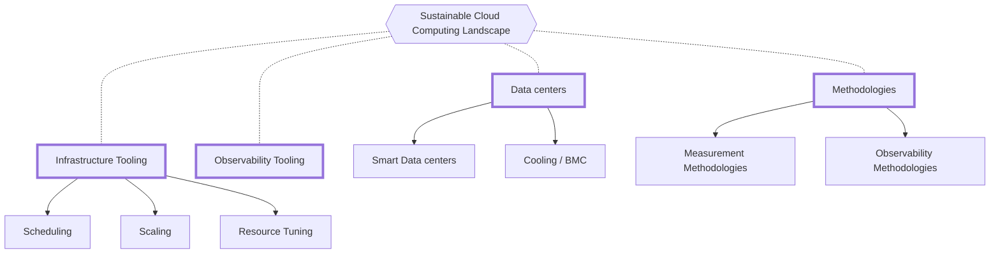
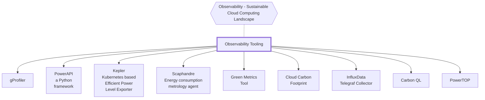
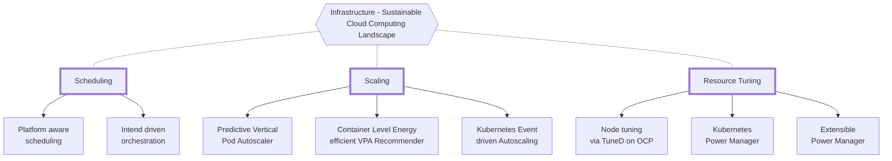

<i class="fas fa-globe-americas mb-3"></i>[Read the English translation of this document here](/landscape/).

이 문서는 클라우드 네이티브 환경 내에서 알려진 지속 가능성 노력과 진행 중인 노력을 파악하고 도전 과제를 설명합니다. 이 문서는 0.1 버전이며 향후 버전에서 해결될 미진한 부분이 포함되어 있습니다. 여러분의 의견을 환영합니다!
클라우드 컴퓨팅은 데이터를 저장하고 처리하는 방식을 혁신적으로 변화시켜 조직의 민첩성, 효율성, 확장성을 향상시켰습니다. 그러나 기업이 지속 가능성 요건을 충족하기 위해 비즈니스 모델을 혁신하면서 클라우드 컴퓨팅의 환경적 지속 가능성에 대한 우려도 커지고 있습니다. 클라우드 컴퓨팅은 에너지 소비로 인해 간접적으로 막대한 양의 탄소 배출을 유발하기 때문에 클라우드 컴퓨팅의 탄소 발자국이 논의의 주제가 되었습니다. 따라서 환경에 미치는 영향을 완화하기 위해 클라우드 컴퓨팅과 관련된 탄소 배출량을 정량화하고 줄이는 것이 필수적이 되었습니다.
운영 탄소 배출량을 정량화하는 것은 가시성과 관리 책임을 위한 도구를 배포하는 것만큼 간단하지 않습니다. 특히 클라우드 컴퓨팅의 경우 서버에 포함된 여러 하드웨어 구성 요소, 클라우드 인프라의 다양한 하드웨어 세대/아키텍처/공급업체, 서비스의 종속성, 가상화/컨테이너화된 환경에서 실행되는 서비스, 서버의 별도 팬/냉각 컨트롤러, 누락된 데이터, 원격 측정 및 가시성, AI/ML 워크로드, 기밀 워크로드 등이 존재하기 때문에 더욱 그러합니다. 이러한 문제로 인해 클라우드 컴퓨팅과 관련된 탄소 배출량을 정확하게 측정하기가 어렵습니다.
이 백서에서는 클라우드 컴퓨팅의 탄소 및 에너지 회계와 관련된 과제를 살펴보고 퍼블릭 및 프라이빗 클라우드에서 탄소 배출량을 정량화하는 데 따르는 복잡성에 대한 인사이트를 제공합니다. 또한 이 백서에서는 통신 산업과 같은 부문별 과제를 살펴봅니다.

<!-- markdown-link-check-disable -->
## 목차

- [기여자](#contributors)
- [지속 가능한 클라우드 시스템의 기초](#foundations-of-sustainable-cloud-systems)
- [지속 가능한 클라우드 시스템 구축의 과제](#challenges-of-sustainable-cloud-systems)
- [탄소/에너지 회계의 어려움](#challenges-of-carbonenergy-accounting)
- [솔루션 계층](#layers-of-the-solutions)
- [현재 업계 연구 및 개발](#current-industry-research-and-development)
- [현재 지속 가능한 클라우드 컴퓨팅 환경](#current-sustainable-cloud-computing-landscape)
- [지속 가능성 관련 활동](#sustainability-initiatives)

## 기여자   

<!-- markdown-link-check-enable -->

이 문서에 기여해주신 분들께 특별히 감사드립니다. 콘텐츠를 개선하고 강화하는 데 관심이 있으신 분은 저장소에 PR을 제출하고 아래에서 자신을 기여자로 추가해 주세요!

Huamin Chen, [Marlow Weston](https://github.com/catblade), [Niki Manoledaki](https://github.com/nikimanoledaki), Eun Kyung Lee, [Chen Wang](https://github.com/wangchen615), [Chris Lloyd-Jones](https://github.com/Sealjay), [Parul Singh](https://github.com/husky-parul), [Przemysław Perycz](https://github.com/pperycz), [Christopher Cantalupo](https://github.com/cmcantalupo), [Patricia Cahill](https://github.com/patricia-cahill), [Jochen Joswig](https://github.com/by-d-sign), [Emily Fox](https://github.com/thefoxatwork), [Leonard Pahlke](https://github.com/leonardpahlke)\

## 지속 가능한 클라우드 시스템의 기초  

지속 가능한 클라우드 및 클라우드 네이티브 시스템은 세 가지 기반이 존재할 때만 구축할 수 있습니다. 이러한 기반은 클라우드 및 클라우드 네이티브 아키텍처에서 정보에 입각한 설계, 의사 결정, 책임의 기초를 형성합니다.

### 클라우드의 탄소 배출량&#x20;

정보 및 통신 기술(약칭: ICT) 시스템의 탄소 배출량은 다음과 같이 분류되고 구성됩니다:

* **운영 배출량:** ICT 시스템의 운영 또는 사용 단계에서 배출되는 탄소 배출량입니다. 이러한 배출은 대부분 이러한 시스템에 필요한 전기를 생산하기 위한 화석 연료의 연소로 인해 발생합니다.
* **내재된 배출량:** ICT 시스템의 하드웨어(약칭: HW) 및 물리적 구성 요소(예: 디바이스, 서버, 케이블, 건물 등)의 생성 및 폐기 과정에서 배출되는 탄소량입니다. 내재화된 배출은 임베디드 배출이라고도 합니다.

클라우드 및 클라우드 네이티브 시스템도 ICT 시스템의 범주에 속하기 때문에 환경적으로 지속 가능한 컴퓨팅을 보장하기 위한 탄소 배출량 산정에서 예외가 될 수 없습니다.

### 그린 컴퓨팅&#x20;

그린 컴퓨팅은 리소스 소비를 모니터링 및 최적화하고, 환경에 미치는 영향을 줄이며, 지속 가능성을 개선하는 동시에 사용자와 이해관계자에게 유용한 서비스를 제공하는 소프트웨어 및 시스템의 아키텍처와 설계를 말합니다.

### 탄소/에너지 회계&#x20;

탄소 및 에너지 회계는 탄소 및 에너지 소비를 추적하고 설명하기 위한 시스템, 서비스 및 방법론을 말합니다.

<!-- markdown-link-check-disable-next-line -->
## 지속 가능한 클라우드 시스템 구축의 과제  

그린 컴퓨팅과 탄소 및 에너지 회계는 다양한 산업 분야에서 관심을 갖고 빠르게 발전하는 분야로, 지속 가능한 클라우드 시스템의 구축 및 유지 관리와 관련된 과제는 여전히 밝혀지고 있습니다. 이러한 기술의 도입과 성숙도가 높아짐에 따라 더 많은 과제와 해결책이 발견될 것으로 예상됩니다. 그러나 아래 섹션에서는 두 기반 전반에 걸쳐 현재 직면한 과제를 파악하려고 합니다. 탄소 회계에 널리 사용되는 표준은 [온실가스 프로토콜(](https://ghgprotocol.org/)약칭: 온실가스 프로토콜, GHGP)입니다.

<!-- markdown-link-check-disable-next-line -->
## 탄소/에너지 회계의 어려움 

### 운영 탄소 배출량 정량화

클라우드 네이티브 워크로드의 성능에 대한 관찰 가능성은 조직이 아키텍처가 어떻게 운영되고 있는지에 대한 가시성과 이해를 높이기 위해 다양한 텔레메트리 데이터 항목에 대한 가치를 알게 되면서 인기가 높아졌습니다. 더 많은 조직이 리소스 활용과 에너지 소비에서 실질적인 가치를 달성하는 방법을 고려하기 시작하면서, 운영 탄소 배출량을 정량화하는 것이 가시성과 책임성을 위한 도구를 배포하는 것만큼 간단하지 않다는 사실을 깨닫고 있습니다. 운영 탄소 배출량을 정량화하는 것은 다음과 같은 여러 가지 이유로 쉽지 않습니다:

* 서버에 포함된 여러 하드웨어(HW) 구성 요소 - 정확한 정량화/추정을 위해 다양한 HW 구성 요소(예: CPU, 메모리, GPU, 스토리지, I/O)에 대한 전력 모델링이 필요합니다.
* HW는 여러 사용자/계정이 동시에 사용하므로 사용자별(예: 멀티 소프트웨어 스레드) 전력 모델링은 완전히 다른 문제입니다. 여기서 이해해야 할 중요한 문제는 [에너지 비례성(Energy Proportionality)](https://learn.greensoftware.foundation/energy-efficiency/#energy-proportionality)입니다. 전력 모델링을 위해서는 SW/HW 상호 작용을 잘 이해해야 합니다.
* 클라우드 인프라의 다양한 세대/아키텍처/공급업체 - Intel vs. AMD vs. ARM, Skylake vs. Sapphire Rapids, and ConnectX-5 vs. ConnectX-6 등 다양한 세대/아키텍처/공급업체에 대한 전력 모델링이 필요합니다.
* 서비스의 종속성 - 서비스마다 다른 서비스를 사용할 수 도 있습니다. (예: 쿠버네티스는 COS 서비스를 사용함) 애플리케이션이 데이터센터와 클라우드에 분산되어 있을 수 있습니다.
* 가상화/컨테이너화된 환경에서 실행되는 서비스 - 가상화/컨테이너화된 환경에는 전력 모델링이 필요하므로 모델링의 복잡성이 증가합니다.
* 서버에 별도의 팬/냉각 컨트롤러가 있는 경우 - 팬 및 기타 냉각 구성 요소는 별도의 컨트롤러로 제어되는 경우가 많으므로 추가적인 모델링이 필요합니다.
* 누락된 데이터 - 클라우드의 내부 데이터 노출 제한으로 인해 운영 배출량 계산을 위한 주요 데이터에 대한 액세스가 금지됩니다. 온프레미스(On-premise) 데이터 센터에는 전력 측정 기술이 부족한 경우가 있습니다.
* 텔레메트리 및 관측 가능성 - 사용자가 여러 HW를 동시에 사용하는 경우가 많기 때문에 신뢰할 수 있고 세분화된 텔레메트리가 더욱 중요해집니다. 그러나 서버/클라우드에서 실행되는 서비스에 비해 텔레메트리/관측 가능성 오버헤드가 낮아야 합니다.
* AI/ML 워크로드 - 인공지능(AI)/머신러닝(ML) 워크로드 사용이 급격히 증가함에 따라 전용 GPU 기반 클러스터의 필요성이 커지고 있습니다. 이러한 워크로드의 특성은 기존 워크로드와 다르며 전력 소비량이 훨씬 높습니다.
* 기밀 워크로드 - VM 사용 사례를 통해서 확인한 결과 기밀 컨테이너(SGX/SEV/TDX)로 발전하고, TEE(신뢰할 수 있는 실행 환경)를 사용하면서, bounce buffer/SWIOTLB를 사용하면 에너지 비용이 더 많이 들 수 있습니다. 그러나 기밀 워크로드는 보안에 대한 우려로 인해 관찰하기 어렵습니다.

제조 세부 정보('내재된 배출량')가 제조 기술 소비자의 전체적 정량화를 위한 정보에 통합되지 않기 때문에 내재된 탄소 배출량을 정량화하는 것도 매우 어렵습니다. 이는 이 백서의 범위를 벗어나는 것이지만, 관심 있는 독자는 이 [TAG 저장소](https://github.com/cncf/tag-env-sustainability)에 이슈 또는 PR을 제출하여 이러한 배출량을 정량화하기 위한 지침, 모범 사례, 방법, 메커니즘을 제안해 주시기 바랍니다.

<figure><figcaption>
<a href="https://learn.greensoftware.foundation/energy-efficiency/#energy-proportionality">에너지 비례성(Energy Proportionality)</a>
</figcaption></figure>

### 클라우드&#x20;

#### 퍼블릭 클라우드의 과제

AWS, Azure, GCP와 같은 퍼블릭 클라우드 제공업체는 사용자가 지속 가능성 관련 메트릭에 액세스하는 것과 관련하여 내릴 수 있는 결정을 제한하기 때문에 소비 및 배출 데이터를 상당히 제한적으로 제공하는 경우가 많습니다. 지속 가능성 관련 지표에는 에너지 소비량, 하드웨어, 전원, 데이터 센터 PUE 등과 같은 데이터 포인트가 포함됩니다.

제공업체는 일상적인 비용, 에너지 사용량 및 배출량을 낮추기 위해 노력하지만 사용자에게 노출되는 기능은 상당히 제한적일 수 있습니다. 이는 부분적으로는 클라우드 컴퓨팅이 설계된 공유 책임 모델에 기인하는 것으로, 조직이 자체 데이터 센터를 운영할 때 책임져야 할 운영상의 복잡성을 줄여줍니다.

또한, 앞서 언급한 정량화 문제는 특정 사용자의 탄소 비용을 계산하는 데 더 큰 어려움을 야기하는데, 탄소 계산은 사용자가 개별 작업 유형에 연결해야 하는 것보다 훨씬 더 오래 걸릴 수 있기 때문입니다. 위에서 언급한 하이퍼스케일러는 탄소 대시보드 또는 API를 통해 클라우드 리소스의 탄소 배출량에 대한 인사이트를 제공합니다. 그러나 이러한 방법은 매우 제한적이거나 사용자가 조치를 취할 수 있는 시간 내에 탄소 배출량 데이터를 사용할 수 있게 되기까지 상당한 시간 지연이 발생할 수 있습니다. 또한 탄소 배출량 계산에 사용되는 방법론이 클라우드 제공업체마다 다를 수 있으므로 사용자가 제공업체를 비교할 수 있는 능력이 떨어집니다. 이러한 정보를 측정하거나 추정하는 방법은 종종 모호하고 일관성이 없으며 업계 합의가 없는 경우가 많습니다. 대부분의 신흥 기술 분야와 마찬가지로, 업계가 이러한 배출량을 측정하고 표현하기 위한 공동의 스키마 또는 프레임워크를 중심으로 움직일 때까지 근본적인 구현의 다양성은 계속될 것입니다.

#### 클라우드 서비스 제공업체의 사용자

사용자는 자신의 워크로드가 조직의 탄소 발자국에 어떤 영향을 미치는지 인식하지 못하고 경험이 부족한 경우가 많습니다. 환경에 미치는 영향에 관심이 있는 사용자들도 개별 워크로드를 탄소 비용과 연결하는 데 어려움을 겪습니다.

#### 프라이빗 클라우드의 과제

프라이빗 클라우드는 특정 회사나 대학에서 해당 회사나 대학의 구성원만 사용할 수 있도록 운영하는 클라우드입니다. 이러한 클라우드는 사용자가 워크로드를 실행하는 클라우드의 관리자 또는 관리자에게 책임을 지도록 하기 때문에 더 신뢰할 수 있는 환경인 경우가 많습니다. 프라이빗 클라우드의 특수한 목적으로 인해 환경 지속 가능성, 그린 컴퓨팅, 배출량에 대한 책임은 설계, 운영, 심지어 비용에 있어서도 최우선 순위가 아니기 때문에 프라이빗 클라우드만의 또 다른 과제를 안고 있습니다. 이러한 문제는 아직 해결되지 않았습니다.

### 업종별 과제&#x20;

#### 통신(Telco)

통신 고객은 고객에게 높은 안정성과 빠른 속도의 서비스를 제공해야 하는 고유한 요구 사항으로 인해 까다로운 경우가 많습니다. 통신사는 시스템이 매우 안정적이어야 하고 트래픽이 빠르고 안정적이어야 합니다. 일부 시스템은 전력 변조가 트래픽에 영향을 미칠 수 있고 이에 대한 허용 오차가 낮기 때문에 완전히 최대 전력으로 유지됩니다. 통신사가 트래픽에 영향을 미치지 않을 것이라고 확신하는 전력을 줄이는 시스템을 구축하는 것은 어려운 일입니다.

#### 금융(Finance)

금융 분야에서는 업무 외 시간에 시뮬레이션을 실행할 수 있으며, 이러한 시뮬레이션은 AI/ML 워크로드처럼 보일 수 있습니다. 그러나 트랜잭션과 빠른 트래픽의 경우, 금융 분야는 예측 가능한 사용 시간대(시장 개장 시간대)가 있습니다. 따라서 금융에서 운영하는 대부분의 클러스터에 대한 시간대 조정은 제한적일 수 있습니다. 그러나 거래 시간은 실제 금액에 영향을 미치므로 이러한 환경에서는 전력 사용량보다 빠른 속도가 우선시됩니다. 이러한 고객들이 지속 가능한 옵션을 사용하도록 하려면 수익에 미치는 영향을 제한하는 데 주의를 기울여야 합니다. 추가적인 고도의 보안 및 규제 요건은 로깅, 모니터링 및 기타 요인의 증가로 인해 금융 워크로드의 사용률과 탄소 배출량을 증가시킬 수 있습니다.

### 워크로드별 과제&#x20;

#### AI/ML&#x20;

위에서 파악한 과제 외에도 인공 지능(AI) 및 머신 러닝(ML) 워크로드는 클라우드 서비스 제공업체에서 스케줄링 가능한 컴퓨팅으로 존재하거나 베어메탈 환경 내에 존재합니다. 두 경우 모두 AI/Ml 클러스터에는 XPU 또는 가속기의 복잡성이 추가되는 경우가 많습니다. 이러한 가속기는 실행하는 데 상당한 양의 전력이 필요하며, 일반 컴퓨터 칩보다 훨씬 더 많은 전력을 필요로 합니다. 또한 이러한 클러스터의 일부 워크로드(예: 정보 집합 학습, training sets of information)는 시간에 민감하지 않은 반면, 인식 시스템의 추론 작업(inference jobs for recognition systems)과 같이 시간에 민감한 워크로드도 있습니다.

<!-- markdown-link-check-disable-next-line -->
## 솔루션 계층  

지속 가능한 클라우드 시스템의 세 가지 토대를 보완하는 솔루션을 고려할 때 고려해야 할 사항을 세 가지 일반적인 영역으로 나눌 수 있습니다:

1. 사용할 수 있는 옵션이 여러 개 있는 경우 어떤 데이터센터를 사용할지에 대해서&#x20;
2. 데이터 센터를 선택한 후 워크로드를 어디에 배치할지에 대해서
3. 워크로드를 실행하기 위해 할당된 노드에서 리소스를 관리하는 방법

이러한 모든 요소는 개별적으로 더 자세히 조사하면 다음과 같습니다.&#x20;

<table><thead><tr><th width="166">범위</th><th width="417.3333333333333">목표</th><th>필요 요건</th></tr></thead><tbody><tr><td>멀티 데이터 센터</td><td>해당 지역의 재생 에너지 사용 여부, 해당 지역의 한계 배출량, 전력 사용 효율성(PUE, Power Usage Effectiveness), 시간대 등과 같은 환경적 요인에 따라 예약할 데이터 센터를 지능적으로 선택</td><td>클러스터 관리</td></tr><tr><td>데이터 센터</td><td>워크로드의 가용성,긴급성에 따라 효율적으로 스케줄링</td><td>전원 관리, K8S 스케줄러 플러그인</td></tr><tr><td>노드</td><td>리소스 소비를 최소화하면서 워크로드 사양(성능 매개변수 포함)을 처리할 수 있도록 리소스 최적화</td><td>노드 튜닝, 파드 스케일링</td></tr></tbody></table>

<!-- markdown-link-check-disable-next-line -->
## 현재 업계 연구 및 개발  

지속 가능한 컴퓨팅 분야에는 수많은 개발과 연구가 진행 중입니다. 여기에 소개되지 않은 것을 알고 계신다면 기고해 주시면 감사하겠습니다!

### 런타임 시스템 전력 측정&#x20;

:green_book: [2016년까지의 주제와 연구를 요약](https://en.wikipedia.org/wiki/Run-time_estimation_of_system_and_sub-system_level_power_consumption)

### 에너지 절약 및 탄소 저감&#x20;

#### 튜닝, 확장 및 구성&#x20;

런타임 시 워크로드에 의해 소비되는 에너지는 HW 수준에서 DVFS 기반 스케일링을 통해, SW 수준에서 런타임 파라미터 튜닝 및 재구성을 통해, 또는 오케스트레이션 수준에서 스케일 투 제로 자동화를 통해 줄일 수 있습니다.

### 그린 시스템 아키텍처&#x20;

그린 HW/SW 시스템은 하위 시스템 효율성을 개선하거나 계산 수행 방식을 변경합니다.

예를 들어, [에너지 효율적인 언어](https://haslab.github.io/SAFER/scp21.pdf)로 작성되거나 보다 [최적화된 런타임](https://inria.hal.science/hal-03275286/document)에서 실행되는 프로그램은 일반적으로 "환경친화적"입니다.

반면, 유휴 전력 및 데이터센터 냉각 등은 환경 친화적인 아키택처로 에너지 낭비의 근본 원인을 해결하는 것으로 평가됩니다. 예를 들어, 페더레이션 학습은 값비싼 냉각이 필요하지 않은 기기에 모델 학습을 확산하여 탄소 발자국을 총체적으로 줄이는 것으로 [평가](https://www.cam.ac.uk/research/news/can-federated-learning-save-the-world)됩니다.

<!-- markdown-link-check-disable-next-line -->
## 현재 지속 가능한 클라우드 컴퓨팅 환경  

아래 다이어그램은 지속 가능한 클라우드 컴퓨팅 환경의 차원을 보여주며, 다음 섹션에서 자세히 설명합니다.

### 데이터 센터

#### 스마트 데이터 센터

[ECO-Qube](https://www.ecoqube.org)- 엣지 컴퓨팅 애플리케이션의 하드웨어 및 소프트웨어 구성 요소를 모두 조율하여 에너지 효율성과 냉각 성능을 향상시키는 것을 목표로 하는 종합적인 관리 시스템

[Patchwork Kilt](https://openuk.uk/patchworkkilt/) - 지속 가능한 데이터 센터를 위한 청사진

[Open Compute Sustainability Project](https://www.opencompute.org/projects/sustainability)- OCP 커뮤니티의 전문성을 활용하여 재사용성과 순환성을 촉진하는 업계 모범 사례를 배포할 수 있도록 OCP 회원사 및 데이터센터 업계(벤더, 공급업체, 최종 사용자)를 위한 개방형 프레임워크와 리소스를 제공

#### 냉각 / BMC

:newspaper: :ice_cube: OCP 냉각 텔레메트리는 [플랫폼 파워 텔레메트리를 통해 데이터센터 냉각 시설 효율성 향상시킴](https://www.opencompute.org/documents/ocp-wp-dcf-improve-data-center-cooling-facility-efficiency-through-platform-power-telemetryr1-0-final-update-pdf)

데이터센터 운영자는 일반적으로 피크 수요를 충족할 수 있는 충분한 버퍼를 확보하기 위해 시설 용량을 과도하게 프로비저닝합니다. 과도한 프로비저닝은 데이터센터의 총소유비용(TCO)에 큰 부담을 줍니다. 오늘날 데이터센터 관리 스택은 데이터센터 런타임 상태 모니터링을 위해 널리 배포되어 전력, 온도, 리소스 사용률 전반에 걸쳐 수많은 데이터를 수집합니다. 이러한 데이터는 데이터 인텔리전스를 통해 데이터센터 효율성을 최적화할 수 있는 기회를 창출합니다. 이 백서에서는 클라우드 환경에서 전력 추세 예측을 사용하여 냉각 효율을 개선한 사례를 소개했습니다. 한편, 이 백서에서는 하이퍼스케일 데이터센터에서 IT 플랫폼 데이터 기반 시설 제어를 구현할 때 원격 측정 수집, 메시징 메커니즘, 관리 API 등 몇 가지 주요 과제와 설계 고려 사항에 대해 설명했습니다. 솔루션 배포를 위해서는 IT 장치, 시설 및 관리 시스템 간의 효과적인 상호 운용성이 매우 중요하며, 오픈 컴퓨트 프로젝트 설계와 Redfish API를 채택하면 시스템 수준 통합이 쉬워지고 다양한 시스템과 다양한 제조업체에 대한 배포 비용을 절감할 수 있습니다.

:ice_cube: BMC 텔레메트리는 [베이스보드 관리 컨트롤러(BMC, Baseboard Management Controller) 데이터를 Prometheus 형식으로 노출](https://github.com/gebn/bmc_exporter)

### 방법론

#### 측정 방법론

[소프트웨어 탄소 집약도(SCI, Software Carbon Intensity ) 표준](https://github.com/Green-Software-Foundation/sci) - 소프트웨어 애플리케이션의 탄소 집약도를 계산하는 방법을 설명하는 사양입니다.

[그린 소프트웨어 패턴](https://patterns.greensoftware.foundation/) - 그린 소프트웨어 재단에서 다양한 범주에 걸쳐 검토하고 선별한 소프트웨어 패턴의 온라인 오픈 소스 데이터베이스입니다.

[SCI 지침](https://sci-guide.greensoftware.foundation)- SCI 지침 프로젝트는 SCI 계산의 핵심 구성 요소인 에너지, 탄소 집약도, 구체화된 배출량 및 기능 단위값을 계산하는 데 사용할 수 있는 다양한 방법론을 이해하는 방법에 대한 다양한 접근 방식을 자세히 설명합니다.

런타임(Runtime) - 시스템 전력 소비량 추정 런타임을 통해 [시스템 및 하위 시스템 수준의 전력 소비량에 대한 런타임 예측](https://en.wikipedia.org/wiki/Run-time_estimation_of_system_and_sub-system_level_power_consumption)

#### 관측 가능성 방법론 &#x20;

:eyes: OpenTelemetry는 [효과적인 통합 가시성을 지원하는 고품질, 유비쿼터스, 포터블 텔레메트리](https://opentelemetry.io/)입니다.

OpenTelemetry CNCF 인큐베이팅 프로젝트는 서비스 및 소프트웨어에서 원격 분석 데이터를 생성 및 수집한 다음 이를 다양한 분석 도구로 전달하도록 설계되었습니다. OpenTelemetry는 Spring, ASP.NET Core, Express, Quarkus 등과 같은 널리 사용되는 라이브러리 및 프레임워크와 통합됩니다.

### 관측 가능성 도구&#x20;

아래 다이어그램은 지속 가능한 클라우드 컴퓨팅 환경의 인프라 부문을 보여줍니다.

:eyes: [gProfiler](https://docs.gprofiler.io/) - 애플리케이션의 실행 순서와 리소스 사용량을 코드 수준까지 시각화하는 OS 코드 프로파일링 도구&#x20;

무료 셀프 서비스 오픈 소스인 gProfiler는 기업이 지속적인 프로파일링을 통해 애플리케이션 성능을 개선하여 비용을 절감하고 탄소 발자국을 최소화할 수 있도록 지원합니다. 세분화된 사용자는 CO2 절감량 측정기를 통해 비용 및 리소스 절감과 함께 gCenter 대시보드에서 탄소 배출량 감소를 모니터링할 수 있습니다.

:eyes: [PowerAPI Python 프레임워크](https://github.com/powerapi-ng/) - 소프트웨어 정의 전력 측정기 PowerAPI는 소프트웨어 정의 전력계를 구축하기 위한 미들웨어 툴킷입니다. 소프트웨어 정의 전력 측정기는 소프트웨어의 전력 소비를 실시간으로 추정할 수 있는 구성 가능한 소프트웨어 라이브러리입니다. PowerAPI는 다양한 센서(예: 물리적 측정기, 프로세서 인터페이스, 하드웨어 카운터, OS 카운터)에서 원시 메트릭을 수집하고 다양한 채널(파일 시스템, 네트워크, 웹, 그래픽 포함)을 통해 전력 소비량을 전달할 수 있도록 지원합니다. 미들웨어 툴킷인 PowerAPI는 사용자 요구 사항을 수용하기 위해 전력 측정기를 "단품(à la carte)"으로 조립할 수 있는 기능을 제공합니다.

:eyes: [Kepler](https://github.com/sustainable-computing-io/kepler) - Kubernetes 기반의 효율적인 전력 레벨 익스포터: Kepler는 eBPF 프로그램을 활용하여 시스템 카운터와 관련된 컨테이너별 에너지 소비를 조사하고 이를 Prometheus 메트릭으로 내보냅니다. 이러한 메트릭은 최종 사용자가 컨테이너의 에너지 소비를 모니터링하고 클러스터 관리자가 에너지 절약 목표를 달성하기 위한 현명한 결정을 내리는 데 도움이 됩니다. [Kepler 모델 서버](https://github.com/sustainable-computing-io/kepler-model-server)는 Kepler에 Kubernetes 워크로드의 전력 소비를 추정하기 위한 ML 모델을 제공하는 내부 프로그램입니다. Kepler 모델 서버는 노드 에너지 통계(레이블) 및 노드 성능 카운터(기능)를 다양한 Kubernetes 클러스터 및 워크로드에 대한 Prometheus 메트릭으로 사용하여 모델을 사전 학습합니다. 모델이 허용 가능한 성능 수준에 도달하면, Kepler 모델 서버는 플라스크 경로를 통해 모델을 내보내고, Kepler는 이 모델에 액세스하여 포드별 성능 카운터가 주어진 포드별 에너지 소비 메트릭을 계산할 수 있습니다. 다른 유사한 프로젝트와 달리, Kepler 모델 서버는 Kepler의 전력 추정 에이전트가 클라이언트 클러스터에서 스크랩한 노드 데이터를 사용하여 사전 학습된 모델을 지속적으로 학습하고 튜닝합니다. 이를 통해 Kepler는 고객의 고유한 시스템에 맞게 포드 에너지 소비량 계산 기능을 더욱 조정할 수 있습니다.

:eyes: [Scaphandre](https://github.com/hubblo-org/scaphandre) - 에너지 소비량 계측 에이전트 에너지 소비량 계측 에이전트 Scaphandre는 에너지 소비 메트릭 전용 모니터링 에이전트입니다. 이 에이전트의 목적은 기술 서비스의 에너지 소비 패턴을 측정하고 이해하는 데 도움을 주는 것입니다. 이는 기술 산업이 더 지속 가능한 방향으로 전환할 수 있도록 하는 핵심 요소라고 생각합니다.

:eyes: [그린 메트릭 도구](https://docs.green-coding.berlin/) - 애플리케이션의 에너지/탄소 배출량을 측정하기 위한 종합적인 프레임워크입니다.

:eyes: [InfluxData 텔레그래프 수집기](https://github.com/influxdata/telegraf) - 메트릭 수집, 처리, 집계, 작성을 위한 오픈 소스 플러그인 기반 에이전트입니다. 에너지 소비량을 파악하는 데 도움이 되는 여러 입력 플러그인(예: [intel_powerstat](https://github.com/influxdata/telegraf/tree/master/plugins/inputs/intel_powerstat)(CPU 및 DRAM 전력 소비량, CPU 온도, TDP, CPU 및 Uncore 주파수, C-State 레지던시 노출), [ipmi_sensor](https://github.com/influxdata/telegraf/tree/master/plugins/inputs/ipmi_sensor)(IPMI 센서 데이터 노출), [redfish](https://redfish.dmtf.org/)(DMTF의 Redfish 인터페이스에서 노출되는 CPU 온도, 팬 속도, 전원 공급 및 전압 데이터 노출), 개별 자원의 활용도를 파악하여 전력 소비 위치를 파악하는 데 도움이 되는 많은 플러그인이 포함되어 있습니다. 사용 가능한 풍부한 출력 플러그인 세트를 통해 다양한 메트릭 대상과 쉽게 통합할 수 있습니다.

:eyes: [Carbon QL](https://github.com/Green-Software-Foundation/carbon-ql) - 이 프로젝트의 목적은 모든 런타임 환경에서 소프트웨어 배출량을 측정하는 데 사용할 수 있는 코드명 carbonQL이라는 단일 API를 구축하는 것입니다.

:eyes: [클라우드 탄소 발자국](https://www.cloudcarbonfootprint.org/docs/) &#x20;

이 애플리케이션은 주요 클라우드 제공업체로부터 사용 데이터(컴퓨팅, 스토리지, 네트워킹 등)를 가져와 예상 에너지(와트시)와 온실가스 배출량을 이산화탄소 환산량( 메트릭 톤 CO2e)으로 표시하여 계산합니다. 이러한 시각화를 대시보드에 표시하여 개발자, 지속 가능성 리더 및 조직의 기타 이해관계자가 보고 조치를 취할 수 있도록 합니다. 현재 AWS, Google Cloud 및 Microsoft Azure를 지원합니다.

:eyes: [PowerTOP](https://github.com/fenrus75/powertop) - Linux 도구로, 무엇보다도 Linux 시스템에서 실행 중인 프로세스당 전력 소비를 모니터링할 수 있습니다.

:green_book: OSTI \[논문] [복원력 있는 HPC 시스템을 위한 에너지 절약 기법 평가를 위한 메트릭](https://www.osti.gov/biblio/1140455)

:green_book: [Carbon Aware SDK](https://github.com/Green-Software-Foundation/carbon-aware-sdk) - 탄소 인식 소프트웨어 구축을 지원하는 웹에이피 및 명령줄 인터페이스(CLI)입니다.

### 인프라 도구&#x20;

아래 다이어그램은 지속 가능한 클라우드 컴퓨팅 환경의 인프라 부문을 보여줍니다.

### 클러스터 수준에서의 스케줄링

클러스터 수준 스케줄링 단계에서는 데이터센터의 탄소 발자국, 열 온도 및 냉각, 캐싱 감지, 서버 전력 효율을 인식하는 지능형 스케줄러를 통해 워크로드에 소비되는 에너지를 줄일 수 있습니다. 전력 비용(탄소, 비용 등)에 따른 일괄 스케줄링.

* :train: [플랫폼 인지 스케줄링](https://github.com/intel/platform-aware-scheduling/tree/master/telemetry-aware-scheduling/docs/power) - K8s에서 CPU 텔레메트리를 사용한 전력 중심 스케줄링 및 스케일링 \
  스케줄링 확장 기능인 텔레메트리 인지 스케줄링과 쿠버네티스 네이티브 수평 파드 오토스케일러(HPA)는 노드의 현재 전력 사용 상태에 대한 실시간 정보를 기반으로 클러스터 자동화를 활성화하는 데 사용됩니다. 배치 및 확장 결정을 내리는 데 사용되는 전력 메트릭은 인텔의 평균 전력 제한(RAPL, Running Average Power Limit)에서 파생되며, [메트릭을 수집](https://collectd.org/)하고 Prometheus에 노출하여 Prometheus 어댑터를 사용하여 클러스터 내부에서 사용할 수 있도록 하는 데 사용된다.
* :train: [인텐트 중심 오케스트레이션](https://github.com/intel/intent-driven-orchestration) \
  이는 워크로드 배치를 선택하기 위해 명령형 모델에서 인텐트 중심 모델로 이동하여 오케스트레이션을 수행하는 새로운 방법을 제공합니다. 이 모델에서는 사용자가 목표(예: 필요한 지연 시간, 처리량 또는 안정성 목표)의 형태로 의도를 표현하고, 오케스트레이션 스택 자체가 목표를 달성하는 데 필요한 인프라의 리소스를 결정합니다. 이 새로운 접근 방식은 스케줄링(워크로드를 배치할 시기와 위치 결정)에 대한 커뮤니티의 투자를 계속 활용할 수 있으며, 시스템에서 무엇을 어떻게 구성할지 결정하는 지속적인 실행 계획 루프를 통해 보강될 것입니다. 전력 최적 사용 환경에서 이를 활용하기 위한 예비 작업이 이미 진행 중입니다.

* :green_book: 탄소 감지 쿠버네티스 스케줄러 - [저탄소 쿠버네티스 스케줄러](https://ceur-ws.org/Vol-2382/ICT4S2019_paper_28.pdf)
<!-- markdown-link-check-disable-next-line -->
* :green_book: 에너지 인지 스케줄링 \[백서] [Kubernetes의 전체적인 스케줄링을 통한 데이터센터 효율성 향상](https://www.researchgate.net/publication/333062266_Improving_Data_Center_Efficiency_Through_Holistic_Scheduling_In_Kubernetes)

### 스케일링

&#x20;:speedboat: [예측적 VPA](https://github.com/openshift/predictive-vpa-recommenders) - 예측적 수직 파드 오토스케일러(VPA) 추천 기능으로 OpenShift의 기본 VPA와 연동 가능.

:speedboat: [CLEVER](https://github.com/sustainable-computing-io/clever) - 쿠버네티스를 위한 컨테이너 수준의 에너지 효율적인 VPA 추천 도구: 쿠버네티스의 수직 파드 오토스케일러는 과거 리소스 사용량 측정을 기반으로 자동 CPU 및 메모리 요청과 제한 조정을 허용한다. VPA 배포에는 세 가지 주요 구성 요소가 있습니다: VPA 추천자, VPA 업데이터, VPA 어드미션 컨트롤러. 기본 VPA 추천 기능을 사용자 지정 추천 기능으로 대체할 수 있습니다. 지능형 추천 기능인 CLEVER는 이 기능을 사용하여 클러스터의 CPU 주파수를 조정하려고 할 때 워크로드의 QoS 또는 성능이 저하되지 않도록 보장합니다. 작동 방식은 다음과 같습니다. 목표 메트릭 또는 에너지 소비 예산에 따라 CPU 주파수를 업데이트하기 위해 클러스터에 주파수 튜너가 배포되어 있다고 가정해 보겠습니다. 직관적으로 주파수를 낮추면 에너지를 절약할 수 있지만 워크로드의 성능도 저하됩니다. 이에 대응하기 위해 주파수가 변경된 후 노드의 클러스터 상태 및 CPU 주파수와 같은 정보를 얻을 수 있습니다. CLEVER는 업데이트된 CPU 주파수를 기반으로 VPA가 관리하는 파드에 대한 CPU 요청에 대한 새로운 권장 사항을 다시 계산합니다. 이것이 바로 CLEVER가 주파수를 낮추어 에너지를 절감하는 동시에 CPU 할당을 증가시킴으로써 워크로드에 대해 유사한 QoS를 보장하는 방법입니다.

:speedboat: [KEDA](https://keda.sh/): 쿠버네티스 이벤트 기반 오토스케일링은 스케일 투 제로 플랫폼을 가능하게 합니다.

### 온-노드 전력 관리 튜닝

지역과 노드가 선택되면 관리자와 사용자는 워크로드를 실행하는 데 필요한 전력량을 최소화하도록 노드를 추가로 조정할 수 있습니다. 이렇게 하면 노드당 전력을 30% 이상 줄일 수 있습니다.

* :musical_note: [OCP에서 TuneD를 통한 노드 튜닝](https://docs.openshift.com/container-platform/4.10/scalability_and_performance/using-node-tuning-operator.html) - 튜닝된 데몬을 오케스트레이션하여 노드 수준 튜닝을 관리\
  노드 튜닝 오퍼레이터는 TuneD 데몬을 오케스트레이션하여 노드 수준 튜닝을 관리할 수 있도록 도와줍니다. 대부분의 고성능 애플리케이션에는 일정 수준의 커널 튜닝이 필요합니다. 노드 튜닝 오퍼레이터는 노드 수준 sysctl 사용자에게 통합 관리 인터페이스를 제공하고 사용자 요구에 따라 지정된 커스텀 튜닝을 추가할 수 있는 유연성을 제공합니다.
* :musical_note: [쿠버네티스 파워 매니저](https://github.com/intel/kubernetes-power-manager) - 쿠버네티스 오퍼레이터는 쿠버네티스 환경에서 인텔의 특정 전원 관리 기술을 노출하고 활용하도록 설계되어짐\
  &#x20;Kubernetes(K8s)와 같은 컨테이너 오케스트레이션 엔진의 플랫폼 풀에서 CPU 리소스를 할당하는 것은 전적으로 가용성에 기반합니다. 쿠버네티스 컨텍스트에서 전원 관리 기술을 노출하고 사용하기 위해, 쿠버네티스 파워 매니저는 오퍼레이터 SDK를 사용하여 생성된 쿠버네티스 오퍼레이터이다. 쿠버네티스 파워 매니저는 강력한 전원 관리 기술 세트를 사용하여 사용자가 코어별로 CPU 성능과 전력 사용량을 보다 정밀하게 제어할 수 있도록 해준다. 그러나 쿠버네티스는 워크로드와 워크로드 오케스트레이터와 같은 하드웨어 기능 사이의 추상화 계층으로 작동하도록 의도적으로 구축되었습니다. 하드웨어 기능에 의존하는 특정 요구사항이 있는 성능 크리티컬 애플리케이션을 실행하는 Kubernetes 사용자는 이로 인해 장애물이 있습니다. 사용자가 주파수를 조정하고 쿠버네티스 네이티브 CPU 매니저가 선택한 코어의 우선순위 수준을 결정할 수 있게 함으로써, 쿠버네티스 파워 매니저는 하드웨어 기능 활성화와 컨테이너 오케스트레이션 레이어 사이의 간극을 메웁니다. 또한, 다양한 주파수 튜닝에 따라 노드의 전원을 제어하는 데 사용되는 TuneD 프로파일을 사용할 수 있도록 TuneD와 함께 작동하는 것으로 입증되었습니다.
* :musical_note: [GEOPM](https://github.com/geopm/geopm) - [확장형 전원 관리자](https://geopm.github.io/)\
  처음에는 HPC 환경에 특화되어 있었지만 현재는 보다 일반화된 GEOPM(Global Extensible Open Power Manager)은 이기종 플랫폼에서 전력 및 에너지 최적화를 탐색하기 위한 프레임워크입니다. GEOPM 소프트웨어는 두 가지 패키지로 나뉩니다: GEOPM 서비스와 GEOPM 런타임입니다. GEOPM 서비스는 저수준 하드웨어 메트릭 및 구성 노브에 대한 사용자 공간 액세스를 제공합니다. GEOPM 런타임은 하드웨어 메트릭 및 애플리케이션 피드백에 반응하여 하드웨어 설정을 조정하기 위해 GEOPM 서비스를 활용합니다. 애플리케이션 피드백은 미들웨어 패키지에 콜백으로 삽입된 경량 비동기 프로파일링 후크를 통해 수집됩니다. GEOPM 런타임에는 최적화 알고리즘을 선택할 수 있는 플러그인 아키텍처가 있습니다. 기본 제공 알고리즘 중 일부는 에너지 효율성을 목표로 하고, 다른 알고리즘은 전력 제한 내에서 성능을 최적화합니다. GEOPM을 Kubernetes로 포팅하는 작업은 현재 진행 중입니다. 클라우드(cloud)라는 [실험 브랜치](https://github.com/geopm/geopm/tree/cloud#experimental-branch)에는 Kubernetes를 지원하는 새로운 기능이 구현되어 있습니다. 이러한 기능은 각각 프로덕션 준비가 되면 메인 개발 브랜치로 마이그레이션될 예정입니다. 추가 설명서는 서비스 [readme](https://github.com/geopm/geopm/tree/cloud/service#kubernetes-support) 파일과 [런타임 k8 디렉터리](https://github.com/geopm/geopm/tree/cloud/k8)에서 찾을 수 있습니다.

<!-- markdown-link-check-disable-next-line -->
## 지속 가능성 관련 활동  

여러 가지 지속 가능성 활동이 진행 중이며, 누락된 항목이 있다면 PR을 제출하여 이 목록이 업데이트 될 수 있도록 도와주세요.

### 조직

* :bee: [그린 소프트웨어 재단](https://greensoftware.foundation/) \
  그린 소프트웨어를 위한 사람, 표준, 도구 및 모범 사례로 구성된 신뢰할 수 있는 에코시스템 구축 \
  그린 소프트웨어 재단(GSF)은 환경에 유해한 영향을 미치지 않도록 소프트웨어를 구축하는 방식을 바꾸기 위해 존재하는 재단으로, 42개 이상의 회원 조직을 보유하고 있습니다. 주요 축은 지식, 기술 문화 및 도구이며, [표준 워킹 그룹](https://standards.greensoftware.foundation/), [오픈 소스 워킹 그룹](https://opensource.greensoftware.foundation/), [커뮤니티 워킹 그룹](https://community.greensoftware.foundation/) 및 [정책 워킹 그룹](https://policy.greensoftware.foundation/)을 통해 제공됩니다. GSF는 일관성 있는 탄소 측정을 위해 [소프트웨어 탄소 집약도](https://github.com/Green-Software-Foundation/sci)(SCI, Software Carbon Intensity) 표준을 만들어 국제표준화기구(ISO, International Standards Organisation)에 비준을 요청했습니다. 이 표준은 에너지 그리드가 친환경적일 때 더 많은 일을 하고 더러울 때는 더 적게 하는 도구인 [탄소 인식 SDK](https://github.com/Green-Software-Foundation/carbon-aware-sdk), CI/CD 프로세스에서 탄소를 측정하는 [탄소 파이프라인](https://github.com/Green-Software-Foundation/carbon-ci), SCI 표준에 따라 탄소를 측정하는 표준화된 API인 [CarbonQL](https://github.com/Green-Software-Foundation/carbon-ql)을 통해 코드에서 구현되고 있습니다.
* :bee: [LF 에너지](https://lfenergy.org/) \
  LF Energy는 리눅스 재단에서 호스팅하는 전력 시스템 부문에 중점을 둔 오픈 소스 재단입니다. LF Energy는 에너지에 대한 세계의 관계를 변화시킬 공유 디지털 투자를 구축하기 위한 중립적이고 협력적인 커뮤니티를 제공합니다. 이 조직에는 핵심 LF 에너지 재단과 호스팅되는 많은 프로젝트 및 워킹 그룹의 저장소가 포함되어 있습니다. 자세한 내용은 [여기](https://landscape.lfenergy.org/)(랜드스케이프)에서 확인할 수 있습니다.
* :bee: [에너지 효율적인 고성능 컴퓨팅 워킹 그룹](https://eehpcwg.llnl.gov/) \
  고성능 컴퓨팅(HPC)에서 에너지 절약 조치, 에너지 효율적인 설계의 구현을 장려합니다. 고성능 컴퓨팅(HPC)에서 에너지 절약 조치, 에너지 효율적인 설계의 구현을 장려하고 아이디어를 공유하는 것을 목표로 합니다. 클라우드 네이티브 환경으로 끌어올리는 패턴 측면에서 추정할 수 있는 광범위한 논문 모음을 여기에서 찾을 수 있습니다.
* :bee: [친환경 소프트웨어 교육](https://learn.greensoftware.foundation/) \
  이 이니셔티브는 애플리케이션 도메인, 산업, 조직 규모 또는 유형, 프로그래밍 언어 또는 프레임워크에 관계없이 친환경 애플리케이션을 구축, 유지 관리 및 실행하는 방법을 알려주며, Linux 재단이 지원하는 친환경 소프트웨어 인증으로 이어집니다.
* :bee: [클라우드 탄소 발자국](https://www.cloudcarbonfootprint.org/)\
  클라우드 사용의 탄소 발자국을 파악하고 탄소 발자국을 줄이세요. 클라우드 탄소 발자국은 클라우드 탄소 배출량을 측정, 모니터링 및 줄이기 위한 가시성과 도구를 제공하는 오픈 소스 도구입니다. 모범 사례 방법론을 사용하여 클라우드 사용량을 예상 에너지 사용량 및 탄소 배출량으로 변환하여 직원, 투자자 및 기타 이해관계자와 공유할 수 있는 메트릭과 탄소 절감 추정치를 생성합니다.

### 컨퍼런스

:bee: 리눅스 재단의 [SustainabilityCon](https://events.linuxfoundation.org/open-source-summit-north-america/about/sustainabilitycon/) - 리눅스 재단의 첫 번째 지속 가능성 중심 트랙&#x20;

:bee:: [EnviroInfo](https://www.enviroinfo2023.eu/) -  EnviroInfo 2023은 선도적인 환경 정보 및 통신 기술에 관한 오랜 전통의 국제 및 학제 간 컨퍼런스 중 37번째 행사입니다.

### 탄소 배출량 보고서

:page_facing_up: IEA 배출량 - [2019년 글로벌 에너지 및 CO2 현황 보고서](https://www.iea.org/reports/global-energy-co2-status-report-2019/emissions)

:page_facing_up: 유럽 환경청 - [EU 온실가스 배출 강도](https://www.eea.europa.eu/ims/greenhouse-gas-emission-intensity-of-1)&#x20;

:page_facing_up: [전력지도](https://app.electricitymaps.com/map)- 실시간 CO2 배출량 데이터&#x20;

[SCI 보고](https://github.com/Green-Software-Foundation/sci-reporting) - SCI 점수를 저장, 호스팅 및 공개적으로 보고하기 위한 인프라와 프로세스를 생성하고, SCI 사양 내에서 기타 관련 보고 요건을 충족합니다.&#x20;

:page_facing_up: [WattTime API](https://www.watttime.org/api-documentation/#introduction)- 전력망의 한계 배출률에 대한 인사이트 제공

### 넷 제로 / 탄소 중립

:leafy_green: [2040년까지 탄소중립](https://www.theclimatepledge.com/)을 달성하겠다는 기후 서약

:leafy_green: WeTransfer - [기후 중립을 실현하는 WeTransfer](https://wetransfer.com/blog/story/breaking-the-climate-neutral-barrier/)&#x20;

:leafy_green: Adrian Cockroft, 전 Amazon 지속 가능성 아키텍처 부사장 "[클라우드 컴퓨팅 선구자의 새로운 초점은 지속 가능성 혁신에 있습니다.](https://www.aboutamazon.com/news/sustainability/cloud-computing-pioneers-new-focus-is-on-sustainability-transformation)"&#x20;

:leafy_green: 슈퍼크리티컬 기업의 [탄소중립 달성 지원](https://gosupercritical.com/)

### 프로그래밍 언어 효율성 분석

:electric_plug:: 프로그래밍 언어의 에너지 효율 - [컴퓨터 언어 벤치마크 게임을 통해 프로그래밍 언어의 에너지 소비를 분석하는 도구](https://github.com/greensoftwarelab/Energy-Languages)
