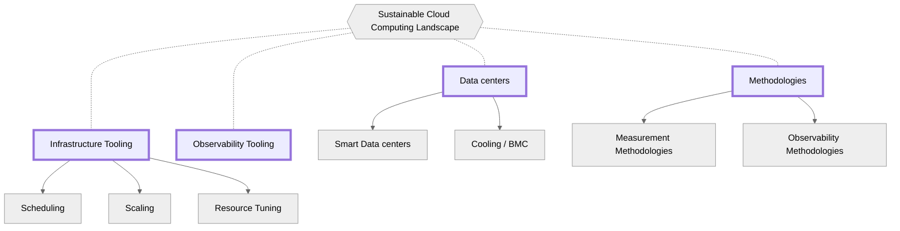
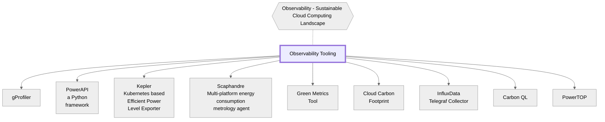
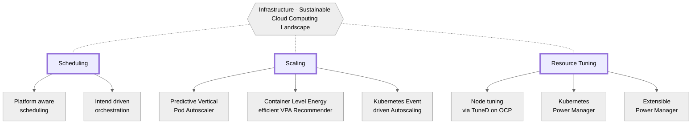

*这篇文档于23年6月发布，我们希望文中空白的领域将在不远的未来解决，欢迎贡献！*

云计算彻底改变了我们存储和处理数据的方式，使组织能够更加敏捷、高效和可扩展。
然而，随着公司转变其商业模式以满足可持续性要求，人们也开始关注云计算中的环境可持续性。
云计算的碳足迹已经成为一个热议的话题，因为它的能源消耗间接导致了大量的排放。
因此，量化和减少与云计算相关的碳排放以减轻对环境的影响已成为当务之急。

量化运营碳排放并不像部署可见性和问责制工具那么简单。
云计算尤其如此，因为服务器中包含多个硬件组件，云基础设施中硬件的不同代/体系结构/供应商，服务的依赖性，在虚拟化/容器化环境中运行的服务，服务器中单独的风扇/冷却控制器，缺失数据，遥测和可观察性，AI/ML工作负载，以及机密工作负载。
这些挑战使得准确测量与云计算相关的碳排放变得困难。

在这篇白皮书中，我们探讨了云计算中与碳和能源核算相关的挑战，并深入了解了量化公共和私人云中碳排放的复杂性。
此外，该文件探讨了特定部门的挑战，例如电信业。

## 目录

- [目录](#目录)
- [贡献者](#贡献者)
- [可持续云计算基础](#可持续云计算基础)
  - [云的碳排放](#云的碳排放)
  - [绿色计算](#绿色计算)
  - [碳核算](#碳核算)
- [可持续云系统的挑战](#可持续云系统的挑战)
- [碳核算的挑战](#碳核算的挑战)
  - [量化运营碳排放](#量化运营碳排放)
  - [云](#云)
    - [公有云中的挑战](#公有云中的挑战)
      - [云服务使用者](#云服务使用者)
    - [私有云的挑战](#私有云的挑战)
  - [特定行业的挑战](#特定行业的挑战)
    - [电信](#电信)
    - [金融](#金融)
  - [特定于工作负载挑战](#特定于工作负载挑战)
    - [AI/ML](#aiml)
- [在不同层面解决问题](#在不同层面解决问题)
- [当前工业研究和部署](#当前工业研究和部署)
  - [运行时系统功率测量](#运行时系统功率测量)
  - [能源保护和减少碳排](#能源保护和减少碳排)
    - [调整缩放和配置](#调整缩放和配置)
  - [绿色系统架构](#绿色系统架构)
- [当前可持续的云计算全景](#当前可持续的云计算全景)
  - [数据中心](#数据中心)
    - [Smart Data Centers](#smart-data-centers)
    - [制冷](#制冷)
  - [方法论](#方法论)
    - [测量方法论](#测量方法论)
    - [观测方法论](#观测方法论)
  - [观测工具](#观测工具)
  - [基础设施工具](#基础设施工具)
    - [集群级别调度工具](#集群级别调度工具)
    - [缩放扩容](#缩放扩容)
    - [节点上电源管理调整](#节点上电源管理调整)
- [可持续发展倡议](#可持续发展倡议)
  - [相关组织](#相关组织)
  - [峰会学会](#峰会学会)
  - [碳排放报告](#碳排放报告)
  - [碳中和](#碳中和)
  - [程序设计语言效率分析](#程序设计语言效率分析)

## 贡献者

特别感谢本文件的撰稿人。如果您有兴趣改进和增强内容，请在回购上提交PR，并确保您在下面添加自己作为贡献者！

<!-- cspell:disable-next-line -->
Huamin Chen, [Marlow Weston](https://github.com/catblade), [Niki Manoledaki](https://github.com/nikimanoledaki), Eun Kyung Lee, [Chen Wang](https://github.com/wangchen615), [Chris Lloyd-Jones](https://github.com/Sealjay),
[Parul Singh](https://github.com/husky-parul), [Przemysław Perycz](https://github.com/pperycz), [Christopher Cantalupo](https://github.com/cmcantalupo), [Patricia Cahill](https://github.com/patricia-cahill), [Jochen Joswig](https://github.com/by-d-sign), [Emily Fox](https://github.com/thefoxatwork), [Leonard Pahlke](https://github.com/leonardpahlke)

<!-- cspell:disable-next-line -->
中文译者:[Yi Yuan](https://github.com/SamYuan1990)

## 可持续云计算基础

可持续的云计算和云原生系统基于以下三个基础条件。
这些基础构成了云和云原生架构中知情设计、决策和问责制的基础。

### 云的碳排放

信息和通信技术（简称ICT）系统的碳排放分为以下几类：

- **运行排放量**: 信息和通信技术系统运行或使用阶段的碳排放量。
这些排放主要是由于燃烧化石燃料来产生这些系统所需的电力。

- **隐含排放量**: 在创建和处置ICT系统的硬件（简称HW）和物理组件（例如：设备、服务器、电缆、建筑物等）过程中排放的碳量。
隐含排放也称为嵌入排放。

由于云和云原生系统运行在ICT系统内部，因此也不可避免的要计算相关碳排放数据。

### 绿色计算

绿色计算是指监测和优化资源消耗、减少环境影响和提高可持续性的软件和系统的架构和设计，同时为用户和利益相关者提供有用的服务。

### 碳核算

碳和能源核算是指跟踪和核算碳和能源消耗的系统、服务和方法。

## 可持续云系统的挑战

随着绿色计算和碳与能源审计这两个快速发展的领域受到各行业的关注，与构建和维护可持续云系统相关的挑战仍在不断被发现。
随着这些技术越来越多地被采用和成熟，我们预计会发现更多的挑战和解决方案。然而，以下部分试图阐述各基金会当前面临的挑战。
碳核算的一个流行标准是[温室气体议定书](https://ghgprotocol.org/)（简称：GHG协议）。

## 碳核算的挑战

### 量化运营碳排放

云原生工作负载性能的可观测性越来越受欢迎，因为组织了解了各种遥测数据点的价值，从而提高了对其架构如何运行的可见性和理解。
随着越来越多的组织开始考虑如何在资源利用和能源消耗方面达到类似的价值，他们了解到量化运营碳排放并不像部署可见性和审计工具那么简单。

量化运营碳排放并非易事，原因有很多，但不限于以下几点：

* 服务器中包含的多个硬件（HW）组件 - 需要对各种硬件组件（如CPU、内存、GPU、存储、I/O）进行功率建模，以进行准确的量化/估计。
*  硬件由多个用户/帐户同时使用——每个不同用户（例如，多个软件线程）的功率建模是一个完全不同的建模问题。
这里需要理解的一个重要问题是[能源比例](https://learn.greensoftware.foundation/energy-efficiency#energy-比例）。对于功率建模，应充分理解软件/硬件交互。
* 云基础设施中硬件的不同代/架构/供应商 - 不同代/体系结构/供应商需要功率建模，例如，Intel,AMD或ARM、Skylake或Sapphire Rapids,以及ConnectX-5或ConnectX-6。
* 服务的依赖性 - 一个服务可能使用不同的服务。（例如，Kubernetes使用COS服务），应用程序可以分布在数据中心和云之间。
* 在虚拟化/容器化环境中运行的服务 - 虚拟化/集装箱化环境需要功率建模，这增加了建模的复杂性。
* 服务器中单独的风扇/冷却控制器 – 风扇和其他冷却组件通常由单独的控制器控制，这需要额外的建模。
* 缺少数据 – 由于在云中暴露内部数据的限制，禁止访问关键数据来计算操作排放。内部部署（On-prem）数据中心有时缺乏功率测量技术。
* 遥测和可观测性 – 用户经常同时使用多个硬件，可靠和高粒度的遥测变得更加重要。然而，相对于在服务器/云上执行的服务，遥测/可观测性开销应该较低。
* AI/ML工作负载 – 使用人工智能（AI）/机器学习（ML）工作负载的急剧增加导致了对基于GPU的专用集群的强烈需求。这种工作负载的特性不同于传统工作负载，并且它们的功耗明显更高。
* 机密工作负载 - 从VM用例发展为机密容器（SGX/SEV/TDX）、TEE（可信执行环境）以及反弹缓冲器/SWIOTLB的使用可能花费更多的能量。然而，由于安全问题，这部分可能会很难进行观测。

量化嵌入的碳排放量也非常具有挑战性，因为制造细节（具体排放量）没有被纳入制造技术消费者进行整体量化的信息中。
这不在本白皮书的范围内，但本TAG鼓励感兴趣的读者通过在我们的[Github仓库](https://github.com/cncf/tag-env-sustainability)上提交问题或合并请求，提出量化这些排放的指导、最佳实践、方法和机制。
<!-- We may want to put some directions though // +1, would this be guidance/best practice on methods to quantify these emissions or guidance on methods to mitigate these emissions? -->

### 云

#### 公有云中的挑战

公共云提供商，如AWS、Azure和GCP，通常对消费和排放数据非常严格，因为这些提供商限制了用户在访问可持续性相关指标方面的手段来实施决策。
可持续性相关指标包括能源消耗、硬件、电源、数据中心PUE等数据。

供应商确实试图降低日常成本、能源使用量和排放量，但向用户提供的相关功能可能非常有限。
这可能由于云计算在设计之初的分享责任模型 - 通过对用户抽象了运维复杂性，从而避免了他们运营自己数据中心。
<!--- this statement needs reference: They do not trust their users, as users vary from amateur to experienced. --->
此外，之前确定的量化挑战也严重加剧了特定用户核算碳成本的进一步困难，因为碳核算可能需要比用户连接到单个类型的工作更长的时间。
上面提到的超标量通过碳仪表板或API提供了对云资源碳排放的深入了解。
然而，这些数据可能非常有限，和/或有相当大的时间滞后，从而错过了用户采取行动/可接受时间窗口。
此外，用于计算碳排放的方法可能因云提供商而异，从而降低了用户在提供商之间进行比较的能力。
如何衡量或估计这些信息往往是迟钝的、不一致的，而且没有行业共识。
与大多数新兴技术领域一样，底层实现的差异将持续下去，直到行业以测量和表达这些测量的集体模式或框架为中心。

##### 云服务使用者

用户往往不知道他们的工作量如何影响组织的碳足迹，也缺乏经验。
那些关心环境影响的人很难将个人工作量与碳成本联系起来。

#### 私有云的挑战

这些是由特定公司或大学运行的云，供这些公司或大学的成员使用。
这些云通常是更信任的环境，因为用户对他们运行工作负载的云的管理员或管理负责。
由于私有云的特殊用途，环境可持续性、绿色计算和排放问责制不在设计、运营甚至费用的前沿，因此导致了私有云特有的进一步挑战。
这些仍然是未知的。

### 特定行业的挑战

#### 电信

电信（Telco）客户由于其在向客户提供高可靠性和高速服务方面的独特需求而经常提出要求。
电信公司需要他们的系统极其稳定，流量快速可靠。
一些系统完全处于满功率，因为功率调制会影响业务，并且对此的容忍度很低。
建立电信公司确信不会影响其流量的降低功率的系统是一项挑战。

#### 金融

金融公司可能会在非交易时间进行模拟，这些模拟通常像是AI/ML的工作负载。
然而，对于交易和快速流量，金融在市场开市时是可预测的使用时间。
因此，金融机构运营的大多数集群的每日时间调整可能受到限制。
然而，交易时间确实会影响实际资金，因此在这些环境中，快速将优先于功耗。
为了让这群客户使用可持续的选择，必须小心将影响限制在他们的底线内。
此外，由于日志记录、监控和其他因素的增加，高安全性和法规要求可能会增加金融工作负载的利用率和排放量。

### 特定于工作负载挑战

#### AI/ML

除了上述挑战外，人工智能（AI）和机器学习（ML）工作负载要么作为云服务提供商的可调度计算，要么在物理环境中存在。
在任何一种情况下，AI/Ml集群通常都会增加XPU或加速器的复杂性。
这些加速器需要大量的功率才能运行，更多的是普通计算机芯片所需的数量级。
此外，这些集群上的一些工作负载对时间不敏感，例如信息的训练集，还有一些是时间敏感的，例如识别系统的推理作业。

## 在不同层面解决问题

在考虑与可持续云系统的三个基础相辅相成的解决方案时，我们可以将解决方案考虑分为三个一般领域：

1. 如果有多个数据中心，则考虑具体数据中心位置。
2. 选择好数据中心之后，选择具体的负载部署方式。
3. 如何管理为工作负载分配的节点上的资源。

所有这些元素都可以单独进行进一步研究。

| 领域               | 目标                                                                                                                                                                                                                                     | 付出                                |
| ------------------ | ---------------------------------------------------------------------------------------------------------------------------------------------------------------------------------------------------------------------------------------- | -------------------------------------- |
| 多数据中心 | 根据环境因素，如该地区是否由可再生能源供电、该地区的边际排放率、用电效率（PUE）、一天中的时间等，智能地选择要调度的数据中心。 | 集群管理                     |
| 数据中心内部 | 根据工作负载、可用性和工作负载的紧迫性进行有效调度。                                                                                                                                                    | 能源管理，k8s调度插件 |
| 节点上管理      | 优化资源以处理工作负载规范（可能包括性能参数），同时最大限度地减少资源消耗                                                                                                  | 节点优化, Pod Scaling               |

## 当前工业研究和部署

在可持续计算领域有许多发展和正在进行的研究。
如果你知道一些没有在这里展示的，我们希望你能贡献它们！

### 运行时系统功率测量

📗 [A summarization of topics and research up to 2016](https://en.wikipedia.org/wiki/Run-time_estimation_of_system_and_sub-system_level_power_consumption)

### 能源保护和减少碳排

#### 调整缩放和配置

在运行时，工作负载消耗的能量可以在硬件级别通过基于DVFS的扩展来减少，在软件级别通过运行时参数调整和重新配置来减少，或者在编排级别通过扩展到零自动化来减少。

### 绿色系统架构

绿色硬件/软件系统要么提高子系统的效率，要么改变计算的方式。

例如，用[节能语言](https://haslab.github.io/SAFER/scp21.pdf)编写的程序或在更多[优化的运行环境](https://hal.inria.fr/hal-03275286/document)上运行通常是“更环保”的。

另一方面，解决能源浪费根本原因的体系结构，包括闲置能耗利用和数据中心冷却，被评估为更环保。
例如，联合学习将模型训练扩展到不需要昂贵冷却的设备被[发现](https://www.cam.ac.uk/research/news/can-federated-learning-save-the-world)以减少总的碳足迹。

## 当前可持续的云计算全景

下图展示了可持续云计算格局的各个维度，这些维度将在以下章节中进行详细描述。



### 数据中心

#### Smart Data Centers

* [ECO-Qube](https://www.ecoqube.org)是一个整体管理系统，旨在通过协调边缘计算应用程序中的硬件和软件组件来提高能效和冷却性能。
* [Patchwork Kilt](https://openuk.uk/patchworkkilt/) - 可持续数据中心的蓝图。
* [Open Compute Sustainability Project](https://www.opencompute.org/projects/sustainability) - 利用OCP社区的专业知识，我们为OCP成员和数据中心行业（供应商、供应商和最终用户）提供了一个开放的框架和资源，以部署行业最佳实践，促进可重用性和循环性。

#### 制冷

* 📰 🧊 OCP冷却遥测[Improve data center cooling facility efficiency through platform power telemetry](https://www.opencompute.org/documents/ocp-wp-dcf-improve-data-center-cooling-facility-efficiency-through-platform-power-telemetryr1-0-final-update-pdf) <br>
数据中心运营商通常会过度提供设施容量，以确保有足够的缓冲区来满足峰值需求。
过度资源调配给数据中心的总体拥有成本（TCO）带来了巨大压力。
如今，数据中心管理堆栈已被广泛部署用于监测数据中心运行时的健康状况，它收集了大量有关功率、温度和资源利用率的数据。
这些数据创造了通过数据智能优化数据中心效率的机会。
在本文中，我们介绍了我们在云环境中使用功率趋势预测来提高冷却效率的实践。
同时，本文讨论了在超大规模数据中心实现IT平台数据驱动设施控制时的一些关键挑战和设计注意事项，如遥测采集、消息传递机制和管理API。
IT设备、设施和管理系统之间的有效互操作性对于解决方案部署至关重要，采用开放计算项目设计和Redfish API更容易实现系统级集成，并降低不同系统和不同制造商的部署成本。
* 🧊 BMC Telemetry [Exposes Baseboard Management Controller data in Prometheus format.](https://github.com/gebn/bmc_exporter)

### 方法论

#### 测量方法论

* [Software Carbon Intensity (SCI) Standard](https://github.com/Green-Software-Foundation/sci) - 描述如何计算软件应用程序的碳强度的规范。
* [Green Software Patterns](https://patterns.greensoftware.foundation/) - 由绿色软件基金会审查和策划的一个在线开源软件模式数据库，涵盖广泛的类别。
* [SCI Guidance](https://sci-guide.greensoftware.foundation) - SCI指导项目详细介绍了如何理解可用于计算能源、碳强度、内含排放量和功能单位值的不同方法的各种方法，这些是SCI计算的核心组成部分。
* Runtime system power consumption estimate [Run-time estimation of system and sub-system level power consumption](https://en.wikipedia.org/wiki/Run-time_estimation_of_system_and_sub-system_level_power_consumption)

#### 观测方法论

* 👀 Open Telemetry [High-quality, ubiquitous, and portable telemetry to enable effective observability](https://opentelemetry.io/)<br>
CNCF孵化项目旨在创建和收集来自服务和软件的遥测数据，然后将这些数据转发到各种分析工具。
OpenTelemetry集成了流行的库和框架，如Spring、ASP。NET Core、Express、Quarkus和其他。

### 观测工具

下图说明了可持续云计算环境的观测设施维度。



* 👀 gProfiler [OS code profiling tool to visualize applications' execution sequences and resource usage down to the line of code level](https://docs.gprofiler.io/)<br>
gProfiler是一款免费的、自助服务的开源软件，使企业能够通过持续的分析来提高应用程序性能，从而降低成本并最大限度地减少碳足迹。
Granulate用户可以在gCenter仪表板上使用CO2节能计监测其碳排放减少情况，以及成本和资源减少情况。
* 👀 PowerAPI [Python framework for building software-defined power meters](https://github.com/powerapi-ng/)<br>
PowerAPI是一个中间件工具包，用于构建软件定义的功率表。
软件定义的功率表是可配置的软件库，可以实时估计软件的功耗。
PowerAPI支持从各种传感器（例如，物理仪表、处理器接口、硬件计数器、操作系统计数器）获取原始指标，并通过不同渠道（包括文件系统、网络、web、图形）提供功耗。
作为一个中间件工具包，PowerAPI提供了组装功率表的能力，以满足用户的需求。
* 👀 [Kubernetes-based Efficient Power Level Exporter:](https://github.com/sustainable-computing-io/kepler)<br>
Kepler利用eBPF程序来探测与系统计数器相关的每个容器的能耗，并将其导出为Prometheus指标。
这些指标有助于最终用户监控其容器的能耗，并帮助集群管理员为实现其节能目标做出明智的决策。
The [Kepler Model Server](https://github.com/sustainable-computing-io/kepler-model-server) 是一个内部程序，为Kepler提供ML模型，用于估计Kubernetes工作负载的功耗。
Kepler Model Server在各种不同的Kubernetes集群和工作负载上使用节点能量统计（标签）和节点性能计数器（功能）作为Prometheus度量来预训练其模型。
一旦模型达到可接受的性能水平，Kepler Model Server就会通过flask导出它们，然后Kepler可以访问它们来计算每个Pod的能耗指标，给出每个Pod的性能计数器。
与其他类似项目不同，Kepler Model Server还使用Kepler功率估计代理从客户端集群中收集的节点数据来连续训练和调整其预训练模型。
这使Kepler能够进一步调整其Pod能耗计算能力，为客户的独特系统提供服务。
* 👀 Scaphandre [Scaphandre](https://github.com/hubblo-org/scaphandre)<br>
Scaphandre是一个多平台监测代理，致力于电力使用/能源消耗指标和其他有用数据，以减少ICT软件的影响。
* 👀 Green Metrics Tool [A holistic framework to measure the energy / co2 of your application.](https://docs.green-coding.berlin/)
* 👀 [InfluxData Telegraf Collector](https://github.com/influxdata/telegraf) - 一个开源的、基于插件的代理，用于收集、处理、聚合和编写度量。包括多个输入插件，有助于确定能耗, e.g. [intel_powerstat](https://github.com/influxdata/telegraf/tree/master/plugins/inputs/intel_powerstat) (暴露CPU和DRAM功耗、CPU温度、TDP、CPU和非核心频率、C状态驻留), [ipmi_sensor](https://github.com/influxdata/telegraf/tree/master/plugins/inputs/ipmi_sensor) (暴露IPMI传感器数据), [redfish](https://github.com/influxdata/telegraf/tree/master/plugins/inputs/redfish) (暴露CPU温度、风扇速度、电源和电压数据遵循[DMTF Redfish](https://redfish.dmtf.org/)接口), 以及大量插件，这些插件有助于确定单个资源的利用率，进而有助于识别电力消耗的位置。
一组丰富的可用输出插件使其易于与各种指标集成。
* 👀 [Carbon QL](https://github.com/Green-Software-Foundation/carbon-ql) - 这个项目的目的是建立一个carbonQL的API，您可以使用它来测量每个运行时环境的软件排放量。
* 👀 [Cloud Carbon Footprint](https://www.cloudcarbonfootprint.org/docs/) <br>
该应用程序从主要云提供商获取使用数据（计算、存储、网络等），并计算估计的能源（瓦时）和温室气体排放量，以二氧化碳当量（公吨二氧化碳当量）表示。
我们将这些可视化显示在仪表板中，供开发人员、可持续发展领导者和组织中的其他利益相关者查看并采取行动。它目前支持AWS、谷歌云和微软Azure。
* 👀 [PowerTOP](https://github.com/fenrus75/powertop) - 一个Linux工具，它允许您监视Linux机器上运行的每个进程的功耗。
* 📗 OSTI [Paper] [Metrics for Evaluating Energy Saving Techniques for Resilient HPC Systems](https://www.osti.gov/servlets/purl/1140455)
* 📗 [Carbon Aware SDK](https://github.com/Green-Software-Foundation/carbon-aware-sdk): Carbon Aware SDK是一个WebApi和命令行界面（CLI），用于帮助构建碳感知软件。

### 基础设施工具

下图说明了可持续云计算环境的基础设施维度。



#### 集群级别调度工具

在集群级调度阶段，可以通过智能调度器来减少工作负载消耗的能量，这些智能调度器了解数据中心的碳足迹、热温度和冷却、缓存感知或服务器功率效率。
根据电力成本（碳、金钱等）进行批量调度。

* 🚆 Power Driven Scheduling and Scaling with CPU telemetry in K8s [Power Driven Scheduling and Scaling with CPU telemetry in Kubernetes](https://github.com/intel/platform-aware-scheduling/tree/master/telemetry-aware-scheduling/docs/power) <br>
遥测感知调度（一种调度扩展）和Kubernetes本地Horizontal Pod Autoscaler（HPA）用于基于节点当前用电状态的实时信息实现集群自动化。
用于驱动布局和缩放决策的功率指标源自英特尔的运行平均功率限制（RAPL）。[collectd](https://collectd.org/)用于收集度量并将其暴露给Prometheus，从而使它们在集群内使用Prometheus-Adapter可用。
* 🚆 [Intent Driven Orchestration](https://github.com/intel/intent-driven-orchestration) <br>
这提供了一种新的编排方式，从命令式模型转变为意图驱动的模型来选择工作负载的位置。
在这个模型中，用户以目标的形式表达他们的意图（例如，所需的延迟、吞吐量或可靠性目标），而编排堆栈本身决定了实现这些目标需要基础设施中的哪些资源。
这种新方法将继续受益于社区在调度方面的投资（确定何时何地放置工作负载），并通过连续运行的计划循环来扩展，以确定在系统中配置什么/如何配置。
已经有初步的工作正在做，以在电力优化使用环境中利用这一点。
* 📗 Carbon-aware Kubernetes scheduler [A Low Carbon Kubernetes Scheduler](http://ceur-ws.org/Vol-2382/ICT4S2019_paper_28.pdf)
<!-- markdown-link-check-disable-next-line -->
* 📗 Energy aware scheduling [Paper] [Improving Data Center Efficiency Through Holistic Scheduling In Kubernetes](https://www.researchgate.net/publication/333062266_Improving_Data_Center_Efficiency_Through_Holistic_Scheduling_In_Kubernetes)

#### 缩放扩容

* 🚤 Predictive VPA [Predictive Vertical Pod Autoscaler (VPA) recommenders pluggable with the default VPA on OpenShift](https://github.com/openshift/predictive-vpa-recommenders)
* 🚤 CLEVER [Container Level Energy-efficient VPA Recommender for Kubernetes](https://github.com/sustainable-computing-io/clever):<br>
Kubernetes中的Vertical Pod Autoscaler允许根据历史资源使用测量值自动请求CPU和内存，并进行限制调整。
VPA部署有三个主要组件：VPA推荐程序、VPA更新程序和VPA准入控制器。
可以将默认的VPA推荐程序替换为自定义推荐程序。
CLEVER是一款智能推荐器，它使用此功能来确保在您尝试调整集群的CPU频率时，工作负载的QoS或性能不会受到影响。
它的工作原理如下：假设您在集群中部署了一个频率调谐器，以根据目标指标或能耗预算更新CPU频率。
直观地说，当你降低频率时，你确实节省了能源，但工作负载的性能也会降低。
为了应对这种情况，您可以在频率更改后获得节点的ClusterState和CPU频率等信息。
CLEVER根据更新的CPU频率重新计算由VPA管理的pod的CPU请求的新建议。
这就是CLEVER如何通过降低频率以减少能量，同时增加CPU分配，来保证工作负载的类似QoS。

* 🚤 [KEDA](https://keda.sh/): Kubernetes Event-driven Autoscaling enables scale-to-zero platforms.

#### 节点上电源管理调整

一旦选择了区域和节点，管理员和用户就可以进一步调整节点，以最大限度地减少运行工作负载所需的电量。
这可以将每个节点的功率降低30%或更多。

* 🎵 Node tuning via TuneD on OCP [Manage node-level tuning by orchestrating the tuned daemon](https://docs.openshift.com/container-platform/4.10/scalability_and_performance/using-node-tuning-operator.html) <br>
Node Tuning Operator通过协调TuneD守护进程来帮助您管理节点级调整。
大多数高性能应用程序都需要一定程度的内核调优。Node Tuning Operator为节点级sysctl的用户提供了统一的管理界面，并更灵活地添加用户需求指定的自定义调优。
* 🎵 Kubernetes Power Manager [Kubernetes Operator designed to expose and utilize Intel specific power management technologies in a Kubernetes Environment](https://github.com/intel/kubernetes-power-manager) <br>
在像Kubernetes（K8s）这样的容器编排引擎中，从平台池中分配CPU资源完全基于可用性。
为了在Kubernetes上下文中公开和使用电源管理技术，KubernetesPowerManager是使用OperatorSDK创建的Kubernete操作员。
Kubernetes Power Manager利用了一组强大的电源管理技术，使用户可以更精确地控制CPU性能和每核的功耗。
然而，Kubernetes是有目的地构建的，作为工作负载和工作负载协调器等硬件功能之间的抽象层进行操作。
Kubernetes的用户正在运行性能关键型应用程序，这些应用程序具有依赖于硬件功能的特定要求，因此会遇到障碍。
通过使用户能够调整频率并确定Kubernetes Native CPU Manager选择的内核的优先级，Kubernete Power Manager填补了硬件功能启用和容器编排层之间的空白。
事实证明，它也可以与TuneD一起工作，以允许TuneD配置文件用于根据各种频率调谐控制节点上的功率。
* 🎵 GEOPM [Extensible Power Manager](https://geopm.github.io):<br>
全球可扩展开放电源管理器（GEOPM）最初专门针对HPC环境，但现在更为普遍，它是一个用于探索异构平台上的电源和能源优化的框架。
<br>
GEOPM软件分为两个包：GEOPM服务和GEOPM运行时。GEOPM服务为用户空间提供对低级硬件度量和配置旋钮的访问。GEOPM运行时利用GEOPM服务来调整硬件设置，以响应硬件指标和应用程序反馈。应用程序反馈是通过将回调注入中间件包的轻量级异步评测挂钩来收集的。<br>
GEOPM Runtime具有用于在优化算法之间进行选择的插件架构。一些内置算法以能效为目标，另一些则在功率范围内优化性能。
GEOPM到Kubernetes的端口正在进行中。如[实验代码分支](https://github.com/geopm/geopm/tree/cloud#experimental-branch)称为“云”，并实现了支持Kubernetes的新功能。这些功能将迁移到主“dev”分支中，因为它们都已准备好投入生产。<br>
相关文档[service readme file](https://github.com/geopm/geopm/tree/cloud/service#kubernetes-support) 以及 [runtime k8 directory](https://github.com/geopm/geopm/tree/cloud/k8).

<!--- ### HPC Specific Models --->

## 可持续发展倡议

有许多可持续发展倡议正在进行中，如果我们遗漏了，请通过提交拉取请求来加入这份名单！

### 相关组织

* 🐝 Green Software Foundation [Building a trusted ecosystem of people, standards, tooling and best practices for green software](https://greensoftware.foundation/) <br>
  绿色软件基金会（GSF）旨在改变我们构建软件的方式, [从而实现没有任何有害的环境影响](https://greensoftware.foundation/articles/theory-of-change), 一个拥有42多个成员组织的基金会。
  关键支柱是知识、技术文化和工具；包含[标准化工作组](https://standards.greensoftware.foundation/),[开源工作组](https://opensource.greensoftware.foundation/), [社区工作组](https://community.greensoftware.foundation/), [原则工作组](https://policy.greensoftware.foundation/). <br>
  GSF创建了一个软件碳强度[（SCI）](https://github.com/Green-Software-Foundation/software_carbon_intensity)标准，该标准已提交给ISO（国际标准组织）批准，以确保我们一致地测量碳。
  该标准通过[Carbon Aware SDK](https://github.com/Green-Software-Foundation/carbon-aware-sdk)（一种在能源网是绿色的时候做得更多，在脏的时候做的更少的工具）以代码形式实现，[碳甬道](https://github.com/Green-Software-Foundation/Carbon_CI_Pipeline_Tooling)（测量CI/CD过程中的碳，以及[CarbonQL](https://github.com/Green-Software-Foundation/carbon-ql)-根据SCI标准测量碳的标准化API。
* 🐝 [LF Energy](https://www.lfenergy.org/)<br>
  LF Energy是一个专注于电力系统行业的开源基金会，由Linux基金会托管。LF Energy提供了一个中立的合作社区，以建立共享的数字投资，从而改变世界与能源的关系。该组织包含核心LF能源基金会以及许多托管项目和工作组的存储库。LF Energy的[全景视图](https://landscape.lfenergy.org/).
* 🐝 Energy Efficient High Performance Computing Working Group [Encourages implementation of energy conservation measures, energy efficient design in high performance computing (HPC)](https://eehpcwg.llnl.gov/)<br>
  任务是鼓励在高性能计算（HPC）中实施节能措施和节能设计，以及分享想法。您可以在这里找到大量的[论文](https://datacenters.lbl.gov/resources?field_focus_areas_tid)可以根据要提升到云原生景观中的模式来推断。
* 🐝 [Green Software Training](https://learn.greensoftware.foundation/) <br>
  该计划将教您如何构建、维护和运行更环保的应用程序，而不考虑应用程序领域、行业、组织规模或类型、编程语言或框架；并进一步获得Linux Foundation颁发的[Green Software Certification](https://training.linuxfoundation.org/training/green-software-for-practitioners-lfc131/)证书。
* 🐝 [Cloud Carbon Footprint](https://www.cloudcarbonfootprint.org/)<br>
  了解云使用的碳足迹，并减少碳足迹。<br>
云碳足迹是一个开源工具，提供可见性和工具来测量、监测和减少云碳排放。我们使用最佳实践方法将云利用率转换为估计的能源使用量和碳排放量，生成可与员工、投资者和其他利益相关者共享的指标和碳节约估计。
* 🐝 [Open Compute Project](https://www.opencompute.org/projects/heat-reuse)<br>
  处理器中使用的能量几乎100%转化为热量。直到最近，这一直是一个负担和挑战：需要去除大量的热量，这需要大量的额外能源支出。通过适当的设计，数据中心冷却系统可以转换为热源和热量管理机会，进而将热量从负债转换为资产。OCP热再利用小组探讨了这些挑战和机遇。其目标是提出解决方案，以实现旨在利用热量将成本转化为利润的技术。```

### 峰会学会

* 🐝 Linux Foundation's SustainabilityCon [The first sustainability-focused track by the Linux Foundation](https://events.linuxfoundation.org/open-source-summit-north-america/about/sustainabilitycon/)
* 🐝 [EnviroInfo](https://www.enviroinfo2023.eu/): EnviroInfo 2023是关于领先环境信息和通信技术的长期且成熟的国际和跨学科系列会议的第37届。

### 碳排放报告

* 📄 IEA [Emissions - Global Energy and CO2 Status Report 2019](https://www.iea.org/reports/global-energy-co2-status-report-2019/emissions)
* 📄 European Environment Agency [EU Greenhouse Emission Intensity](https://www.eea.europa.eu/ims/greenhouse-gas-emission-intensity-of-1)
* 📄 electricityMap's [real-time CO2 emission data](https://app.electricitymap.org)
* [SCI Reporting](https://github.com/Green-Software-Foundation/sci-reporting) - Creating the infrastructure, and processes to store, host, and publicly report SCI scores, and other related reporting requirements within the SCI specification.
* 📄 WattTime API [Provides insight into a electricity grid’s marginal emissions rate](https://docs.watttime.org/#tag/Introduction)

### 碳中和

* 🥬 The Climate Pledge [Net-Zero Carbon by 2040](https://www.theclimatepledge.com/)
* 🥬 WeTransfer [WeTransfer becomes Climate Neutral](https://wetransfer.com/blog/story/breaking-the-climate-neutral-barrier/)
<!-- cspell:disable-next-line -->
* 🥬 Adrian Cockroft, ex-Amazon VP of Sustainability Architecture ["Cloud computing pioneer's new focus is on sustainability transformation"](https://www.aboutamazon.com/news/sustainability/cloud-computing-pioneers-new-focus-is-on-sustainability-transformation)
* 🥬 Supercritical [Helping businesses achieve net zero](https://gosupercritical.com/)

### 程序设计语言效率分析

* 🔌 Energy Efficiency of Languages [全套程序语言能耗分析工具，使用计算机语言基准游戏](https://github.com/greensoftwarelab/Energy-Languages)
